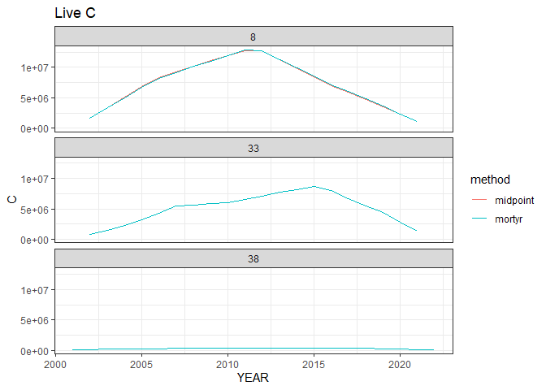
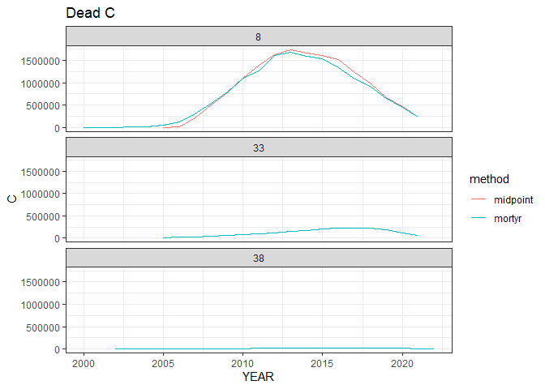

# Carbon - WIP


# Obtaining a database

## Download

You can download a copy of the *work in progress* database from this
[Google Drive
link](https://drive.google.com/file/d/1Ndn63S4ZWDvttZMcXUj8Wx8ziqCCClIf/view?usp=sharing).
The rest of this document will assume you downloaded it and put it in
`data/db`. This database has data for CO, ND, and NH.

## Generating it yourself

You can run `scripts/01-run_locally.R` to generate your own copy of the
database on your own computer. You can get data for different states by
changing lines 11-15 and 27 of that script.

# Connecting to the database

You can connect to the database like this:

``` r
library(dplyr)
```


    Attaching package: 'dplyr'

    The following objects are masked from 'package:stats':

        filter, lag

    The following objects are masked from 'package:base':

        intersect, setdiff, setequal, union

``` r
library(duckdb)
```

    Loading required package: DBI

``` r
library(DBI)
library(ggplot2)

con <- dbConnect(duckdb(dbdir = here::here("data",
                                                  "db",
                                                  "foresttime-carbon-wip.duckdb")))
```

Then you can pull data from tables in the database like this:

``` r
# List available tables

dbListTables(con)
```

     [1] "all_invyrs"                      "cond"                           
     [3] "nsvb_vars"                       "plot"                           
     [5] "qa_flags"                        "ref_species"                    
     [7] "ref_tree_carbon_ratio_dead"      "ref_tree_decay_prop"            
     [9] "sapling_transitions"             "tree"                           
    [11] "tree_annualized"                 "tree_carbon"                    
    [13] "tree_carbon_annualized_midpoint" "tree_carbon_annualized_mortyr"  
    [15] "tree_cns"                        "tree_info_composite_id"         

``` r
# Pull data from the tree table

some_trees <- tbl(con, "tree") |>
  # You can put dplyr-style filtering code here
  filter(STATECD == 8,
         INVYR > 2015) |>
  head() |>
  # And run collect() to pull data into R's memory
  collect()

knitr::kable(some_trees)
```

| TREE_CN | PLT_CN | PREV_TRE_CN | INVYR | STATECD | UNITCD | COUNTYCD | PLOT | SUBP | TREE | CONDID | PREVCOND | STATUSCD | SPCD | SPGRPCD | DIA | DIAHTCD | HT | HTCD | ACTUALHT | TREECLCD | CR | CCLCD | TREEGRCD | AGENTCD | CULL | DAMLOC1 | DAMTYP1 | DAMSEV1 | DAMLOC2 | DAMTYP2 | DAMSEV2 | DECAYCD | STOCKING | WDLDSTEM | VOLCFNET | VOLCFGRS | VOLCSNET | VOLCSGRS | VOLBFNET | VOLBFGRS | VOLCFSND | DIACHECK | MORTYR | SALVCD | UNCRCD | CPOSCD | CLIGHTCD | CVIGORCD | CDENCD | CDIEBKCD | TRANSCD | TREEHISTCD | BHAGE | TOTAGE | CULLDEAD | CULLFORM | CULLMSTOP | CULLBF | CULLCF | BFSND | CFSND | SAWHT | BOLEHT | FORMCL | HTCALC | HRDWD_CLUMP_CD | SITREE | CREATED_DATE | MODIFIED_DATE | MORTCD | HTDMP | ROUGHCULL | MIST_CL_CD | CULL_FLD | RECONCILECD | PREVDIA | P2A_GRM_FLG | TREECLCD_NERS | TREECLCD_SRS | TREECLCD_NCRS | TREECLCD_RMRS | STANDING_DEAD_CD | PREV_STATUS_CD | PREV_WDLDSTEM | TPA_UNADJ | DRYBIO_BOLE | DRYBIO_STUMP | DRYBIO_BG | CARBON_AG | CARBON_BG | CYCLE | SUBCYCLE | BORED_CD_PNWRS | DAMLOC1_PNWRS | DAMLOC2_PNWRS | DIACHECK_PNWRS | DMG_AGENT1_CD_PNWRS | DMG_AGENT2_CD_PNWRS | DMG_AGENT3_CD_PNWRS | MIST_CL_CD_PNWRS | SEVERITY1_CD_PNWRS | SEVERITY1A_CD_PNWRS | SEVERITY1B_CD_PNWRS | SEVERITY2_CD_PNWRS | SEVERITY2A_CD_PNWRS | SEVERITY2B_CD_PNWRS | SEVERITY3_CD_PNWRS | UNKNOWN_DAMTYP1_PNWRS | UNKNOWN_DAMTYP2_PNWRS | PREV_PNTN_SRS | DISEASE_SRS | DIEBACK_SEVERITY_SRS | DAMAGE_AGENT_CD1 | DAMAGE_AGENT_CD2 | DAMAGE_AGENT_CD3 | CENTROID_DIA | CENTROID_DIA_HT | CENTROID_DIA_HT_ACTUAL | UPPER_DIA | UPPER_DIA_HT | VOLCSSND | DRYBIO_SAWLOG | DAMAGE_AGENT_CD1_SRS | DAMAGE_AGENT_CD2_SRS | DAMAGE_AGENT_CD3_SRS | DRYBIO_AG | ACTUALHT_CALC | ACTUALHT_CALC_CD | CULL_BF_ROTTEN | CULL_BF_ROTTEN_CD | CULL_BF_ROUGH | CULL_BF_ROUGH_CD | PREVDIA_FLD | TREECLCD_31_NCRS | TREE_GRADE_NCRS | BOUGHS_AVAILABLE_NCRS | BOUGHS_HRVST_NCRS | TREECLCD_31_NERS | AGENTCD_NERS | BFSNDCD_NERS | AGECHKCD_RMRS | PREV_ACTUALHT_RMRS | PREV_AGECHKCD_RMRS | PREV_BHAGE_RMRS | PREV_HT_RMRS | PREV_TOTAGE_RMRS | PREV_TREECLCD_RMRS | RADAGECD_RMRS | RADGRW_RMRS | VOLBSGRS | VOLBSNET | SAPLING_FUSIFORM_SRS | EPIPHYTE_PNWRS | ROOT_HT_PNWRS | CAVITY_USE_PNWRS | CORE_LENGTH_PNWRS | CULTURALLY_KILLED_PNWRS | DIA_EST_PNWRS | GST_PNWRS | INC10YR_PNWRS | INC5YRHT_PNWRS | INC5YR_PNWRS | RING_COUNT_INNER_2INCHES_PNWRS | RING_COUNT_PNWRS | SNAG_DIS_CD_PNWRS | CONEPRESCD1 | CONEPRESCD2 | CONEPRESCD3 | MASTCD | VOLTSGRS | VOLTSGRS_BARK | VOLTSSND | VOLTSSND_BARK | VOLCFGRS_STUMP | VOLCFGRS_STUMP_BARK | VOLCFSND_STUMP | VOLCFSND_STUMP_BARK | VOLCFGRS_BARK | VOLCFGRS_TOP | VOLCFGRS_TOP_BARK | VOLCFSND_BARK | VOLCFSND_TOP | VOLCFSND_TOP_BARK | VOLCFNET_BARK | VOLCSGRS_BARK | VOLCSSND_BARK | VOLCSNET_BARK | DRYBIO_STEM | DRYBIO_STEM_BARK | DRYBIO_STUMP_BARK | DRYBIO_BOLE_BARK | DRYBIO_BRANCH | DRYBIO_FOLIAGE | DRYBIO_SAWLOG_BARK | PREV_ACTUALHT_FLD | PREV_HT_FLD | PLOT_COMPOSITE_ID | TREE_COMPOSITE_ID |
|---:|---:|:---|---:|---:|---:|---:|---:|---:|---:|---:|:---|---:|---:|---:|---:|---:|---:|---:|---:|---:|---:|---:|:---|---:|---:|:---|:---|:---|:---|:---|:---|:---|---:|---:|---:|---:|---:|---:|---:|---:|---:|---:|:---|---:|:---|:---|:---|:---|:---|:---|:---|:---|---:|---:|:---|:---|:---|:---|:---|:---|:---|:---|:---|:---|:---|:---|:---|:---|:---|:---|:---|:---|:---|:---|:---|:---|:---|:---|:---|:---|:---|---:|:---|:---|---:|---:|---:|---:|---:|---:|---:|---:|:---|:---|:---|:---|:---|:---|:---|:---|:---|:---|:---|:---|:---|:---|:---|:---|:---|:---|:---|:---|:---|:---|:---|:---|:---|:---|:---|:---|:---|:---|:---|:---|:---|---:|:---|:---|:---|:---|:---|:---|:---|:---|:---|:---|:---|:---|:---|:---|:---|:---|:---|:---|:---|:---|:---|:---|:---|:---|:---|:---|:---|:---|:---|:---|:---|:---|:---|:---|:---|:---|:---|:---|:---|:---|:---|:---|:---|---:|:---|---:|:---|:---|:---|:---|:---|:---|:---|:---|:---|:---|:---|:---|:---|:---|:---|:---|:---|---:|---:|:---|:---|:---|:---|:---|:---|:---|
| 6.888012e+14 | 1.887618e+14 | 31290274010690 | 2018 | 8 | 2 | 43 | 84371 | 3 | 31 | 1 | 1 | 1 | 814 | 48 | 1.2 | 2 | 4 | 1 | 4 | 3 | 60 | 3 | NA | NA | NA | NA | NA | NA | NA | NA | NA | NA | 1.0343 | 1 | NA | NA | NA | NA | NA | NA | NA | 0 | NA | NA | NA | NA | NA | NA | NA | NA | NA | NA | NA | NA | NA | NA | NA | NA | NA | NA | NA | NA | NA | NA | 4 | NA | NA | 2019-07-24 14:14:24 | 2024-08-29 11:48:28 | NA | NA | NA | 0 | NA | NA | 1.1 | NA | NA | NA | NA | 2 | NA | 1 | 1 | 74.965282 | NA | NA | 1.127712 | 0.460138 | 0.477022 | 3 | 7 | NA | NA | NA | NA | NA | NA | NA | NA | NA | NA | NA | NA | NA | NA | NA | NA | NA | NA | NA | NA | NA | NA | NA | NA | NA | NA | NA | NA | NA | NA | NA | NA | NA | 1.087796 | NA | NA | NA | NA | NA | NA | 1.1 | NA | NA | NA | NA | NA | NA | NA | NA | 4 | NA | NA | 4 | NA | 2 | 4 | NA | NA | NA | NA | NA | NA | NA | NA | NA | NA | NA | NA | NA | NA | NA | NA | NA | NA | NA | NA | NA | NA | NA | NA | NA | NA | NA | NA | NA | NA | NA | NA | NA | NA | NA | NA | NA | NA | NA | NA | NA | NA | NA | NA | 0.836576 | NA | 4 | 4 | 8_2_43_84371 | 8_2_43_84371_3_31 |
| 6.888012e+14 | 1.887618e+14 | 31290277010690 | 2018 | 8 | 2 | 43 | 84371 | 4 | 1 | 1 | 1 | 1 | 106 | 23 | 14.4 | 2 | 15 | 1 | 15 | 3 | 55 | 2 | NA | NA | 1 | NA | NA | NA | NA | NA | NA | NA | 8.4431 | 6 | NA | NA | NA | NA | NA | NA | NA | 2 | NA | NA | 63 | NA | NA | NA | NA | NA | NA | NA | NA | NA | 7 | NA | 0 | NA | NA | NA | NA | NA | NA | NA | 16 | NA | NA | 2019-07-24 14:14:24 | 2024-08-29 11:48:28 | NA | NA | NA | 0 | 1 | NA | 10.1 | NA | NA | NA | NA | 2 | NA | 1 | 7 | 6.018046 | NA | NA | 72.078269 | 142.397366 | 34.309256 | 3 | 7 | NA | NA | NA | NA | NA | NA | NA | NA | NA | NA | NA | NA | NA | NA | NA | NA | NA | NA | NA | NA | 41006 | 0 | NA | NA | NA | NA | NA | NA | NA | NA | NA | NA | NA | 299.154130 | NA | NA | NA | NA | NA | NA | 10.1 | NA | NA | NA | NA | NA | NA | NA | NA | 17 | NA | NA | 17 | NA | 2 | 0 | NA | NA | NA | NA | NA | NA | NA | NA | NA | NA | NA | NA | NA | NA | NA | NA | NA | NA | NA | NA | NA | 10.471606 | NA | 10.366890 | NA | NA | NA | NA | NA | NA | NA | NA | NA | NA | NA | NA | NA | NA | NA | NA | NA | NA | NA | NA | 29.041997 | NA | 17 | 17 | 8_2_43_84371 | 8_2_43_84371_4_1 |
| 6.888012e+14 | 1.887618e+14 | 31290275010690 | 2018 | 8 | 2 | 43 | 84371 | 3 | 32 | 1 | 1 | 1 | 814 | 48 | 1.7 | 2 | 6 | 1 | 6 | 3 | 55 | 3 | NA | NA | NA | NA | NA | NA | NA | NA | NA | NA | 1.9769 | 1 | NA | NA | NA | NA | NA | NA | NA | 0 | NA | NA | NA | NA | NA | NA | NA | NA | NA | NA | NA | NA | NA | NA | NA | NA | NA | NA | NA | NA | NA | NA | 6 | NA | NA | 2019-07-24 14:14:24 | 2024-08-29 11:48:28 | NA | NA | NA | 0 | NA | NA | 1.4 | NA | NA | NA | NA | 2 | NA | 1 | 1 | 74.965282 | NA | NA | 1.886233 | 1.150823 | 0.797877 | 3 | 7 | NA | NA | NA | NA | NA | NA | NA | NA | NA | NA | NA | NA | NA | NA | NA | NA | NA | NA | NA | NA | NA | NA | NA | NA | NA | NA | NA | NA | NA | NA | NA | NA | NA | 2.720621 | NA | NA | NA | NA | NA | NA | 1.4 | NA | NA | NA | NA | NA | NA | NA | NA | 5 | NA | NA | 5 | NA | 2 | 4 | NA | NA | NA | NA | NA | NA | NA | NA | NA | NA | NA | NA | NA | NA | NA | NA | NA | NA | NA | NA | NA | 0.000000 | NA | 0.000000 | NA | NA | NA | NA | NA | NA | NA | NA | NA | NA | NA | NA | NA | NA | NA | NA | NA | NA | NA | NA | 0.858256 | NA | 5 | 5 | 8_2_43_84371 | 8_2_43_84371_3_32 |
| 6.888012e+14 | 1.887618e+14 | 31290276010690 | 2018 | 8 | 2 | 43 | 84371 | 3 | 33 | 1 | 1 | 1 | 814 | 48 | 1.6 | 2 | 5 | 1 | 5 | 3 | 80 | 3 | NA | NA | NA | NA | NA | NA | NA | NA | NA | NA | 1.7661 | 1 | NA | NA | NA | NA | NA | NA | NA | 0 | NA | NA | NA | NA | NA | NA | NA | NA | NA | NA | NA | NA | NA | NA | NA | NA | NA | NA | NA | NA | NA | NA | 5 | NA | NA | 2019-07-24 14:14:24 | 2024-08-29 11:48:28 | NA | NA | NA | 0 | NA | NA | 1.2 | NA | NA | NA | NA | 2 | NA | 1 | 1 | 74.965282 | NA | NA | 1.721430 | 0.895653 | 0.728165 | 3 | 7 | NA | NA | NA | NA | NA | NA | NA | NA | NA | NA | NA | NA | NA | NA | NA | NA | NA | NA | NA | NA | NA | NA | NA | NA | NA | NA | NA | NA | NA | NA | NA | NA | NA | 2.117384 | NA | NA | NA | NA | NA | NA | 1.2 | NA | NA | NA | NA | NA | NA | NA | NA | 4 | NA | NA | 4 | NA | 2 | 4 | NA | NA | NA | NA | NA | NA | NA | NA | NA | NA | NA | NA | NA | NA | NA | NA | NA | NA | NA | NA | NA | 0.000000 | NA | 0.000000 | NA | NA | NA | NA | NA | NA | NA | NA | NA | NA | NA | NA | NA | NA | NA | NA | NA | NA | NA | NA | 0.842857 | NA | 4 | 4 | 8_2_43_84371 | 8_2_43_84371_3_33 |
| 6.888012e+14 | 1.887618e+14 | NA | 2018 | 8 | 2 | 43 | 84371 | 3 | 34 | 1 | 1 | 1 | 814 | 48 | 1.2 | 2 | 5 | 1 | 5 | 3 | 50 | 3 | NA | NA | NA | NA | NA | NA | NA | NA | NA | NA | 1.0343 | 1 | NA | NA | NA | NA | NA | NA | NA | 0 | NA | NA | NA | NA | NA | NA | NA | NA | NA | NA | NA | NA | NA | NA | NA | NA | NA | NA | NA | NA | NA | NA | 5 | NA | NA | 2019-07-24 14:14:24 | 2024-08-29 11:48:28 | NA | NA | NA | 0 | NA | 1 | NA | NA | NA | NA | NA | 2 | NA | NA | NA | 74.965282 | NA | NA | 1.127712 | 0.550686 | 0.477022 | 3 | 7 | NA | NA | NA | NA | NA | NA | NA | NA | NA | NA | NA | NA | NA | NA | NA | NA | NA | NA | NA | NA | NA | NA | NA | NA | NA | NA | NA | NA | NA | NA | NA | NA | NA | 1.301857 | NA | NA | NA | NA | NA | NA | NA | NA | NA | NA | NA | NA | NA | NA | NA | NA | NA | NA | NA | NA | NA | 0 | NA | NA | NA | NA | NA | NA | NA | NA | NA | NA | NA | NA | NA | NA | NA | NA | NA | NA | NA | NA | NA | NA | NA | NA | NA | NA | NA | NA | NA | NA | NA | NA | NA | NA | NA | NA | NA | NA | NA | NA | NA | NA | NA | NA | 0.836576 | NA | NA | NA | 8_2_43_84371 | 8_2_43_84371_3_34 |
| 6.888042e+14 | 1.887618e+14 | 31290297010690 | 2018 | 8 | 2 | 43 | 84560 | 1 | 4 | 1 | 1 | 2 | 108 | 21 | 7.7 | 1 | 45 | 1 | 45 | 3 | NA | NA | NA | 10 | 1 | NA | NA | NA | NA | NA | NA | 2 | NA | NA | 5.689644 | 5.747115 | NA | NA | NA | NA | 5.689644 | 0 | 2013 | NA | NA | NA | NA | NA | NA | NA | NA | NA | NA | NA | 98 | NA | 0 | NA | NA | NA | NA | NA | NA | NA | 46 | NA | NA | 2019-07-24 14:14:27 | 2024-08-29 11:48:28 | NA | 4.7 | NA | NA | 1 | NA | 8.0 | NA | NA | NA | NA | 5 | 1 | 1 | NA | 6.018046 | 143.2855 | 9.036866 | 43.319482 | 105.211610 | 21.833019 | 3 | 7 | NA | NA | NA | NA | NA | NA | NA | NA | NA | NA | NA | NA | NA | NA | NA | NA | NA | NA | NA | NA | NA | NA | NA | NA | NA | NA | NA | NA | NA | NA | NA | NA | NA | 208.753195 | NA | NA | NA | NA | NA | NA | 8.0 | NA | NA | NA | NA | NA | NA | NA | NA | 46 | NA | NA | 46 | NA | 1 | NA | NA | NA | NA | NA | NA | NA | NA | NA | NA | NA | NA | NA | NA | NA | NA | NA | NA | NA | NA | NA | NA | 6.569751 | 0.575756 | 6.504053 | 0.460605 | 0.362464 | 0.031765 | 0.35884 | 0.025412 | 0.503663 | 0.460171 | 0.040328 | 0.40293 | 0.455569 | 0.032263 | 0.322344 | NA | NA | NA | 163.795252 | 14.101517 | 0.778005 | 12.33579 | 30.856426 | 0.0 | NA | 46 | 46 | 8_2_43_84560 | 8_2_43_84560_1_4 |

``` r
# Pull some data from the carbon estimates table

co_annual_carbon_midpoint <- tbl(con, "tree_carbon_annualized_midpoint") |>
  filter(STATECD == 8) |>
  arrange(TREE_COMPOSITE_ID, YEAR) |>
  head() |>
  collect()

knitr::kable(co_annual_carbon_midpoint)
```

| ID | PROVINCE | SFTWD_HRDWD | STATECD | TREE_COMPOSITE_ID | TRE_CN | YEAR | midpoint_dead_year | HT | DIA | ACTUALHT | PLT_CN | STATUSCD | SPCD | TREECLCD | CULL | VOLCFGRS | DRYBIO_AG | CARBON_AG | STANDING_DEAD_CD | DECAYCD | CR | ACTUAL_HT | ECOSUBCD | STDORGCD | JENKINS_SPGRPCD | WDSG | CULL_DECAY_RATIO | DECAY_WD | DECAY_BK | DECAY_BR | C_FRAC | DIVISION | CRmn | BROKEN_TOP | SPCD_DIVISION | SPCD_NUMERIC | k | saw | DBH | THT | VTOTIB_GROSS | VTOTBK_GROSS | VTOTOB_GROSS | HT4 | VMERIB_GROSS | VMEROB_GROSS | VMERBK_GROSS | VSTPIB_GROSS | VSTPOB_GROSS | VSTPBK_GROSS | VTOPIB_GROSS | VTOPOB_GROSS | VTOPBK_GROSS | HTSAW | VSAWIB_GROSS | VSAWOB_GROSS | VSAWBK_GROSS | HT_RAT_ADJ | VTOTIB_PRESENT | VTOTBK_PRESENT | VTOTOB_PRESENT | VMERIB_PRESENT | VMERBK_PRESENT | VMEROB_PRESENT | VSAWIB_PRESENT | VSAWBK_PRESENT | VSAWOB_PRESENT | VSTPIB_PRESENT | VSTPBK_PRESENT | VSTPOB_PRESENT | VTOPIB_PRESENT | VTOPBK_PRESENT | VTOPOB_PRESENT | SND_WOOD_DECAY | VTOTIB_SOUND | VMERIB_SOUND | VSTPIB_SOUND | VTOPIB_SOUND | VSAWIB_SOUND | VTOTBK_SOUND | VSTPBK_SOUND | VMERBK_SOUND | VTOPBK_SOUND | VSAWBK_SOUND | VTOTOB_SOUND | VMEROB_SOUND | VSTPOB_SOUND | VTOPOB_SOUND | VSAWOB_SOUND | Total | Bark | Branch | FOLIAGE | Wood | CULL_REDUCTION | WOOD_REDUCTION | BARK_REDUCTION | CRprop_HT | broken_crn_prop | BRANCH_REDUCTION | FOLIAGE_REDUCTION | Wood_Reduced | Bark_Reduced | Branch_Reduced | Foliage_Reduced | AGB_Reduction_Factor | Total_Reduced | TotalC | Diff | WoodR | BarkR | BranchR | WoodAdd | BarkAdd | BranchAdd | WoodF | BarkF | BranchF | WDSGAdj | BKSGAdj | WMERIB | WMERBK | WMEROB | WSTPIB | WSTPBK | WSTPOB | WTOPIB | WTOPBK | WTOPOB | WSAWIB | WSAWBK | WSAWOB | WTOTIB | WTOTBK | WTOTOB | WTOTBCH | WMERBCH | BIOMASS | CARBON | AGB |
|---:|:---|:---|---:|:---|---:|---:|---:|---:|---:|---:|---:|---:|---:|---:|---:|---:|---:|---:|---:|---:|---:|---:|:---|---:|---:|---:|---:|---:|---:|---:|---:|:---|---:|:---|:---|---:|---:|---:|---:|---:|---:|---:|---:|---:|---:|---:|---:|---:|---:|---:|---:|---:|---:|---:|---:|---:|---:|---:|---:|---:|---:|---:|---:|---:|---:|---:|---:|---:|---:|---:|---:|---:|---:|---:|---:|---:|---:|---:|---:|---:|---:|---:|---:|---:|---:|---:|---:|---:|---:|---:|---:|---:|---:|---:|---:|---:|---:|---:|---:|---:|---:|---:|---:|---:|---:|---:|---:|---:|---:|---:|---:|---:|---:|---:|---:|---:|---:|---:|---:|---:|---:|---:|---:|---:|---:|---:|---:|---:|---:|---:|---:|---:|---:|---:|---:|---:|---:|---:|---:|---:|
| 611338 | M331 | S | 8 | 8_1_119_80086_1_1 | 3.167379e+13 | 2002 | NA | 38.0 | 5.20 | 38.0 | 3.167378e+13 | 1 | 122 | 2 | 0 | 1.384486 | 92.53076 | 47.46828 | 0 | 0 | 22 | 38 | M331In | 0 | 4 | 0.38 | 0.92 | 1 | 1 | 1 | 51.3 | M330 | 56.1 | FALSE | 122 M330 | 122 | 9 | 7 | 5.20 | 38.0 | 2.163509 | 0.8899628 | 3.053472 | 15.80282 | 1.384483 | 1.953993 | 0.5695095 | 0.1362120 | 0.1922430 | 0.0560310 | 0.6428133 | 0.9072355 | 0.2644223 | 5 | NA | NA | NA | 1 | 2.163509 | 0.8899628 | 3.053472 | 1.384483 | 0.5695095 | 1.953993 | NA | NA | NA | 0.1362120 | 0.0560310 | 0.1922430 | 0.6428133 | 0.2644223 | 0.9072355 | 1 | 2.163509 | 1.384483 | 0.1362120 | 0.6428133 | NA | 0.8899628 | 0.0560310 | 0.5695095 | 0.2644223 | NA | 3.053472 | 1.953993 | 0.1922430 | 0.9072355 | NA | 92.53076 | 15.72870 | 23.38646 | 7.338729 | 51.30112 | 1 | 1 | 1 | 0.22 | 1 | 1 | 1 | 51.30112 | 15.72870 | 23.38646 | 7.338729 | 1 | 92.53076 | 90.41627 | 2.114484 | 0.5673881 | 0.1739587 | 0.2586532 | 1.199733 | 0.3678329 | 0.5469180 | 52.50085 | 16.09653 | 23.93338 | 0.3888867 | 0.2898517 | 33.59661 | 10.30057 | 43.89718 | 3.305392 | 1.013419 | 4.318811 | 15.59885 | 4.782538 | 20.38139 | NA | NA | NA | 52.50085 | 16.09653 | 68.59738 | 23.93338 | 44.31476 | 92.53076 | 47.46828 | 99.86949 |
| 346853 | M331 | S | 8 | 8_1_119_80086_1_1 | 3.167379e+13 | 2003 | NA | 38.8 | 5.26 | 38.8 | 3.167378e+13 | 1 | 122 | 2 | 0 | 1.384486 | 92.53076 | 47.46828 | 0 | 0 | 22 | 38 | M331In | 0 | 4 | 0.38 | 0.92 | 1 | 1 | 1 | 51.3 | M330 | 56.1 | FALSE | 122 M330 | 122 | 9 | 7 | 5.26 | 38.8 | 2.255569 | 0.9250256 | 3.180595 | 16.51607 | 1.470880 | 2.074099 | 0.6032189 | 0.1392238 | 0.1963206 | 0.0570967 | 0.6454649 | 0.9101749 | 0.2647100 | 5 | NA | NA | NA | 1 | 2.255569 | 0.9250256 | 3.180595 | 1.470880 | 0.6032189 | 2.074099 | NA | NA | NA | 0.1392238 | 0.0570967 | 0.1963206 | 0.6454649 | 0.2647100 | 0.9101749 | 1 | 2.255569 | 1.470880 | 0.1392238 | 0.6454649 | NA | 0.9250256 | 0.0570967 | 0.6032189 | 0.2647100 | NA | 3.180595 | 2.074099 | 0.1963206 | 0.9101749 | NA | 95.88399 | 16.27295 | 23.84532 | 7.468633 | 53.48405 | 1 | 1 | 1 | 0.22 | 1 | 1 | 1 | 53.48405 | 16.27295 | 23.84532 | 7.468633 | 1 | 95.88399 | 93.60233 | 2.281660 | 0.5713966 | 0.1738520 | 0.2547514 | 1.303733 | 0.3966713 | 0.5812561 | 54.78779 | 16.66962 | 24.42658 | 0.3892629 | 0.2887935 | 35.72769 | 10.87044 | 46.59813 | 3.381748 | 1.028924 | 4.410672 | 15.67835 | 4.770263 | 20.44861 | NA | NA | NA | 54.78779 | 16.66962 | 71.45741 | 24.42658 | 44.87519 | 95.88399 | 49.18849 | 103.35262 |
| 613659 | M331 | S | 8 | 8_1_119_80086_1_1 | 3.167379e+13 | 2004 | NA | 39.6 | 5.32 | 39.6 | 3.167378e+13 | 1 | 122 | 2 | 0 | 1.384486 | 92.53076 | 47.46828 | 0 | 0 | 22 | 38 | M331In | 0 | 4 | 0.38 | 0.92 | 1 | 1 | 1 | 51.3 | M330 | 56.1 | FALSE | 122 M330 | 122 | 9 | 7 | 5.32 | 39.6 | 2.350046 | 0.9608770 | 3.310923 | 17.23518 | 1.559845 | 2.197627 | 0.6377827 | 0.1422681 | 0.2004380 | 0.0581700 | 0.6479337 | 0.9128581 | 0.2649244 | 5 | NA | NA | NA | 1 | 2.350046 | 0.9608770 | 3.310923 | 1.559845 | 0.6377827 | 2.197627 | NA | NA | NA | 0.1422681 | 0.0581700 | 0.2004380 | 0.6479337 | 0.2649244 | 0.9128581 | 1 | 2.350046 | 1.559845 | 0.1422681 | 0.6479337 | NA | 0.9608770 | 0.0581700 | 0.6377827 | 0.2649244 | NA | 3.310923 | 2.197627 | 0.2004380 | 0.9128581 | NA | 99.30822 | 16.82744 | 24.30967 | 7.600001 | 55.72430 | 1 | 1 | 1 | 0.22 | 1 | 1 | 1 | 55.72430 | 16.82744 | 24.30967 | 7.600001 | 1 | 99.30822 | 96.86141 | 2.446809 | 0.5752993 | 0.1737270 | 0.2509738 | 1.407648 | 0.4250767 | 0.6140849 | 57.13195 | 17.25252 | 24.92376 | 0.3895992 | 0.2877399 | 37.92136 | 11.45137 | 49.37273 | 3.458677 | 1.044440 | 4.503117 | 15.75191 | 4.756709 | 20.50862 | NA | NA | NA | 57.13195 | 17.25252 | 74.38446 | 24.92376 | 45.43237 | 99.30822 | 50.94512 | 106.90822 |
| 614745 | M331 | S | 8 | 8_1_119_80086_1_1 | 3.167379e+13 | 2005 | NA | 40.4 | 5.38 | 40.4 | 3.167378e+13 | 1 | 122 | 2 | 0 | 1.384486 | 92.53076 | 47.46828 | 0 | 0 | 22 | 38 | M331In | 0 | 4 | 0.38 | 0.92 | 1 | 1 | 1 | 51.3 | M330 | 56.1 | FALSE | 122 M330 | 122 | 9 | 7 | 5.38 | 40.4 | 2.446970 | 0.9975233 | 3.444493 | 17.95990 | 1.651399 | 2.324602 | 0.6732035 | 0.1453447 | 0.2045954 | 0.0592507 | 0.6502264 | 0.9152955 | 0.2650691 | 5 | NA | NA | NA | 1 | 2.446970 | 0.9975233 | 3.444493 | 1.651399 | 0.6732035 | 2.324602 | NA | NA | NA | 0.1453447 | 0.0592507 | 0.2045954 | 0.6502264 | 0.2650691 | 0.9152955 | 1 | 2.446970 | 1.651399 | 0.1453447 | 0.6502264 | NA | 0.9975233 | 0.0592507 | 0.6732035 | 0.2650691 | NA | 3.444493 | 2.324602 | 0.2045954 | 0.9152955 | NA | 102.80405 | 17.39221 | 24.77950 | 7.732820 | 58.02255 | 1 | 1 | 1 | 0.22 | 1 | 1 | 1 | 58.02255 | 17.39221 | 24.77950 | 7.732820 | 1 | 102.80405 | 100.19426 | 2.609793 | 0.5791005 | 0.1735849 | 0.2473145 | 1.511332 | 0.4530208 | 0.6454398 | 59.53388 | 17.84523 | 25.42494 | 0.3898980 | 0.2866914 | 40.17793 | 12.04330 | 52.22123 | 3.536182 | 1.059968 | 4.596150 | 15.81977 | 4.741964 | 20.56173 | NA | NA | NA | 59.53388 | 17.84523 | 77.37911 | 25.42494 | 45.98667 | 102.80405 | 52.73848 | 110.53687 |
| 615828 | M331 | S | 8 | 8_1_119_80086_1_1 | 3.167379e+13 | 2006 | NA | 41.2 | 5.44 | 41.2 | 3.167378e+13 | 1 | 122 | 2 | 0 | 1.384486 | 92.53076 | 47.46828 | 0 | 0 | 22 | 38 | M331In | 0 | 4 | 0.38 | 0.92 | 1 | 1 | 1 | 51.3 | M330 | 56.1 | FALSE | 122 M330 | 122 | 9 | 7 | 5.44 | 41.2 | 2.546368 | 1.0349707 | 3.581339 | 18.68991 | 1.745561 | 2.455043 | 0.7094826 | 0.1484536 | 0.2087925 | 0.0603389 | 0.6523542 | 0.9175034 | 0.2651492 | 5 | NA | NA | NA | 1 | 2.546368 | 1.0349707 | 3.581339 | 1.745561 | 0.7094826 | 2.455043 | NA | NA | NA | 0.1484536 | 0.0603389 | 0.2087925 | 0.6523542 | 0.2651492 | 0.9175034 | 1 | 2.546368 | 1.745561 | 0.1484536 | 0.6523542 | NA | 1.0349707 | 0.0603389 | 0.7094826 | 0.2651492 | NA | 3.581339 | 2.455043 | 0.2087925 | 0.9175034 | NA | 106.37206 | 17.96733 | 25.25477 | 7.867081 | 60.37949 | 1 | 1 | 1 | 0.22 | 1 | 1 | 1 | 60.37949 | 17.96733 | 25.25477 | 7.867081 | 1 | 106.37206 | 103.60159 | 2.770471 | 0.5828046 | 0.1734272 | 0.2437682 | 1.614643 | 0.4804750 | 0.6753527 | 61.99413 | 18.44781 | 25.93013 | 0.3901618 | 0.2856486 | 42.49759 | 12.64615 | 55.14374 | 3.614265 | 1.075509 | 4.689775 | 15.88228 | 4.726145 | 20.60842 | NA | NA | NA | 61.99413 | 18.44781 | 80.44194 | 25.93013 | 46.53855 | 106.37206 | 54.56887 | 114.23914 |
| 587390 | M331 | S | 8 | 8_1_119_80086_1_1 | 1.223463e+13 | 2007 | NA | 42.0 | 5.50 | 42.0 | 1.223461e+13 | 1 | 122 | 2 | 0 | 1.842348 | 110.01284 | 56.43659 | 0 | 0 | 30 | 42 | M331In | 0 | 4 | 0.38 | 0.92 | 1 | 1 | 1 | 51.3 | M330 | 56.1 | FALSE | 122 M330 | 122 | 9 | 7 | 5.50 | 42.0 | 2.648271 | 1.0732257 | 3.721497 | 19.42493 | 1.842349 | 2.588970 | 0.7466214 | 0.1515948 | 0.2130294 | 0.0614346 | 0.6543278 | 0.9194975 | 0.2651697 | 5 | NA | NA | NA | 1 | 2.648271 | 1.0732257 | 3.721497 | 1.842349 | 0.7466214 | 2.588970 | NA | NA | NA | 0.1515948 | 0.0614346 | 0.2130294 | 0.6543278 | 0.2651697 | 0.9194975 | 1 | 2.648271 | 1.842349 | 0.1515948 | 0.6543278 | NA | 1.0732257 | 0.0614346 | 0.7466214 | 0.2651697 | NA | 3.721497 | 2.588970 | 0.2130294 | 0.9194975 | NA | 110.01284 | 18.55286 | 25.73548 | 8.002773 | 62.79581 | 1 | 1 | 1 | 0.30 | 1 | 1 | 1 | 62.79581 | 18.55286 | 25.73548 | 8.002773 | 1 | 110.01284 | 107.08414 | 2.928699 | 0.5864156 | 0.1732549 | 0.2403295 | 1.717435 | 0.5074115 | 0.7038528 | 64.51325 | 19.06027 | 26.43933 | 0.3903928 | 0.2846121 | 44.88056 | 13.25984 | 58.14040 | 3.692927 | 1.091066 | 4.783993 | 15.93976 | 4.709359 | 20.64912 | NA | NA | NA | 64.51325 | 19.06027 | 83.57351 | 26.43933 | 47.08845 | 110.01284 | 56.43659 | 118.01562 |

Plot carbon estimates for different interpolation methods:

``` r
mortyr_carbon <- tbl(con, "tree_carbon_annualized_mortyr") |>
  collect()

midpoint_carbon <- tbl(con, "tree_carbon_annualized_midpoint") |>
  collect()

mortyr_carbon_total <- mortyr_carbon |> group_by(YEAR, STATECD, STATUSCD) |> summarize(C = sum(CARBON, na.rm = T)) |> ungroup()  |> 
  mutate(method = "mortyr")
```

    `summarise()` has grouped output by 'YEAR', 'STATECD'. You can override using
    the `.groups` argument.

``` r
midpoint_carbon_total <- midpoint_carbon |> group_by(YEAR, STATECD, STATUSCD) |> summarize(C = sum(CARBON, na.rm = T)) |> ungroup() |> 
  mutate(method = "midpoint")
```

    `summarise()` has grouped output by 'YEAR', 'STATECD'. You can override using
    the `.groups` argument.

``` r
both_carbon_totals <- bind_rows(mortyr_carbon_total,
                                midpoint_carbon_total)

ggplot(both_carbon_totals |> filter(STATUSCD == 1), aes(YEAR, C, color = method)) + geom_line() + facet_wrap(vars(STATECD), ncol = 1) + theme_bw() + ggtitle("Live C")
```



``` r
ggplot(both_carbon_totals |> filter(STATUSCD == 2), aes(YEAR, C, color = method)) + geom_line() + facet_wrap(vars(STATECD), ncol = 1) + theme_bw() + ggtitle("Dead C")
```



When you’re done, disconnect from the database.

``` r
dbDisconnect(con, shutdown = TRUE)
```

# Description of database tables

Many of these tables are identical to their counterparts in the
`pre-carbon` branch. Detailed descriptions for these tables can be found
at https://viz.datascience.arizona.edu/foresttime-tables/.

- all_invyrs: See
  [here](https://viz.datascience.arizona.edu/foresttime-tables/table_descriptions.html#all_invyrs-table).
- cond: Nearly-completely raw from FIADB. See
  [here](https://viz.datascience.arizona.edu/foresttime-tables/table_descriptions.html#cond-table).
- nsvb_vars: The `tree` table with variables added to create a dataframe
  that mirrors the input data for David Walker’s NSVB estimation code.
- plot: Nearly-raw from FIADB. See
  [here](https://viz.datascience.arizona.edu/foresttime-tables/table_descriptions.html#plot-table).
- qa_flags: Derived as part of forestTIME. See
  [here](https://viz.datascience.arizona.edu/foresttime-tables/table_descriptions.html#qa_flags-table).
- ref_species: Nearly-raw from FIADB. Downloaded to support the creation
  of the nsvb_vars table.
- ref_tree_carbon_ratio_dead: Nearly-raw from FIADB. Downloaded to
  support the creation of the nsvb_vars table.
- ref_tree_decay_prop: Nearly-raw from FIADB. Downloaded to support the
  creation of the nsvb_vars table.
- sapling_transitions: Derived by forestTIME. See
  [here](https://viz.datascience.arizona.edu/foresttime-tables/table_descriptions.html#sapling_transitions-table).
- tree: Nearly-raw from FIADB. See
  [here](https://viz.datascience.arizona.edu/foresttime-tables/table_descriptions.html#tree-table).
- tree_annualized: Derived as part of forestTIME. Interpolations of
  annual measurements for DIA, HT, and ACTUALHT for tree surveys in
  FIADB. Currently restricted to trees that are either alive in all
  surveys or alive in some surveys and dead in others, and that have no
  NA measurements for DIA, HT, or ACTUALHT. Very similar to the table
  described
  [here](https://viz.datascience.arizona.edu/foresttime-tables/table_descriptions.html#tree_annualized-table),
  but with the following modifications:
  - `TREE_CN_midpoint` is the CN for the TREE_CN record for the most
    *recent* survey using the midpoint interpolation method. This is
    used to get the nsvb_vars for these interpolated years.
  - `midpoint_dead_year` is the year in which the tree is presumed to
    have died according to the midpoint interpolation method. (If a tree
    dies, it is assumed to have died in the middle year of the 5 or 10
    year remeasurement period).
  - `HT_est_midpoint`, `DIA_est_midpoint`, `AHEIGHT_est_midpoint`:
    Measurements interpolated for each year according to the midpoint
    method.
  - The corresponding columns ending in `_mortyr` are the same only for
    the mortyr interpolation method. (If a tree dies and has a MORTYR
    listed, it is assumed to have died in MORTYR; otherwise, it is
    assumed to have died in the midpoint year of the remeasurement
    period).
- tree_carbon: NSVB carbon estimates for the *tree surveys* (i.e. every
  5-10 years). The direct output of David Walker’s code run on
  `nsvb_vars`.
- tree_carbon_annualized_midpoint: NSVB carbon estimates for
  *interpolated annual data* interpolated using the midpoint method.
- tree_carbon_annualized_mortyr: NSVB carbon estimates for interpolated
  annual data interpolated using the *mortyr* method.
- tree_cns: Derived in forestTIME. See
  [here](https://viz.datascience.arizona.edu/foresttime-tables/table_descriptions.html#tree_cns-table).
- tree_info_composite_id: Derived in forestTIME. See
  [here](https://viz.datascience.arizona.edu/foresttime-tables/table_descriptions.html#tree_info_composite_id-table).

# FIADB citation

Forest Inventory and Analysis Database, June 28, 2024. U.S. Department
of Agriculture, Forest Service, Northern Research Station. St. Paul, MN.
\[Available only on internet:
https://apps.fs.usda.gov/fia/datamart/datamart.html\]
