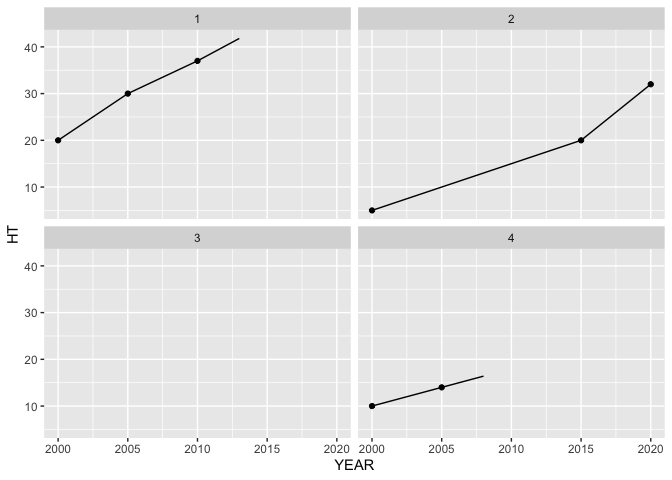
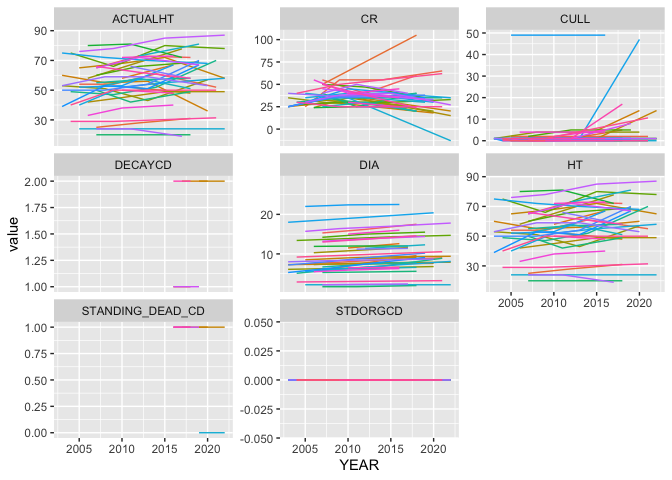

# Calculating Annualized Carbon Estimates
Eric Scott

- [Read in data](#read-in-data)
- [Initial Wrangling](#initial-wrangling)
  - [Tree table](#tree-table)
    - [Chain by joins](#chain-by-joins)
  - [Plot table](#plot-table)
  - [Cond table](#cond-table)
- [Annualizing](#annualizing)
  - [Toy Example](#toy-example)
  - [Actual data](#actual-data)
  - [Visualize results](#visualize-results)
- [Mortality](#mortality)
- [Carbon estimation](#carbon-estimation)

``` r
library(readr)
library(dplyr)
library(tidyr)
library(here)
```

I’m going to try to work through a small sample of data to figure out
how the code in forestTIME-builder works

# Read in data

I’ll use RI as an example. Some of the columns get auto-detected as the
wrong type (e.g. CN should be character, not numeric, even though it
looks like a number). I got these column types from the Green Book and
recorded them in a list in `scripts/create_column_types.R`.

``` r
tree_raw <- read_csv(
  here("data/rawdat/state/RI_TREE.csv"),
  col_types = cols(
    CN = col_character(),
    PLT_CN = col_character(),
    PREV_TRE_CN = col_character(),
    DAMTYP1 = col_integer(),
    DAMSEV1 = col_integer(),
    DAMTYP2 = col_integer(),
    DAMSEV2 = col_integer(),
    ACTUALHT = col_double(),
    HT = col_double(),
    DIA = col_double(),
    MORTYR = col_double(),
    INVYR = col_double()
  )
)

plot_raw <- read_csv(
  here("data/rawdat/state/RI_PLOT.csv"),
  col_types = cols(
    CN = col_character()
  )
)

plotgeom_raw <- read_csv(
  here("data/rawdat/state/RI_PLOTGEOM.csv"),
  col_types = cols(
    CN = col_character()
  )
)

#needed later
cond_raw <- read_csv(
  here("data/rawdat/state/RI_COND.csv"),
  col_types = cols(
    CN = col_character(),
    PLT_CN = col_character(),
    NBR_LIVE_STEMS = col_integer(),
    LAND_COVER_CLASS_CD_RET = col_integer(),
    TRTYR2 = col_integer(),
    DSTRBYR2 = col_integer()
  )
)
```

# Initial Wrangling

## Tree table

Tree table gets filtered to only year 2000 and onward, the `CN` column
is renamed to be more specific, and composite IDs are created that
should be universally unique (not just unique within the plot or state)

``` r
tree <- tree_raw |> 
  filter(INVYR >= 2000.0) |> 
  rename(TREE_CN = CN) |> 
  mutate(
    PLOT_COMPOSITE_ID = paste(STATECD, UNITCD, COUNTYCD, PLOT, sep = "_"),
    TREE_COMPOSITE_ID = paste(STATECD, UNITCD, COUNTYCD, PLOT, SUBP, TREE, sep = "_"),
    .before = 1
  )
```

It is my understanding that the `TREE_COMPOSITE_ID` is now consistent
through time as well since the combination of state, unit, county, plot,
sub-plot, and tree number are unique for each tree and the same every
inventory. But if that’s try, what does the `chain_by_joins()` function
do??

### Chain by joins

> [!IMPORTANT]
>
> ### Question
>
> It looks like `chain_by_joins()` adds a `TREE_FIRST_CN` column that
> connects every observation to the first `CN` a tree was given. Is this
> column needed? Or is `TREE_COMPOSITE_ID` enough?
>
> Answer: I found references in Renata’s notes to two methods for
> creating unique keys for trees and that they work equally well for
> *most* trees but sometimes disagree. I wonder if sometimes trees at
> the border of plots “move” plots between years or something like that?

## Plot table

I need to join one column from the PLOTGEOM table (`ECOSUBCD`) that is
needed for the carbon estimation code (it used to be in the PLOT table
in older versions of FIADB)

We also do similar filtering and renaming as in the tree table

``` r
#only care about keys and the ECOSUBCD column
plotgeom <- plotgeom_raw |> select(CN, INVYR, ECOSUBCD)
plot <- left_join(plot_raw,
                  plotgeom,
                  by = join_by(CN, INVYR)) |>
  filter(INVYR >= 2000.0) |>
  rename(PLT_CN = CN) |>
  mutate(
    PLOT_COMPOSITE_ID = paste(STATECD, UNITCD, COUNTYCD, PLOT, sep = "_"),
    .before = 1
  )
```

## Cond table

Needed later on for carbon estimation

``` r
cond <-
  cond_raw |>
  filter(INVYR >= 2000.0) |>
  rename(COND_CN = CN) |>
  mutate(
    PLOT_COMPOSITE_ID = paste(STATECD, UNITCD, COUNTYCD, PLOT, sep = "_"),
    .before = 1
  )
```

# Annualizing

I’m skipping some steps in `create_all_tables.R`, but I don’t think
they’re all necessary. This section would replace what goes on in
`add_annual_estimates_to_db.R`, which I think is probably overly
complicated and has the issue of not working when a tree goes “missing”
for a survey.

First, `ACTUALHT` and `HT` get coalesced. If I remember correctly,
`ACTUALHT` only applies when a tree is broken, and we want to use that
value for carbon estimation if it exists.

``` r
tree <- 
  tree |> 
  mutate(ACTUALHT = coalesce(ACTUALHT, HT)) |> 
  select(ACTUALHT, HT, everything())
```

Maybe I’m not understanding something that the code needs to do, but I
think we can just \~~use the built-in R function for linear
interpolation, `approx()`.

Let’s try an example

### Toy Example

``` r
df <- tibble::tribble(
  ~TREE_COMPOSITE_ID, ~YEAR, ~HT, ~STATUSCD,
  1, 2000, 20, 1,
  1, 2005, 30, 1,
  1, 2010, 37, 1,
  1, 2015, 45, 2,
  2, 2000, 5, 1,
  2, 2005, NA, NA,
  2, 2010, NA, NA,
  2, 2015, 20, 1,
  2, 2020, 32, 1,
  3, 2000, NA, 2,
  4, 2000, 10, 1,
  4, 2005, 14, 1,
  4, 2010, NA, 2
)
```

There are two trees each measured every 5 years. Tree 1 was measured in
4 surveys, the last of which it was dead. Tree 2 was missing for two
surveys, and then found again still alive. Tree 3 was only recorded once
and it was already dead in the first survey.

First we need to expand it to include all years between surveys.

``` r
all_yrs <-
  df |>
  group_by(TREE_COMPOSITE_ID) |>
  expand(YEAR = full_seq(YEAR, 1))

df_all_yrs <- right_join(df, all_yrs) |> arrange(TREE_COMPOSITE_ID, YEAR)
```

    Joining with `by = join_by(TREE_COMPOSITE_ID, YEAR)`

``` r
df_all_yrs
```

    # A tibble: 49 × 4
       TREE_COMPOSITE_ID  YEAR    HT STATUSCD
                   <dbl> <dbl> <dbl>    <dbl>
     1                 1  2000    20        1
     2                 1  2001    NA       NA
     3                 1  2002    NA       NA
     4                 1  2003    NA       NA
     5                 1  2004    NA       NA
     6                 1  2005    30        1
     7                 1  2006    NA       NA
     8                 1  2007    NA       NA
     9                 1  2008    NA       NA
    10                 1  2009    NA       NA
    # ℹ 39 more rows

Then, I think we just need to use `approx()` in a `mutate()` call, but
let’s make a “friendlier” version that returns a vector and does nothing
when it can’t interpolate (i.e. it needs at least 2 non-`NA` values to
interpolate).

We also want linear *extrapolation* of trailing `NA`s in the case that a
“mort tree” (tree first recorded dead) has no observations for `DIA` or
`HT`. That is accomplished with `Hmisc::approxExtrap()`, but needs a
continuous set of numbers created by `approx()` to start with.

``` r
inter_extra_polate <- function(x, y) {
  if (sum(!is.na(y)) < 2) {
    return(y)
  } else {
    #first interpolate
    interpolated <- approx(x, y, xout = x)$y
  }
  #then extrapolate trailing NAs if needed
  if (all(!is.na(interpolated))) {
    return(interpolated)
  } else {
    extrapolated <- 
      Hmisc::approxExtrap(
        x = x[!is.na(interpolated)],
        y = interpolated[!is.na(interpolated)],
        xout = x[is.na(interpolated)]
      )$y
    return(c(interpolated[!is.na(interpolated)], extrapolated))
  }
}

#for "interpolating" categorical vars
step_interp <- function(x) {
  if (all(is.na(x))) {
    return(x)
  }
  x_non_nas <- x[!is.na(x)]
  i <- seq_along(x)
  
  # index at which each non-missing value is
  i_non_nas <- i[!is.na(x)]
  
  # count leading NAs
  leading_NAs <- i_non_nas[1] - 1
  
  #this is the number of rep()s on the right side (not including the non-missing value)
  right <- floor((dplyr::lead(i_non_nas) - i_non_nas) / 2)
  right[is.na(right)] <- 0
  
  #number of rep()s to the left, including the non-missing value
  left <- ceiling((i_non_nas - dplyr::lag(i_non_nas)) / 2)
  left[is.na(left)] <- 1
  
  times <- left + right
  
  #extrapolate trailing NAs
  #reps of last value gets adjusted so sum(times) adds up to the total length of the input
  times[length(times)] <- length(x) - (sum(times) - times[length(times)] + leading_NAs)
  
  x_interp <- purrr::map2(x_non_nas, times, rep) |> purrr::list_c()
  
  #add back leading NAs
  c(rep(NA, leading_NAs), x_interp)
}
```

``` r
df_interpolated <- df_all_yrs |> 
  group_by(TREE_COMPOSITE_ID) |> 
  mutate(HT_interpolated = inter_extra_polate(x = YEAR, y = HT))
df_interpolated
```

    # A tibble: 49 × 5
    # Groups:   TREE_COMPOSITE_ID [4]
       TREE_COMPOSITE_ID  YEAR    HT STATUSCD HT_interpolated
                   <dbl> <dbl> <dbl>    <dbl>           <dbl>
     1                 1  2000    20        1            20  
     2                 1  2001    NA       NA            22  
     3                 1  2002    NA       NA            24  
     4                 1  2003    NA       NA            26  
     5                 1  2004    NA       NA            28  
     6                 1  2005    30        1            30  
     7                 1  2006    NA       NA            31.4
     8                 1  2007    NA       NA            32.8
     9                 1  2008    NA       NA            34.2
    10                 1  2009    NA       NA            35.6
    # ℹ 39 more rows

Yeah, that seems to have done it! Then we can just cut off any dead
trees at the estimated mortality year.

``` r
df_interpolated <- 
  df_interpolated |> 
  group_by(TREE_COMPOSITE_ID) |> #for each tree...
  #figure out when it was last recorded alive and first recorded dead
  mutate(
    last_live = YEAR[max(which(STATUSCD == 1))],
    first_dead = YEAR[min(which(STATUSCD == 2))]
  ) |> 
  #estimate the mortality year as the midpoint between surveys
  mutate(
    dead_yr = ceiling(mean(c(last_live, first_dead))),
    last_yr = if_else(!is.na(dead_yr), dead_yr, max(YEAR))
  ) |> 
  #remove estimates after death
  filter(YEAR <= last_yr) |> 
  select(-last_live, -first_dead, -dead_yr, -last_yr)
```

    Warning: There were 2 warnings in `mutate()`.
    The first warning was:
    ℹ In argument: `last_live = YEAR[max(which(STATUSCD == 1))]`.
    ℹ In group 3: `TREE_COMPOSITE_ID = 3`.
    Caused by warning in `max()`:
    ! no non-missing arguments to max; returning -Inf
    ℹ Run `dplyr::last_dplyr_warnings()` to see the 1 remaining warning.

``` r
library(ggplot2)
ggplot(df_interpolated, aes(x = YEAR)) +
  geom_point(aes(y = HT)) +
  geom_line(aes(y = HT_interpolated)) +
  facet_wrap(vars(TREE_COMPOSITE_ID))
```

    Warning: Removed 37 rows containing missing values or values outside the scale range
    (`geom_point()`).

    `geom_line()`: Each group consists of only one observation.
    ℹ Do you need to adjust the group aesthetic?



### Actual data

It *might* be trickier to do with the real data because:

1.  We might need to “annualize” the `TREE_CN` key, which is different
    for each inventory year for the same `TREE_COMPOSITE_ID`
2.  Some, but not many, trees have a recorded `MORTYR`, which we’d like
    to (optionally) use instead of the midpoint between surveys as an
    estimated end to that tree’s timeseries.

Renata’s code only interpolates/extrapolates `DIA`, `HT`, and `ACTUALHT`
and other variables needed for carbon estimation are added later with
joins. I’m not sure that’s the best approach, especially since some of
the other variables used (e.g. `CULL`, the precentage of rotten wood)
are continuous and could also be linearly interpolated. I’m going to try
doing the necessary joins *first* and then annualizing.

Variable used by carbon estimation code in `add_carbon_variables_*.R`:

Interpolation needed:

- `CR` - `tree` table; compacted crown ratio (interpolate)
- `DIA` - `tree` table; diameter (interpolate)
- `HT` - `tree` table; height (interpolate)
- `ACTUALHT` - `tree` table; height accounting for broken tops
  (interpolate)
- `CULL` - `tree` table; rotten and missing cull, a percentage
  (interpolate)
- `STATUSCD` - `tree` table; alive (1) or dead (2)
- `DECAYCD` - `tree` table; needed for joining to `REF_TREE_DECAY_PROP`
  (categorical). `NA` for live trees, 1-5 for dead trees
- `STANDING_DEAD_CD` - `tree` table; `NA` for live trees, 0 or 1 for
  dead trees.
- `STDORGCD` - `cond` table; stand origin code, method of stand
  regeneration for trees in the condition (2.5.25) (categorical). This
  is also `NA` sometimes, but here I think it is safe to assume that
  `NA` can be replaced with `0` (natural stands).
- `COND_STATUS_CD` - `cond` table; eventually for carbon estimation only
  trees in ‘accessible forest land’ (`COND_STATUS_CD == 1`) are kept
  (not sure why)

Invariant; join *after* interpolation:

- `CULL_DECAY_RATIO` - this is a weird one—it’s the `DENSITY_PROP` value
  from the `REF_TREE_DECAY_PROP` table when `DECAYCD = 3`. I do not know
  why, but it’s in the David Walker code like this.
- `ECOSUBCD` - `plot` table; ecological subsection code (invariant)
- `SPCD` - `REF_SPECIES` table; species code (invariant[^1])
- `SFTWD_HRDWD` - `REF_SPECIES` table; softwood or hardwood (invariant)
- `JENKINS_SPGRPCD` - `REF_SPECIES` table; species group code
  (invariant)
- `WDSG` - renamed from `WOOD_SPGR_GREENVOL_DRYWT` in `REF_SPECIES`
  table; green specific gravity of wood based on volume attributes in
  the `tree` table (invariant)
- `CARBON_RATIO_LIVE` - `REF_SPECIES` table; wood carbon fraction
  (invariant)
- `CARBON_RATIO` - `REF_TREE_CARBON_RATIO_DEAD` table; wood carbon
  fraction of dead trees (invariant)

``` r
tree |> 
  group_by(TREE_COMPOSITE_ID) |> 
  filter(length(unique(STANDING_DEAD_CD)) > 1) |> 
  select(TREE_COMPOSITE_ID, INVYR, STATUSCD, STANDING_DEAD_CD, everything()) |> 
  arrange(TREE_COMPOSITE_ID, INVYR)
```

    # A tibble: 2,752 × 198
    # Groups:   TREE_COMPOSITE_ID [934]
       TREE_COMPOSITE_ID INVYR STATUSCD STANDING_DEAD_CD ACTUALHT    HT
       <chr>             <dbl>    <dbl>            <dbl>    <dbl> <dbl>
     1 44_1_1_228_3_3     2004        2                1       30    45
     2 44_1_1_228_3_3     2008        2                0       NA    NA
     3 44_1_1_228_3_4     2004        1               NA       55    55
     4 44_1_1_228_3_4     2008        2                1       36    49
     5 44_1_1_228_3_4     2013        2                1       32    49
     6 44_1_1_228_3_4     2020        2                1       32    40
     7 44_1_1_228_3_7     2004        1               NA       55    55
     8 44_1_1_228_3_7     2008        1               NA       57    57
     9 44_1_1_228_3_7     2013        1               NA       50    50
    10 44_1_1_228_3_7     2020        2                1       43    60
    # ℹ 2,742 more rows
    # ℹ 192 more variables: PLOT_COMPOSITE_ID <chr>, TREE_CN <chr>, PLT_CN <chr>,
    #   PREV_TRE_CN <chr>, STATECD <dbl>, UNITCD <dbl>, COUNTYCD <dbl>, PLOT <dbl>,
    #   SUBP <dbl>, TREE <dbl>, CONDID <dbl>, PREVCOND <dbl>, SPCD <dbl>,
    #   SPGRPCD <dbl>, DIA <dbl>, DIAHTCD <dbl>, HTCD <dbl>, TREECLCD <dbl>,
    #   CR <dbl>, CCLCD <dbl>, TREEGRCD <dbl>, AGENTCD <dbl>, CULL <dbl>,
    #   DAMLOC1 <dbl>, DAMTYP1 <int>, DAMSEV1 <int>, DAMLOC2 <dbl>, …

There are some trees in the `tree` table that were dead on their first
survey and don’t have any height or diameter measurements. We should get
rid of these. I’ll also drop trees that change species (for now)

``` r
tree <- tree |> 
  group_by(TREE_COMPOSITE_ID) |> 
  filter(!(all(is.na(DIA)) |
             all(is.na(ACTUALHT)) |
             all(is.na(HT)) |
             all(STATUSCD != 1)))

# drop trees with more than 1 SPCD
tree <- tree |> 
  group_by(TREE_COMPOSITE_ID) |> 
  filter(length(unique(SPCD)) == 1)
```

Let’s convert `NA`s for `DECAYCD` and `STANDING_DEAD_CD` to `-1`s (an
unused code) *for now*, so the variable works nicely with our
`step_interp()` function (i.e. to distinguish `NA`s for live trees or
missing inventories from years that need interpolation), then we can
switch `-1`s back to `NA`s later based on estimated mortality year.

``` r
tree <- tree |> 
  mutate(across(c(DECAYCD, STANDING_DEAD_CD), \(x) if_else(is.na(x), -1, x)))
```

And let’s assume an `NA` for `STDORGCD` is a `0`

``` r
cond_cols <- cond |> 
  select(PLOT_COMPOSITE_ID, INVYR, CONDID, COND_STATUS_CD, STDORGCD) |> 
  mutate(STDORGCD = if_else(is.na(STDORGCD), 0, STDORGCD))

tree <- 
  left_join(tree, cond_cols,
            by = join_by(PLOT_COMPOSITE_ID, INVYR, CONDID))
```

#### Interpolation & Extrapolation

First, interpolate/extrapolate continuous variables

``` r
tree_to_interpolate <- tree |> 
  select(
    TREE_COMPOSITE_ID,
    PLOT_COMPOSITE_ID,
    SPCD,
    INVYR,
    DIA,
    HT,
    ACTUALHT,
    CR,
    CULL,
    STATUSCD,
    MORTYR,
    DECAYCD,
    STANDING_DEAD_CD,
    STDORGCD,
    COND_STATUS_CD
  )
```

First, expand to include all years

``` r
# this needs to include all columns that are invariant over time
all_yrs <- tree_to_interpolate |> 
  group_by(TREE_COMPOSITE_ID, PLOT_COMPOSITE_ID, SPCD) |>
  expand(YEAR = full_seq(INVYR, 1))

tree_annual <- 
  right_join(
    tree_to_interpolate,
    all_yrs,
    by = join_by(TREE_COMPOSITE_ID, PLOT_COMPOSITE_ID, SPCD, INVYR == YEAR)
  ) |>
  arrange(TREE_COMPOSITE_ID, INVYR) |> 
  rename(YEAR = INVYR)
tree_annual
```

    # A tibble: 48,795 × 15
    # Groups:   TREE_COMPOSITE_ID [4,738]
       TREE_COMPOSITE_ID PLOT_COMPOSITE_ID  SPCD  YEAR   DIA    HT ACTUALHT    CR
       <chr>             <chr>             <dbl> <dbl> <dbl> <dbl>    <dbl> <dbl>
     1 44_1_1_228_1_1    44_1_1_228          931  2004   5.9    30       30    50
     2 44_1_1_228_1_1    44_1_1_228          931  2005  NA      NA       NA    NA
     3 44_1_1_228_1_1    44_1_1_228          931  2006  NA      NA       NA    NA
     4 44_1_1_228_1_1    44_1_1_228          931  2007  NA      NA       NA    NA
     5 44_1_1_228_1_1    44_1_1_228          931  2008   6.4    35       35    45
     6 44_1_1_228_1_1    44_1_1_228          931  2009  NA      NA       NA    NA
     7 44_1_1_228_1_1    44_1_1_228          931  2010  NA      NA       NA    NA
     8 44_1_1_228_1_1    44_1_1_228          931  2011  NA      NA       NA    NA
     9 44_1_1_228_1_1    44_1_1_228          931  2012  NA      NA       NA    NA
    10 44_1_1_228_1_1    44_1_1_228          931  2013   6.8    35       35    36
    # ℹ 48,785 more rows
    # ℹ 7 more variables: CULL <dbl>, STATUSCD <dbl>, MORTYR <dbl>, DECAYCD <dbl>,
    #   STANDING_DEAD_CD <dbl>, STDORGCD <dbl>, COND_STATUS_CD <dbl>

Then interpolate with our custom `approx()` wrapper function,
`inter_extra_polate()`

``` r
tree_interpolated <- 
  tree_annual |> 
  group_by(TREE_COMPOSITE_ID) |> 
  mutate(
    across(c(ACTUALHT, DIA, HT, CULL, CR),
           \(var) inter_extra_polate(x = YEAR, y = var)),
    across(c(DECAYCD, STANDING_DEAD_CD, STDORGCD, COND_STATUS_CD), step_interp)
  )
tree_interpolated
```

    # A tibble: 48,795 × 15
    # Groups:   TREE_COMPOSITE_ID [4,738]
       TREE_COMPOSITE_ID PLOT_COMPOSITE_ID  SPCD  YEAR   DIA    HT ACTUALHT    CR
       <chr>             <chr>             <dbl> <dbl> <dbl> <dbl>    <dbl> <dbl>
     1 44_1_1_228_1_1    44_1_1_228          931  2004  5.9   30       30    50  
     2 44_1_1_228_1_1    44_1_1_228          931  2005  6.02  31.2     31.2  48.8
     3 44_1_1_228_1_1    44_1_1_228          931  2006  6.15  32.5     32.5  47.5
     4 44_1_1_228_1_1    44_1_1_228          931  2007  6.28  33.8     33.8  46.2
     5 44_1_1_228_1_1    44_1_1_228          931  2008  6.4   35       35    45  
     6 44_1_1_228_1_1    44_1_1_228          931  2009  6.48  35       35    43.2
     7 44_1_1_228_1_1    44_1_1_228          931  2010  6.56  35       35    41.4
     8 44_1_1_228_1_1    44_1_1_228          931  2011  6.64  35       35    39.6
     9 44_1_1_228_1_1    44_1_1_228          931  2012  6.72  35       35    37.8
    10 44_1_1_228_1_1    44_1_1_228          931  2013  6.8   35       35    36  
    # ℹ 48,785 more rows
    # ℹ 7 more variables: CULL <dbl>, STATUSCD <dbl>, MORTYR <dbl>, DECAYCD <dbl>,
    #   STANDING_DEAD_CD <dbl>, STDORGCD <dbl>, COND_STATUS_CD <dbl>

After interpolating, we can change those -1s back to NAs

``` r
tree_interpolated <- tree_interpolated |> 
  mutate(across(c(DECAYCD, STANDING_DEAD_CD), \(x) if_else(x == -1, NA, x)))
```

There are some trees where interpolation fails. I suspect they are all
ones with only one non-NA measurement and there is nothing we can do.

``` r
failed_to_interpolate <- 
  tree_interpolated |> 
  filter(any(is.na(DIA))) |>
  pull(TREE_COMPOSITE_ID) |>
  unique()
tree |> 
  group_by(TREE_COMPOSITE_ID) |> 
  filter(!all(STATUSCD != 1)) |> 
  filter(TREE_COMPOSITE_ID %in% failed_to_interpolate) |>
  arrange(TREE_COMPOSITE_ID, INVYR) |> 
  select(TREE_COMPOSITE_ID, INVYR, STATUSCD, DIA, ACTUALHT, everything())
```

    # A tibble: 1,654 × 200
    # Groups:   TREE_COMPOSITE_ID [827]
       TREE_COMPOSITE_ID INVYR STATUSCD   DIA ACTUALHT    HT PLOT_COMPOSITE_ID
       <chr>             <dbl>    <dbl> <dbl>    <dbl> <dbl> <chr>            
     1 44_1_1_228_4_7     2004        1   3.2       30    30 44_1_1_228       
     2 44_1_1_228_4_7     2008        2  NA         NA    NA 44_1_1_228       
     3 44_1_1_277_2_1     2007        1   2         17    17 44_1_1_277       
     4 44_1_1_277_2_1     2012        2  NA         NA    NA 44_1_1_277       
     5 44_1_1_91_2_13     2007        1   9.9       51    51 44_1_1_91        
     6 44_1_1_91_2_13     2012        2  NA         NA    NA 44_1_1_91        
     7 44_1_1_91_3_6      2007        1   1.4       17    17 44_1_1_91        
     8 44_1_1_91_3_6      2012        2  NA         NA    NA 44_1_1_91        
     9 44_1_3_111_1_23    2004        1   4.2       36    36 44_1_3_111       
    10 44_1_3_111_1_23    2008        2  NA         NA    NA 44_1_3_111       
    # ℹ 1,644 more rows
    # ℹ 193 more variables: TREE_CN <chr>, PLT_CN <chr>, PREV_TRE_CN <chr>,
    #   STATECD <dbl>, UNITCD <dbl>, COUNTYCD <dbl>, PLOT <dbl>, SUBP <dbl>,
    #   TREE <dbl>, CONDID <dbl>, PREVCOND <dbl>, SPCD <dbl>, SPGRPCD <dbl>,
    #   DIAHTCD <dbl>, HTCD <dbl>, TREECLCD <dbl>, CR <dbl>, CCLCD <dbl>,
    #   TREEGRCD <dbl>, AGENTCD <dbl>, CULL <dbl>, DAMLOC1 <dbl>, DAMTYP1 <int>,
    #   DAMSEV1 <int>, DAMLOC2 <dbl>, DAMTYP2 <int>, DAMSEV2 <int>, …

#### `REF_SPECIES` table

Join in time-invariant columns that are required for carbon estimation

``` r
# REF_SPECIES table variables
ref_species_raw <- read_csv(here("data/rawdat/REF_SPECIES.csv"))
```

    Rows: 2697 Columns: 41
    ── Column specification ────────────────────────────────────────────────────────
    Delimiter: ","
    chr  (11): COMMON_NAME, SHARED_COMMON_NAME_IND, GENUS, SPECIES, VARIETY, SUB...
    dbl  (28): SPCD, E_SPGRPCD, W_SPGRPCD, C_SPGRPCD, P_SPGRPCD, MAJOR_SPGRPCD, ...
    dttm  (2): CREATED_DATE, MODIFIED_DATE

    ℹ Use `spec()` to retrieve the full column specification for this data.
    ℹ Specify the column types or set `show_col_types = FALSE` to quiet this message.

``` r
ref_species <- ref_species_raw |> 
  select(SPCD,
         JENKINS_SPGRPCD, 
         SFTWD_HRDWD, 
         CARBON_RATIO_LIVE,
         WDSG = WOOD_SPGR_GREENVOL_DRYWT)
tree_interpolated <- left_join(tree_interpolated, ref_species, by = join_by(SPCD))
```

#### `ECOSUBCD` from the `plot` table

``` r
plot_ecosubcds <- plot |>
  select(PLOT_COMPOSITE_ID, ECOSUBCD) |>
  distinct()

tree_interpolated <- left_join(tree_interpolated, plot_ecosubcds, by = join_by(PLOT_COMPOSITE_ID))
```

#### REF_TREE_DECAY_PROP

> [!IMPORTANT]
>
> ### Question
>
> I’m not sure what’s going on here, but it *looks* like the code
> creates a new column called `CULL_DECAY_RATIO` using the
> `DENSITY_PROP` column for `DECAYCD` 3. Then later it looks like this
> is overwritten if the tree is NOT alive (`STATUSCD!=1`) to be 1. There
> are no notes in the code (either Renata’s or David Walker’s)
> indicating why this is done. `DECAYCD` 3:
>
> > Only limb stubs exist; the top is broken; a variable amount of bark
> > remains; sapwood is sloughing; heartwood has advanced decay in upper
> > bole and is beginning at the base.

``` r
ref_tree_decay_prop <- read_csv(here("data/rawdat/REF_TREE_DECAY_PROP.csv"))
```

    Rows: 10 Columns: 6
    ── Column specification ────────────────────────────────────────────────────────
    Delimiter: ","
    chr (1): SFTWD_HRDWD
    dbl (5): CN, DECAYCD, DENSITY_PROP, BARK_LOSS_PROP, BRANCH_LOSS_PROP

    ℹ Use `spec()` to retrieve the full column specification for this data.
    ℹ Specify the column types or set `show_col_types = FALSE` to quiet this message.

``` r
ref_tree_carbon_ratio_dead <- read_csv(here("data/rawdat/REF_TREE_CARBON_RATIO_DEAD.csv"))
```

    Rows: 10 Columns: 4
    ── Column specification ────────────────────────────────────────────────────────
    Delimiter: ","
    chr (1): SFTWD_HRDWD
    dbl (3): CN, DECAYCD, CARBON_RATIO

    ℹ Use `spec()` to retrieve the full column specification for this data.
    ℹ Specify the column types or set `show_col_types = FALSE` to quiet this message.

``` r
tree_interpolated <- 
  tree_interpolated |> 
  ungroup() |> 
  #first joins by SFTWD_HRDWD only the DENSITY_PROP column for DECAYCD 3, but calls it CULL_DECAY_RATIO
  left_join(
    ref_tree_decay_prop |>
      filter(DECAYCD == 3) |>
      select(
        SFTWD_HRDWD,
        #not sure I understand the naming of this variable
        CULL_DECAY_RATIO = DENSITY_PROP
      ),
    by = join_by(SFTWD_HRDWD) 
  ) |> 
  #then joins additional columns (including DENSITY_PROP) based on DECAYCD and SFTWD_HRDWD
  left_join(
    ref_tree_decay_prop |>
      select(SFTWD_HRDWD,
             DECAYCD,
             DENSITY_PROP,
             BARK_LOSS_PROP,
             BRANCH_LOSS_PROP),
    by = join_by(DECAYCD, SFTWD_HRDWD)
  ) |> 
  #then join to the carbon ratio dead table to get CARBON_RATIO
  left_join(
    ref_tree_carbon_ratio_dead |>
      select(SFTWD_HRDWD, DECAYCD, CARBON_RATIO),
    by = join_by(DECAYCD, SFTWD_HRDWD)
  ) 
```

#### Additional wrangling

`NA`s for `CULL` get replaced with 0s (not entirely sure why, but
assumes that no data = 100% live wood)

``` r
tree_interpolated <- tree_interpolated |> 
  mutate(CULL = ifelse(is.na(CULL), 0, CULL))
```

### Visualize results

Let’s take a sample of trees and visualize them.

``` r
set.seed(123)

tree_sample <- tree_interpolated |> pull(TREE_COMPOSITE_ID) |> unique() |> sample(50)
tree_subset <- tree_interpolated |>
  filter(TREE_COMPOSITE_ID %in% tree_sample)
tree_subset |> 
  select(TREE_COMPOSITE_ID, YEAR, DIA, HT, ACTUALHT, CR, CULL, DECAYCD, STANDING_DEAD_CD, STDORGCD) |> 
  pivot_longer(DIA:STDORGCD, names_to = "variable") |> 
  ggplot(aes(x = YEAR, y = value, color = TREE_COMPOSITE_ID)) +
  facet_wrap(vars(variable), scales = "free_y") +
  geom_line(show.legend = FALSE)
```



This makes me think about caveats of interpolation since it’s not really
appropriate to linearly interpolate ACTUALHT—trees tops don’t break off
linearly.

# Mortality

We need to estimate mortality of trees in interpolated data using two
methods:

1.  Assume the trees died at the midpoint (rounding up) between the last
    year they were recorded alive and the first year they were recorded
    dead
2.  Using the `MORTYR` variable if it was recorded, otherwise with \#1
    above

> [!IMPORTANT]
>
> I think this has to happen *before* carbon estimation because standing
> dead trees contribute carbon. That means there does need to be two
> versions of the resulting annualized carbon estimates I think.

#### Estimate mortality

Then we need to determine the year trees died. For now, let’s maybe
store this in a different table that we can use in a filtering join
later.

The estimated mortality year will be used for:

1.  Determining when to switch `STATUSCD` from 1 (alive) to 2 (dead)  
2.  Determining when to use `NA`s for `STANDING_DEAD_CD` (non-`NA`s only
    for dead trees)
3.  Determining when to use `NA`s for `DECAYCD` (non-`NA`s only for
    standing dead trees \>4.9 `DIA`)
4.  Determining when to use `NA`s for `DENSITY_PROP`, `BARK_LOSS_PROP`,
    and `BRANCH_LOSS_PROP`, which were joined on `DECAYCD`

I think the strategy that will be most efficient is to produce a
separate table with mortality estimations for each tree that can be used
as input to a function that does some joining and mutating.

``` r
#NOTE: some of these `if_else()` could be replaced with `coalesce()`, but `if_else()` might be more explicit and readable

tree_last_yr <-
  tree_interpolated |> 
  group_by(TREE_COMPOSITE_ID) |> #for each tree...
  #figure out when it was last recorded alive and first recorded dead
  mutate(
    last_live = YEAR[max(which(STATUSCD == 1))],
    first_dead = YEAR[min(which(STATUSCD == 2))]
  ) |> 
  #estimate the mortality year as the midpoint between surveys
  mutate(
    #TODO confirm that midpoint rule rounds up?
    dead_yr = ceiling(mean(c(last_live, first_dead))),
    #if dead_yr is NA still (because it was never alive and mean(c(NA, first_dead)) is NA), then just use the first_dead year
    dead_yr = if_else(is.na(dead_yr), first_dead, dead_yr),
  #use MORTYR data if it exists
    dead_yr_mortyr = if_else(!is.na(MORTYR), MORTYR, dead_yr),
    death_yr_midpt = if_else(!is.na(dead_yr), dead_yr, max(YEAR)),
    death_yr_mortyr = if_else(!is.na(dead_yr), dead_yr_mortyr, max(YEAR))
  ) |> 
  #summarize per tree
  group_by(TREE_COMPOSITE_ID) |> 
  summarize(death_yr_midpt = max(death_yr_midpt, na.rm = TRUE),
            death_yr_mortyr = max(death_yr_mortyr, na.rm = TRUE))
```

    Warning: There were 4059 warnings in `mutate()`.
    The first warning was:
    ℹ In argument: `first_dead = YEAR[min(which(STATUSCD == 2))]`.
    ℹ In group 1: `TREE_COMPOSITE_ID = "44_1_1_228_1_1"`.
    Caused by warning in `min()`:
    ! no non-missing arguments to min; returning Inf
    ℹ Run `dplyr::last_dplyr_warnings()` to see the 4058 remaining warnings.

#### Adjust for mortality

``` r
#test tree
# tree_example <- tree_interpolated |> 
#   filter(TREE_COMPOSITE_ID == "44_1_1_228_3_7")

#join in the mortality year estimates
tree_interpolated_midpoint <- left_join(
  tree_interpolated, tree_last_yr,
  by = join_by(TREE_COMPOSITE_ID)
) |>
  select(TREE_COMPOSITE_ID,
         YEAR,
         death_yr_midpt,
         STATUSCD,
         DECAYCD,
         everything()) |>
  #use midpoint rule column
  #if the tree isn't dead, set STATUSCD to 1, else to 2
  mutate(
    STATUSCD = if_else(YEAR >= death_yr_midpt, 2, 1),
    #if tree is alive, set STANDING_DEAD_CD to NA
    STANDING_DEAD_CD = if_else(YEAR < death_yr_midpt, NA, STANDING_DEAD_CD),
    #only use DECAYCD for standing dead trees >4.9 DIA
    DECAYCD = if_else(STANDING_DEAD_CD == 1 & DIA > 4.9, DECAYCD, NA)
  ) |> 
  # Set things like BRANCH_LOSS_PROP to NA as they were joined on DECAYCD
  mutate(across(
    c(DENSITY_PROP, BARK_LOSS_PROP, BRANCH_LOSS_PROP, CARBON_RATIO),
    \(var) if_else(is.na(DECAYCD), NA, var)
  )) |> 
  # clean up temporary vars
  select(-death_yr_midpt, -MORTYR)

#Some tests:
tree_interpolated_midpoint |> 
  filter(STATUSCD == 1 & !is.na(STANDING_DEAD_CD)) |>
  select(TREE_COMPOSITE_ID, YEAR, STATUSCD, STANDING_DEAD_CD, DECAYCD) |> 
  arrange(TREE_COMPOSITE_ID, YEAR)
```

    # A tibble: 0 × 5
    # ℹ 5 variables: TREE_COMPOSITE_ID <chr>, YEAR <dbl>, STATUSCD <dbl>,
    #   STANDING_DEAD_CD <dbl>, DECAYCD <dbl>

``` r
tree_interpolated_midpoint |> 
  filter(STANDING_DEAD_CD == 0 & !is.na(DECAYCD)) |>
  select(TREE_COMPOSITE_ID, YEAR, STATUSCD, STANDING_DEAD_CD, DECAYCD) |> 
  arrange(TREE_COMPOSITE_ID, YEAR)
```

    # A tibble: 0 × 5
    # ℹ 5 variables: TREE_COMPOSITE_ID <chr>, YEAR <dbl>, STATUSCD <dbl>,
    #   STANDING_DEAD_CD <dbl>, DECAYCD <dbl>

# Carbon estimation

Here’s where we use the functions in `carbon_code/` to estimate carbon
and AGB.

I’ll be trying to replicate the code in
`R/add_carbon_variables_mortyr.R`

Create and re-name variables needed for carbon estimation

> [!NOTE]
>
> I think some of the odd looking choices here have to do with
> limitations in the carbon estimation code provided by David Walker.
> Index-based filtering doesn’t work when there are `NA`s.
>
> E.g.
>
> ``` r
> df <- data.frame(x = c(1, 2, NA), y = 1:3)
> df |> filter(x < 2) #works
> ```
>
>       x y
>     1 1 1
>
> ``` r
> df[df$x < 2] #errors
> ```
>
>     Error in `[.data.frame`(df, df$x < 2): undefined columns selected

``` r
tree_prepped <-
  tree_interpolated_midpoint |>
  mutate(
    #use 1 for CULL_DECAY_RATIO for live trees
    CULL_DECAY_RATIO = if_else(STATUSCD == 1, CULL_DECAY_RATIO, 1),
    # Using 0 instead of NA for live trees likely has to do with index-based
    # filtering
    STANDING_DEAD_CD = if_else(STATUSCD == 1, 0, STANDING_DEAD_CD),
    DECAYCD = if_else(STATUSCD == 1, 0, DECAYCD),
    # these are the proportion *remaining* after deducting for decay, so set to
    # 1 for live trees
    DECAY_WD = if_else(STATUSCD == 1, 1, DENSITY_PROP),
    DECAY_BK = if_else(STATUSCD == 1, 1, BARK_LOSS_PROP),
    DECAY_BR = if_else(STATUSCD == 1, 1, BRANCH_LOSS_PROP),
    #TODO: why is this called C_FRAC if it is a percentage?
    C_FRAC = if_else(STATUSCD == 1,
                     CARBON_RATIO_LIVE * 100,
                     CARBON_RATIO * 100)
  ) |> 
  #done with these columns
  select(-CARBON_RATIO_LIVE, CARBON_RATIO, DENSITY_PROP, BARK_LOSS_PROP, BRANCH_LOSS_PROP)
```

Filtering

> [!IMPORTANT]
>
> ### Question
>
> Why only include `COND_STATUS_CD` 1 (accessible forest land)? This
> removes 1,627 rows for RI

``` r
fiadb <- tree_prepped <- tree_prepped |> 
  #only keep accessible forest land (???)
  filter(COND_STATUS_CD == 1) |> 
  #remove fallen trees
  filter((STANDING_DEAD_CD == 1 & STATUSCD == 2) | STATUSCD == 1) |> 
  #remove trees with no recorded DIA (where interpolation failed I guess?)
  filter(!is.na(DIA)) |> 
  #done with COND_STATUS_CD column
  select(-COND_STATUS_CD)
```

With `fiadb` in the global environment, we can now run
`add_carbon_variables_midpoint.R` successfully!! 🎉

[^1]: About 60 trees in RI do actually “change” species. These are
    likely misidentifications. More at
    <https://github.com/mekevans/forestTIME-builder/issues/53>
