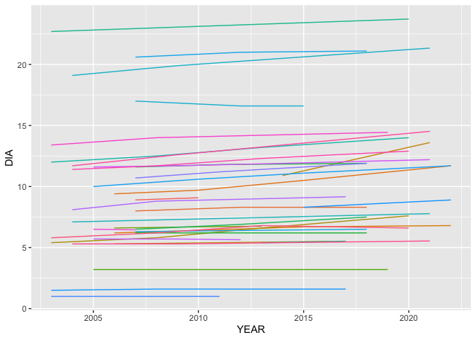
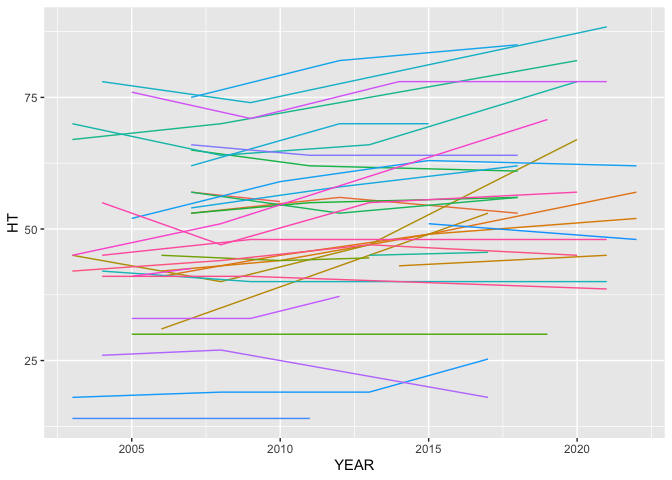
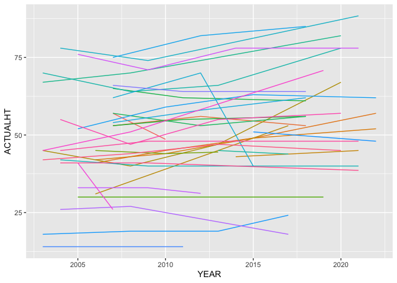

# Calculating Annualized Carbon Estimates
Eric Scott

- [Read in data](#read-in-data)
- [Initial Wrangling](#initial-wrangling)
  - [Tree table](#tree-table)
    - [Chain by joins](#chain-by-joins)
  - [Plot table](#plot-table)
  - [Cond table](#cond-table)
- [Annualizing](#annualizing)
  - [Toy Example](#toy-example)
  - [Actual data](#actual-data)
  - [Visualize results](#visualize-results)
- [Carbon estimation](#carbon-estimation)
  - [NSVB vars table](#nsvb-vars-table)
  - [Join to annualized data](#join-to-annualized-data)

``` r
library(readr)
library(dplyr)
library(tidyr)
library(here)
```

I’m going to try to work through a small sample of data to figure out
how the code in forestTIME-builder works

# Read in data

I’ll use RI as an example. Some of the columns get auto-detected as the
wrong type (e.g. CN should be character, not numeric, even though it
looks like a number). I got these column types from the Green Book and
recorded them in a list in `scripts/create_column_types.R`.

``` r
tree_raw <- read_csv(
  here("data/rawdat/state/RI_TREE.csv"),
  col_types = cols(
    CN = col_character(),
    PLT_CN = col_character(),
    PREV_TRE_CN = col_character(),
    DAMTYP1 = col_integer(),
    DAMSEV1 = col_integer(),
    DAMTYP2 = col_integer(),
    DAMSEV2 = col_integer(),
    ACTUALHT = col_double(),
    HT = col_double(),
    DIA = col_double(),
    MORTYR = col_double(),
    INVYR = col_double()
  )
)

plot_raw <- read_csv(
  here("data/rawdat/state/RI_PLOT.csv"),
  col_types = cols(
    CN = col_character()
  )
)

plotgeom_raw <- read_csv(
  here("data/rawdat/state/RI_PLOTGEOM.csv"),
  col_types = cols(
    CN = col_character()
  )
)

#needed later
cond_raw <- read_csv(
  here("data/rawdat/state/RI_COND.csv"),
  col_types = cols(
    CN = col_character(),
    PLT_CN = col_character(),
    NBR_LIVE_STEMS = col_integer(),
    LAND_COVER_CLASS_CD_RET = col_integer(),
    TRTYR2 = col_integer(),
    DSTRBYR2 = col_integer()
  )
)
```

# Initial Wrangling

## Tree table

Tree table gets filtered to only year 2000 and onward, the `CN` column
is renamed to be more specific, and composite IDs are created that
should be universally unique (not just unique within the plot or state)

``` r
tree <- tree_raw |> 
  filter(INVYR >= 2000.0) |> 
  rename(TREE_CN = CN) |> 
  mutate(
    PLOT_COMPOSITE_ID = paste(STATECD, UNITCD, COUNTYCD, PLOT, sep = "_"),
    TREE_COMPOSITE_ID = paste(STATECD, UNITCD, COUNTYCD, PLOT, SUBP, TREE, sep = "_"),
    .before = 1
  )
```

It is my understanding that the `TREE_COMPOSITE_ID` is now consistent
through time as well since the combination of state, unit, county, plot,
sub-plot, and tree number are unique for each tree and the same every
inventory. But if that’s try, what does the `chain_by_joins()` function
do??

### Chain by joins

> [!IMPORTANT]
>
> ### Question
>
> It looks like `chain_by_joins()` adds a `TREE_FIRST_CN` column that
> connects every observation to the first `CN` a tree was given. Is this
> column needed? Or is `TREE_COMPOSITE_ID` enough?

## Plot table

I need to join one column from the PLOTGEOM table (`ECOSUBCD`) that is
needed for the carbon estimation code (it used to be in the PLOT table
in older versions of FIADB)

We also do similar filtering and renaming as in the tree table

``` r
#only care about keys and the ECOSUBCD column
plotgeom <- plotgeom_raw |> select(CN, INVYR, ECOSUBCD)
plot <- left_join(plot_raw,
                  plotgeom,
                  by = join_by(CN, INVYR)) |>
  filter(INVYR >= 2000.0) |>
  rename(PLT_CN = CN) |>
  mutate(
    PLOT_COMPOSITE_ID = paste(STATECD, UNITCD, COUNTYCD, PLOT, sep = "_"),
    .before = 1
  )
```

## Cond table

Needed later on for carbon estimation

``` r
cond <-
  cond_raw |>
  filter(INVYR >= 2000.0) |>
  rename(COND_CN = CN) |>
  mutate(
    PLOT_COMPOSITE_ID = paste(STATECD, UNITCD, COUNTYCD, PLOT, sep = "_"),
    .before = 1
  )
```

# Annualizing

I’m skipping some steps in `create_all_tables.R`, but I don’t think
they’re all necessary. This section would replace what goes on in
`add_tree_annualized_to_db.R`, which I think is probably overly
complicated and has the issue of not working when a tree goes “missing”
for a survey.

First, `ACTUALHT` and `HT` get coalesced. If I remember correctly,
`ACTUALHT` only applies when a tree is broken, and we want to use that
value for carbon estimation if it exists.

``` r
tree <- 
  tree |> 
  mutate(ACTUALHT = coalesce(ACTUALHT, HT)) |> 
  select(ACTUALHT, HT, everything())
```

Maybe I’m not understanding something that the code needs to do, but I
think we can just \~~use the built-in R function for linear
interpolation, `approx()`.

Let’s try an example

### Toy Example

``` r
df <- tibble::tribble(
  ~TREE_COMPOSITE_ID, ~YEAR, ~HT, ~STATUSCD,
  1, 2000, 20, 1,
  1, 2005, 30, 1,
  1, 2010, 37, 1,
  1, 2015, 45, 2,
  2, 2000, 5, 1,
  2, 2005, NA, NA,
  2, 2010, NA, NA,
  2, 2015, 20, 1,
  2, 2020, 32, 1,
  3, 2000, NA, 2,
  4, 2000, 10, 1,
  4, 2005, 14, 1,
  4, 2010, NA, 2
)
```

There are two trees each measured every 5 years. Tree 1 was measured in
4 surveys, the last of which it was dead. Tree 2 was missing for two
surveys, and then found again still alive. Tree 3 was only recorded once
and it was already dead in the first survey.

First we need to expand it to include all years between surveys.

``` r
all_yrs <-
  df |>
  group_by(TREE_COMPOSITE_ID) |>
  expand(YEAR = full_seq(YEAR, 1))

df_all_yrs <- right_join(df, all_yrs) |> arrange(TREE_COMPOSITE_ID, YEAR)
```

    Joining with `by = join_by(TREE_COMPOSITE_ID, YEAR)`

``` r
df_all_yrs
```

    # A tibble: 49 × 4
       TREE_COMPOSITE_ID  YEAR    HT STATUSCD
                   <dbl> <dbl> <dbl>    <dbl>
     1                 1  2000    20        1
     2                 1  2001    NA       NA
     3                 1  2002    NA       NA
     4                 1  2003    NA       NA
     5                 1  2004    NA       NA
     6                 1  2005    30        1
     7                 1  2006    NA       NA
     8                 1  2007    NA       NA
     9                 1  2008    NA       NA
    10                 1  2009    NA       NA
    # ℹ 39 more rows

Then, I think we just need to use `approx()` in a `mutate()` call, but
let’s make a “friendlier” version that returns a vector and does nothing
when it can’t interpolate (i.e. it needs at least 2 non-`NA` values to
interpolate).

We also want linear *extrapolation* of trailing `NA`s in the case that a
“mort tree” (tree first recorded dead) has no observations for `DIA` or
`HT`. That is accomplished with `Hmisc::approxExtrap()`, but needs a
continuous set of numbers created by `approx()` to start with.

``` r
inter_extra_polate <- function(x, y) {
  if (sum(!is.na(y)) < 2){
    return(y)
  } else {
    #first interpolate
    interpolated <- approx(x, y, xout = x)$y
  }
  #then extrapolate trailing NAs if needed
  if (all(!is.na(interpolated))) {
    return(interpolated)
  } else {
    extrapolated <- 
      Hmisc::approxExtrap(
        x = x[!is.na(interpolated)],
        y = interpolated[!is.na(interpolated)],
        xout = x[is.na(interpolated)]
      )$y
    return(c(interpolated[!is.na(interpolated)], extrapolated))
  }
}
```

``` r
df_interpolated <- df_all_yrs |> 
  group_by(TREE_COMPOSITE_ID) |> 
  mutate(HT_interpolated = inter_extra_polate(x = YEAR, y = HT))
df_interpolated
```

    # A tibble: 49 × 5
    # Groups:   TREE_COMPOSITE_ID [4]
       TREE_COMPOSITE_ID  YEAR    HT STATUSCD HT_interpolated
                   <dbl> <dbl> <dbl>    <dbl>           <dbl>
     1                 1  2000    20        1            20  
     2                 1  2001    NA       NA            22  
     3                 1  2002    NA       NA            24  
     4                 1  2003    NA       NA            26  
     5                 1  2004    NA       NA            28  
     6                 1  2005    30        1            30  
     7                 1  2006    NA       NA            31.4
     8                 1  2007    NA       NA            32.8
     9                 1  2008    NA       NA            34.2
    10                 1  2009    NA       NA            35.6
    # ℹ 39 more rows

Yeah, that seems to have done it! Then we can just cut off any dead
trees at the estimated mortality year.

``` r
df_interpolated <- 
  df_interpolated |> 
  group_by(TREE_COMPOSITE_ID) |> #for each tree...
  #figure out when it was last recorded alive and first recorded dead
  mutate(
    last_live = YEAR[max(which(STATUSCD == 1))],
    first_dead = YEAR[min(which(STATUSCD == 2))]
  ) |> 
  #estimate the mortality year as the midpoint between surveys
  mutate(
    dead_yr = ceiling(mean(c(last_live, first_dead))),
    last_yr = if_else(!is.na(dead_yr), dead_yr, max(YEAR))
  ) |> 
  #remove estimates after death
  filter(YEAR <= last_yr) |> 
  select(-last_live, -first_dead, -dead_yr, -last_yr)
```

    Warning: There were 2 warnings in `mutate()`.
    The first warning was:
    ℹ In argument: `last_live = YEAR[max(which(STATUSCD == 1))]`.
    ℹ In group 3: `TREE_COMPOSITE_ID = 3`.
    Caused by warning in `max()`:
    ! no non-missing arguments to max; returning -Inf
    ℹ Run `dplyr::last_dplyr_warnings()` to see the 1 remaining warning.

``` r
library(ggplot2)
ggplot(df_interpolated, aes(x = YEAR)) +
  geom_point(aes(y = HT)) +
  geom_line(aes(y = HT_interpolated)) +
  facet_wrap(vars(TREE_COMPOSITE_ID))
```

    Warning: Removed 37 rows containing missing values or values outside the scale range
    (`geom_point()`).

    `geom_line()`: Each group consists of only one observation.
    ℹ Do you need to adjust the group aesthetic?


### Actual data

It *might* be trickier to do with the real data? There are some trees in
the `tree` table that were dead on their first survey and don’t have any
height or diameter measurements. We should get rid of these.

``` r
tree <- tree |> 
  group_by(TREE_COMPOSITE_ID) |> 
  filter(!(all(is.na(DIA)) |
             all(is.na(ACTUALHT)) |
             all(is.na(HT)) |
             all(STATUSCD != 1)))
```

I *think* only `ACTUALHT` and `DIA` need interpolation? We should be
able to get rid of most everything in the `tree` table when creating
annualized measures. If users need the per-tree data, they can join back
with the `tree` table by TREE_COMPOSITE_ID.

First, expand to include all years

``` r
all_yrs <- tree |> 
  group_by(TREE_COMPOSITE_ID) |>
  expand(YEAR = full_seq(INVYR, 1))

tree_annual <- 
  right_join(
    tree |> select(TREE_COMPOSITE_ID, INVYR, ACTUALHT, HT, DIA, STATUSCD, MORTYR),
    all_yrs,
    by = join_by(TREE_COMPOSITE_ID, INVYR == YEAR)
  ) |>
  arrange(TREE_COMPOSITE_ID, INVYR) |> 
  rename(YEAR = INVYR)
tree_annual
```

    # A tibble: 49,578 × 7
    # Groups:   TREE_COMPOSITE_ID [4,798]
       TREE_COMPOSITE_ID  YEAR ACTUALHT    HT   DIA STATUSCD MORTYR
       <chr>             <dbl>    <dbl> <dbl> <dbl>    <dbl>  <dbl>
     1 44_1_1_228_1_1     2004       30    30   5.9        1     NA
     2 44_1_1_228_1_1     2005       NA    NA  NA         NA     NA
     3 44_1_1_228_1_1     2006       NA    NA  NA         NA     NA
     4 44_1_1_228_1_1     2007       NA    NA  NA         NA     NA
     5 44_1_1_228_1_1     2008       35    35   6.4        1     NA
     6 44_1_1_228_1_1     2009       NA    NA  NA         NA     NA
     7 44_1_1_228_1_1     2010       NA    NA  NA         NA     NA
     8 44_1_1_228_1_1     2011       NA    NA  NA         NA     NA
     9 44_1_1_228_1_1     2012       NA    NA  NA         NA     NA
    10 44_1_1_228_1_1     2013       35    35   6.8        1     NA
    # ℹ 49,568 more rows

Then interpolate with our custom `approx()` wrapper function,
`interpolate()`

``` r
tree_interpolated <- 
  tree_annual |> 
  group_by(TREE_COMPOSITE_ID) |> 
  mutate(
    ACTUALHT = inter_extra_polate(x = YEAR, y = ACTUALHT),
    DIA = inter_extra_polate(x = YEAR, y = DIA),
    HT = inter_extra_polate(x = YEAR, y = HT)
  )
tree_interpolated
```

    # A tibble: 49,578 × 7
    # Groups:   TREE_COMPOSITE_ID [4,798]
       TREE_COMPOSITE_ID  YEAR ACTUALHT    HT   DIA STATUSCD MORTYR
       <chr>             <dbl>    <dbl> <dbl> <dbl>    <dbl>  <dbl>
     1 44_1_1_228_1_1     2004     30    30    5.9         1     NA
     2 44_1_1_228_1_1     2005     31.2  31.2  6.02       NA     NA
     3 44_1_1_228_1_1     2006     32.5  32.5  6.15       NA     NA
     4 44_1_1_228_1_1     2007     33.8  33.8  6.28       NA     NA
     5 44_1_1_228_1_1     2008     35    35    6.4         1     NA
     6 44_1_1_228_1_1     2009     35    35    6.48       NA     NA
     7 44_1_1_228_1_1     2010     35    35    6.56       NA     NA
     8 44_1_1_228_1_1     2011     35    35    6.64       NA     NA
     9 44_1_1_228_1_1     2012     35    35    6.72       NA     NA
    10 44_1_1_228_1_1     2013     35    35    6.8         1     NA
    # ℹ 49,568 more rows

Then we need to determine the year trees died.

``` r
#NOTE: some of these `if_else()` could be replaced with `coalesce()`, but `if_else()` might be more explicit and readable

tree_annualized <- 
  tree_interpolated |> 
  group_by(TREE_COMPOSITE_ID) |> #for each tree...
  #figure out when it was last recorded alive and first recorded dead
  mutate(
    last_live = YEAR[max(which(STATUSCD == 1))],
    first_dead = YEAR[min(which(STATUSCD == 2))]
  ) |> 
  #estimate the mortality year as the midpoint between surveys
  mutate(
    dead_yr = ceiling(mean(c(last_live, first_dead))),
    #if dead_yr is NA still (because it was never alive and mean(c(NA, first_dead)) is NA), then just use the first_dead year
    dead_yr = if_else(is.na(dead_yr), first_dead, dead_yr),
    last_yr = if_else(!is.na(dead_yr), dead_yr, max(YEAR))
  ) |> 
  #use MORTYR data if it exists
  mutate(
    last_yr = if_else(!is.na(MORTYR), MORTYR, last_yr)
  ) |> 
  #remove any rows after estimated death year
  filter(YEAR <= last_yr) |> 
  #clean up temporary columns
  select(-last_live, -first_dead, -dead_yr, -last_yr) |> 
  #I think we also don't need MORTYR and STATUSCD.  If users want those, they could join to the tree table, but they don't make sense in this annualized table
  select(-MORTYR, -STATUSCD)
```

    Warning: There were 4113 warnings in `mutate()`.
    The first warning was:
    ℹ In argument: `first_dead = YEAR[min(which(STATUSCD == 2))]`.
    ℹ In group 1: `TREE_COMPOSITE_ID = "44_1_1_228_1_1"`.
    Caused by warning in `min()`:
    ! no non-missing arguments to min; returning Inf
    ℹ Run `dplyr::last_dplyr_warnings()` to see the 4112 remaining warnings.

There are some trees where interpolation fails. I suspect they are all
ones with only one non-NA measurement and there is nothing we can do.

``` r
failed_to_interpolate <- 
  tree_annualized |> 
  filter(any(is.na(DIA))) |>
  pull(TREE_COMPOSITE_ID) |>
  unique()
tree |> 
  group_by(TREE_COMPOSITE_ID) |> 
  filter(!all(STATUSCD != 1)) |> 
  filter(TREE_COMPOSITE_ID %in% failed_to_interpolate) |>
  arrange(TREE_COMPOSITE_ID, INVYR) |> 
  select(TREE_COMPOSITE_ID, INVYR, STATUSCD, DIA, ACTUALHT, everything())
```

    # A tibble: 1,656 × 198
    # Groups:   TREE_COMPOSITE_ID [828]
       TREE_COMPOSITE_ID INVYR STATUSCD   DIA ACTUALHT    HT PLOT_COMPOSITE_ID
       <chr>             <dbl>    <dbl> <dbl>    <dbl> <dbl> <chr>            
     1 44_1_1_228_4_7     2004        1   3.2       30    30 44_1_1_228       
     2 44_1_1_228_4_7     2008        2  NA         NA    NA 44_1_1_228       
     3 44_1_1_277_2_1     2007        1   2         17    17 44_1_1_277       
     4 44_1_1_277_2_1     2012        2  NA         NA    NA 44_1_1_277       
     5 44_1_1_91_2_13     2007        1   9.9       51    51 44_1_1_91        
     6 44_1_1_91_2_13     2012        2  NA         NA    NA 44_1_1_91        
     7 44_1_1_91_3_6      2007        1   1.4       17    17 44_1_1_91        
     8 44_1_1_91_3_6      2012        2  NA         NA    NA 44_1_1_91        
     9 44_1_3_111_1_23    2004        1   4.2       36    36 44_1_3_111       
    10 44_1_3_111_1_23    2008        2  NA         NA    NA 44_1_3_111       
    # ℹ 1,646 more rows
    # ℹ 191 more variables: TREE_CN <chr>, PLT_CN <chr>, PREV_TRE_CN <chr>,
    #   STATECD <dbl>, UNITCD <dbl>, COUNTYCD <dbl>, PLOT <dbl>, SUBP <dbl>,
    #   TREE <dbl>, CONDID <dbl>, PREVCOND <dbl>, SPCD <dbl>, SPGRPCD <dbl>,
    #   DIAHTCD <dbl>, HTCD <dbl>, TREECLCD <dbl>, CR <dbl>, CCLCD <dbl>,
    #   TREEGRCD <dbl>, AGENTCD <dbl>, CULL <dbl>, DAMLOC1 <dbl>, DAMTYP1 <int>,
    #   DAMSEV1 <int>, DAMLOC2 <dbl>, DAMTYP2 <int>, DAMSEV2 <int>, …

``` r
tree_annualized
```

    # A tibble: 46,751 × 5
    # Groups:   TREE_COMPOSITE_ID [4,798]
       TREE_COMPOSITE_ID  YEAR ACTUALHT    HT   DIA
       <chr>             <dbl>    <dbl> <dbl> <dbl>
     1 44_1_1_228_1_1     2004     30    30    5.9 
     2 44_1_1_228_1_1     2005     31.2  31.2  6.02
     3 44_1_1_228_1_1     2006     32.5  32.5  6.15
     4 44_1_1_228_1_1     2007     33.8  33.8  6.28
     5 44_1_1_228_1_1     2008     35    35    6.4 
     6 44_1_1_228_1_1     2009     35    35    6.48
     7 44_1_1_228_1_1     2010     35    35    6.56
     8 44_1_1_228_1_1     2011     35    35    6.64
     9 44_1_1_228_1_1     2012     35    35    6.72
    10 44_1_1_228_1_1     2013     35    35    6.8 
    # ℹ 46,741 more rows

### Visualize results

Let’s take a sample of trees and visualize them.

``` r
set.seed(123)
tree_sample <- tree |> pull(TREE_COMPOSITE_ID) |> unique() |> sample(50)
tree_annualized |> filter(TREE_COMPOSITE_ID %in% tree_sample) |> 
  ggplot(aes(x = YEAR, y = DIA, color = TREE_COMPOSITE_ID)) +
  geom_line(show.legend = FALSE)
```

    Warning: Removed 31 rows containing missing values or values outside the scale range
    (`geom_line()`).



``` r
tree_annualized |> filter(TREE_COMPOSITE_ID %in% tree_sample) |> 
  ggplot(aes(x = YEAR, y = HT, color = TREE_COMPOSITE_ID)) +
  geom_line(show.legend = FALSE)
```

    Warning: Removed 31 rows containing missing values or values outside the scale range
    (`geom_line()`).



``` r
tree_annualized |> filter(TREE_COMPOSITE_ID %in% tree_sample) |> 
  ggplot(aes(x = YEAR, y = ACTUALHT, color = TREE_COMPOSITE_ID)) +
  geom_line(show.legend = FALSE)
```

    Warning: Removed 31 rows containing missing values or values outside the scale range
    (`geom_line()`).



Cool! But this makes me wonder if we should really interpolate ACTUALHT
linearly. Trees don’t break a little bit at a time!

# Carbon estimation

Here’s where we use the functions in `carbon_code/` to estimate carbon
and AGB. I think this will involve a lot of joining—first to the `tree`
table to get the species code, then to some reference tables to get info
about each species (e.g. hardwood vs. softwood), then to some other
variables?? Then all this gets plugged into some functions??

I’ll be trying to replicate the code in `R/add_nsvb_inputs_to_db.R` and
then `R/add_carbon_variables_mortyr.R`

## NSVB vars table

> [!IMPORTANT]
>
> ### Question
>
> Why not add these variables directly to the annualized tree table
> rather than joining later by `TRE_CN`?

Each `PLOT_COMPOSITE_ID` corresponds to multiple `PLOT_CN`—each year has
a different `PLT_CN`. Maybe the plot-level variables change from year to
year, so we need to join by `PLT_CN`?

``` r
nsvb_vars <- tree |>
    select(
      TREE_COMPOSITE_ID,
      PLOT_COMPOSITE_ID,
      PLT_CN,
      STATUSCD,
      ##Don't we want to use the interpolated version in tree_annualized?
      # DIA,      
      # HT,       
      # ACTUALHT, 
      ###
      CONDID,
      SPCD,
      TREECLCD,
      CULL,
      VOLCFGRS,
      ## Don't we want to estimate this from the interpolated values?
      # DRYBIO_AG, 
      # CARBON_AG, 
      ###
      STANDING_DEAD_CD,
      DECAYCD,
      CR
    )
```

> [!IMPORTANT]
>
> ### Question
>
> Why does the code fill in `NA`s in the `CULL` column with `0`s?

``` r
nsvb_vars <- nsvb_vars |> 
  mutate(CULL = ifelse(is.na(CULL), 0, CULL))
```

Then we join to the plot table to get the ECOSUBCD column

``` r
#just confirming that each PLOT_CN only has one ECOSUBCD
# plot |>
#   group_by(PLT_CN) |> summarize(n = length(unique(ECOSUBCD))) |> filter(n!=1)

plot_ecosubcds <- plot |> 
  group_by(PLT_CN) |> 
  summarize(ECOSUBCD = first(ECOSUBCD))

nsvb_vars <- left_join(nsvb_vars, plot_ecosubcds, by = join_by(PLT_CN))
```

Then we need the following columns from the `cond` table: `CONDID`,
`STDORGCD`, `COND_STATUS_CD.`

``` r
nsvb_vars <- left_join(nsvb_vars, 
          cond |> select(PLT_CN, CONDID, STDORGCD, COND_STATUS_CD),
          by = join_by(PLT_CN, CONDID))
```

Now we join in some columns from reference tables.

``` r
ref_species <- read_csv(here("data/rawdat/REF_SPECIES.csv"))
```

    Rows: 2697 Columns: 41
    ── Column specification ────────────────────────────────────────────────────────
    Delimiter: ","
    chr  (11): COMMON_NAME, SHARED_COMMON_NAME_IND, GENUS, SPECIES, VARIETY, SUB...
    dbl  (28): SPCD, E_SPGRPCD, W_SPGRPCD, C_SPGRPCD, P_SPGRPCD, MAJOR_SPGRPCD, ...
    dttm  (2): CREATED_DATE, MODIFIED_DATE

    ℹ Use `spec()` to retrieve the full column specification for this data.
    ℹ Specify the column types or set `show_col_types = FALSE` to quiet this message.

``` r
ref_tree_carbon_ratio_dead <- 
  read_csv(here("data/rawdat/REF_TREE_CARBON_RATIO_DEAD.csv"))
```

    Rows: 10 Columns: 4
    ── Column specification ────────────────────────────────────────────────────────
    Delimiter: ","
    chr (1): SFTWD_HRDWD
    dbl (3): CN, DECAYCD, CARBON_RATIO

    ℹ Use `spec()` to retrieve the full column specification for this data.
    ℹ Specify the column types or set `show_col_types = FALSE` to quiet this message.

``` r
ref_tree_decay_prop <- read_csv(here("data/rawdat/REF_TREE_DECAY_PROP.csv"))
```

    Rows: 10 Columns: 6
    ── Column specification ────────────────────────────────────────────────────────
    Delimiter: ","
    chr (1): SFTWD_HRDWD
    dbl (5): CN, DECAYCD, DENSITY_PROP, BARK_LOSS_PROP, BRANCH_LOSS_PROP

    ℹ Use `spec()` to retrieve the full column specification for this data.
    ℹ Specify the column types or set `show_col_types = FALSE` to quiet this message.

> [!IMPORTANT]
>
> ### Question
>
> Why is `WOOD_SPGR_GREENVOL_DRWT` renamed to `WDSG` here? Is that one
> of the inputs to the carbon estimation functions?

``` r
nsvb_vars <- nsvb_vars |> 
  left_join(
    ref_species |>
      select(
        SPCD,
        JENKINS_SPGRPCD,
        SFTWD_HRDWD,
        WOOD_SPGR_GREENVOL_DRYWT,
        CARBON_RATIO_LIVE
      ) |>
      rename(WDSG = WOOD_SPGR_GREENVOL_DRYWT), 
    by = join_by(SPCD)
  )
```

> [!IMPORTANT]
>
> ### Question
>
> I’m not sure what’s going on here, but it *looks* like the code
> creates a new column called `CULL_DECAY_RATIO` using the
> `DENSITY_PROP` column for `DECAYCD` 3. Then later it looks like this
> is overwritten if the tree is NOT alive (`STATUSCD!=1`) to be 1. There
> are no notes in the code (either Renata’s or David Walker’s)
> indicating why this is done. `DECAYCD` 3:
>
> > Only limb stubs exist; the top is broken; a variable amount of bark
> > remains; sapwood is sloughing; heartwood has advanced decay in upper
> > bole and is beginning at the base.

``` r
nsvb_vars |> ungroup() |> count(DECAYCD)
```

    # A tibble: 6 × 2
      DECAYCD     n
        <dbl> <int>
    1       1   122
    2       2   141
    3       3   170
    4       4    53
    5       5     5
    6      NA 12476

``` r
nsvb_vars <- 
  nsvb_vars |> 
  ungroup() |> 
  #first joins by SFTWD_HRDWD only the DENSITY_PROP column for DECAYCD 3, but calls it CULL_DECAY_RATIO
  left_join(
    ref_tree_decay_prop |>
      filter(DECAYCD == 3) |>
      select(
        SFTWD_HRDWD,
        CULL_DECAY_RATIO = DENSITY_PROP
      ),
    by = join_by(SFTWD_HRDWD) 
  ) |> 
  #then joins additional columns (including DENSITY_PROP) based on DECAYCD and SFTWD_HRDWD
  left_join(
    ref_tree_decay_prop |>
      select(SFTWD_HRDWD,
             DECAYCD,
             DENSITY_PROP,
             BARK_LOSS_PROP,
             BRANCH_LOSS_PROP),
    by = join_by(DECAYCD, SFTWD_HRDWD)
  ) |> 
  #then join to the carbon ratio table to get CARBON_RATIO
  left_join(
    ref_tree_carbon_ratio_dead |>
      select(SFTWD_HRDWD, DECAYCD, CARBON_RATIO),
    by = join_by(DECAYCD, SFTWD_HRDWD)
  ) 
```

What happened with all the rows that had `NA` for `DECAYCD`?

``` r
nsvb_vars |> 
  filter(is.na(DECAYCD)) |> 
  select(CARBON_RATIO, DENSITY_PROP, BARK_LOSS_PROP, BRANCH_LOSS_PROP, STATUSCD, CULL_DECAY_RATIO, everything())
```

    # A tibble: 12,476 × 24
       CARBON_RATIO DENSITY_PROP BARK_LOSS_PROP BRANCH_LOSS_PROP STATUSCD
              <dbl>        <dbl>          <dbl>            <dbl>    <dbl>
     1           NA           NA             NA               NA        1
     2           NA           NA             NA               NA        1
     3           NA           NA             NA               NA        1
     4           NA           NA             NA               NA        1
     5           NA           NA             NA               NA        1
     6           NA           NA             NA               NA        1
     7           NA           NA             NA               NA        1
     8           NA           NA             NA               NA        1
     9           NA           NA             NA               NA        1
    10           NA           NA             NA               NA        1
    # ℹ 12,466 more rows
    # ℹ 19 more variables: CULL_DECAY_RATIO <dbl>, TREE_COMPOSITE_ID <chr>,
    #   PLOT_COMPOSITE_ID <chr>, PLT_CN <chr>, CONDID <dbl>, SPCD <dbl>,
    #   TREECLCD <dbl>, CULL <dbl>, VOLCFGRS <dbl>, STANDING_DEAD_CD <dbl>,
    #   DECAYCD <dbl>, CR <dbl>, ECOSUBCD <chr>, STDORGCD <dbl>,
    #   COND_STATUS_CD <dbl>, JENKINS_SPGRPCD <dbl>, SFTWD_HRDWD <chr>, WDSG <dbl>,
    #   CARBON_RATIO_LIVE <dbl>

All those joined variables are also `NA`. Seems like maybe it doesn’t
matter though because they will be filled in later on if `STATUSCD==1` .

> [!IMPORTANT]
>
> ### Question
>
> Why does `CULL_DECAY_RATIO` get set to 1 for trees that are dead? I
> think maybe the `CULL_DECAY_RATIO` variable is just poorly named. It
> comes from a value for `DENSITY_PROP` which is:
>
> > Density proportion. The proportion of the tree remaining after
> > deductions for decay
>
> So, a dead tree should be 100% decay. (But why are live trees not 0%
> decay or just use their `DECAYCD` appropriate value for
> `CULL_DECAY_RATIO` ???)

Create more variables needed for carbon estimation

``` r
nsvb_vars <- 
  nsvb_vars |>
  mutate(
    CULL_DECAY_RATIO = if_else(STATUSCD == 1, CULL_DECAY_RATIO, 1),
    STANDING_DEAD_CD = if_else(STATUSCD == 1, 0, STANDING_DEAD_CD),
    # TODO: why is this important?  Why not just use NA?
    DECAYCD = if_else(STATUSCD == 1, 0, DECAYCD),
    # TODO: why are these variables created?
    DECAY_WD = if_else(STATUSCD == 1, 1, DENSITY_PROP),
    DECAY_BK = if_else(STATUSCD == 1, 1, BARK_LOSS_PROP),
    DECAY_BR = if_else(STATUSCD == 1, 1, BRANCH_LOSS_PROP),
    #TODO: why is this called C_FRAC if it is a percentage?
    C_FRAC = if_else(STATUSCD == 1,
                     CARBON_RATIO_LIVE * 100,
                     CARBON_RATIO * 100),
    # the & here is && in renata's code, which shouldn't work but does for reasons I don't understand
    DEAD_AND_STANDING = STATUSCD == 2 & STANDING_DEAD_CD == 1,
    LIVE = STATUSCD == 1
  )
```

Filtering

> [!IMPORTANT]
>
> ### Question
>
> Why do we filter to exclude trees that are not alive or dead and
> standing? Why only include `COND_STATUS_CD` 1 (accessible forest
> land)? This removes 1,627 rows for RI

``` r
nsvb_vars <- nsvb_vars |> 
      filter(COND_STATUS_CD == 1, DEAD_AND_STANDING | LIVE)
```

Clean up unused columns.

``` r
nsvb_vars <- nsvb_vars |> 
  # rename(TRE_CN = TREE_CN) |> #still not sure we need this or why it is renamed
  select(
    -CONDID,
    -COND_STATUS_CD,
    -CARBON_RATIO_LIVE,
    -CARBON_RATIO,
    -DENSITY_PROP,
    -BARK_LOSS_PROP,
    -BRANCH_LOSS_PROP,
    -DEAD_AND_STANDING,
    -LIVE
  ) 
```

## Join to annualized data

I think maybe I did need `TRE_CN` or `TREE_CN` because some of these
NSVB variables might change year to year such as `DECAYCD`. So, the
interpolated data and the NSVB vars need to have a `TRE_CN` column to
join on.
