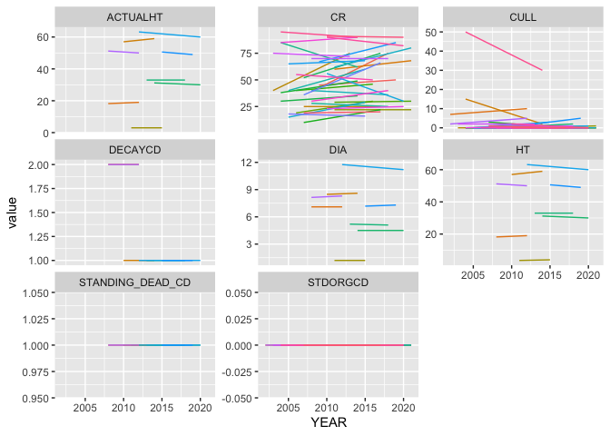

# Calculating Annualized Carbon Estimates
Eric Scott

- [Read in data](#read-in-data)
- [Initial Wrangling](#initial-wrangling)
  - [Tree table](#tree-table)
  - [Plot table](#plot-table)
  - [Cond table](#cond-table)
- [Annualizing](#annualizing)
  - [Toy Example](#toy-example)
  - [Actual data](#actual-data)
  - [Mortality](#mortality)
  - [Visualize results](#visualize-results)
- [Carbon estimation](#carbon-estimation)

``` r
library(readr)
library(dplyr)
library(tidyr)
library(here)
library(purrr)
library(ggplot2)
```

I’m going to try to work through a small sample of data to figure out
how the code in forestTIME-builder works

# Read in data

I’ll use ~~RI~~ CO as an example, but only a sample of 10,000 trees.
Some of the columns get auto-detected as the wrong type (e.g. CN should
be character, not numeric, even though it looks like a number). I got
these column types from the Green Book and recorded them in a list in
`scripts/create_column_types.R`. The list is designed for duckdb
functions, so here I convert them to a form that works with `readr`.

``` r
col_types <- read_rds(here("data/rawdat/table_types.rds"))
col_types_readr <- col_types |> 
  map(\(v) { #for every vector element of col_types...
    as.list(v) |> #convert to list
      #then modify to replace with readr col_*() column specification functions
      modify_at(which(v == "STRING"), \(x) col_character()) |> 
      modify_at(which(v == "INTEGER"), \(x) col_integer()) |> 
      modify_at(which(v == "DOUBLE"), \(x) col_double())
  })
```

``` r
tree_raw <- read_csv(
  here("data/rawdat/state/CO_TREE.csv"),
  col_types = col_types_readr$tree_types
)

plot_raw <- read_csv(
  here("data/rawdat/state/CO_PLOT.csv"),
  col_types = col_types_readr$plot_types
)

plotgeom_raw <- read_csv(
  here("data/rawdat/state/CO_PLOTGEOM.csv"),
  col_types = col_types_readr$plotgeom_types
) 

#needed later
cond_raw <- read_csv(
  here("data/rawdat/state/CO_COND.csv"),
  col_types = col_types_readr$cond_types
)
```

# Initial Wrangling

## Tree table

Tree table gets filtered to only year 2000 and onward, the `CN` column
is renamed to be more specific, and composite IDs are created that
should be universally unique (not just unique within the plot or state)

``` r
tree <- tree_raw |> 
  filter(INVYR >= 2000.0) |> 
  rename(TREE_CN = CN) |> 
  mutate(
    PLOT_COMPOSITE_ID = paste(STATECD, UNITCD, COUNTYCD, PLOT, sep = "_"),
    TREE_COMPOSITE_ID = paste(STATECD, UNITCD, COUNTYCD, PLOT, SUBP, TREE, sep = "_"),
    .before = 1
  )
```

It is my understanding that the `TREE_COMPOSITE_ID` is now consistent
through time as well since the combination of state, unit, county, plot,
sub-plot, and tree number are unique for each tree and the same every
inventory.

I’ll get a sample of 10,000 trees for now.

``` r
set.seed(234)
tree_samp <- sample(unique(tree$TREE_COMPOSITE_ID), 10000)
tree <- tree |> filter(TREE_COMPOSITE_ID %in% tree_samp)
```

## Plot table

I need to join one column from the PLOTGEOM table (`ECOSUBCD`) that is
needed for the carbon estimation code (it used to be in the PLOT table
in older versions of FIADB)

We also do similar filtering and renaming as in the tree table

``` r
#only care about keys and the ECOSUBCD column
plotgeom <- plotgeom_raw |> select(CN, INVYR, ECOSUBCD)
plot <- left_join(plot_raw,
                  plotgeom,
                  by = join_by(CN, INVYR)) |>
  filter(INVYR >= 2000.0) |>
  rename(PLT_CN = CN) |>
  mutate(
    PLOT_COMPOSITE_ID = paste(STATECD, UNITCD, COUNTYCD, PLOT, sep = "_"),
    .before = 1
  )
```

## Cond table

Needed later on for carbon estimation

``` r
cond <-
  cond_raw |>
  filter(INVYR >= 2000.0) |>
  rename(COND_CN = CN) |>
  mutate(
    PLOT_COMPOSITE_ID = paste(STATECD, UNITCD, COUNTYCD, PLOT, sep = "_"),
    .before = 1
  )
```

# Annualizing

I’m skipping some steps in `create_all_tables.R`, but I don’t think
they’re all necessary. This section would replace what goes on in
`add_annual_estimates_to_db.R`, which I think is probably overly
complicated and has the issue of not working when a tree goes “missing”
for a survey.

First, `ACTUALHT` and `HT` get coalesced. If I remember correctly,
`ACTUALHT` only applies when a tree is broken, and we want to use that
value for carbon estimation if it exists.

``` r
tree <- 
  tree |> 
  mutate(ACTUALHT = coalesce(ACTUALHT, HT)) |> 
  select(ACTUALHT, HT, everything())
```

Maybe I’m not understanding something that the code needs to do, but I
think we can just use the built-in R function for linear interpolation,
`approx()`.

Let’s try an example

### Toy Example

``` r
df <- tibble::tribble(
  ~TREE_COMPOSITE_ID, ~YEAR, ~HT, ~STATUSCD, ~DECAYCD, ~MORTYR,
  1, 2000, 20, 1, NA, NA,
  1, 2005, 30, 1, NA, NA,
  1, 2010, 37, 1, NA, NA,
  1, 2015, 45, 2, 2, 2011,
  1, 2020, 33, 2, 3, NA,
  2, 2000, 5, 1, NA, NA,
  2, 2005, NA, NA, NA, NA,
  2, 2010, NA, NA, NA, NA,
  2, 2015, 20, 1, NA, NA,
  2, 2020, 32, 1, NA, NA,
  3, 2000, NA, 2, 2, NA,
  4, 2000, 10, 1, NA, NA,
  4, 2005, 14, 1, NA, NA,
  4, 2010, NA, 2, 2, NA
)
```

There are two trees each measured every 5 years. Tree 1 was measured in
4 surveys, the last of which it was dead. Tree 2 was missing for two
surveys, and then found again still alive. Tree 3 was only recorded once
and it was already dead in the first survey.

First we need to expand it to include all years between surveys.

``` r
all_yrs <-
  df |>
  group_by(TREE_COMPOSITE_ID) |>
  expand(YEAR = full_seq(YEAR, 1))

df_all_yrs <- right_join(df, all_yrs) |> arrange(TREE_COMPOSITE_ID, YEAR)
```

    Joining with `by = join_by(TREE_COMPOSITE_ID, YEAR)`

``` r
df_all_yrs
```

    # A tibble: 54 × 6
       TREE_COMPOSITE_ID  YEAR    HT STATUSCD DECAYCD MORTYR
                   <dbl> <dbl> <dbl>    <dbl>   <dbl>  <dbl>
     1                 1  2000    20        1      NA     NA
     2                 1  2001    NA       NA      NA     NA
     3                 1  2002    NA       NA      NA     NA
     4                 1  2003    NA       NA      NA     NA
     5                 1  2004    NA       NA      NA     NA
     6                 1  2005    30        1      NA     NA
     7                 1  2006    NA       NA      NA     NA
     8                 1  2007    NA       NA      NA     NA
     9                 1  2008    NA       NA      NA     NA
    10                 1  2009    NA       NA      NA     NA
    # ℹ 44 more rows

Then, I think we just need to use `approx()` in a `mutate()` call, but
let’s make a “friendlier” version that returns a vector and does nothing
when it can’t interpolate (i.e. it needs at least 2 non-`NA` values to
interpolate).

We also want linear *extrapolation* of trailing `NA`s in the case that a
“mort tree” (tree first recorded dead) has no observations for `DIA` or
`HT`. That is accomplished with `Hmisc::approxExtrap()`, but needs a
continuous set of numbers created by `approx()` to start with.

``` r
source(here("R/inter_extra_polate.R"))
source(here("R/step_interp.R"))
```

``` r
df_interpolated <- df_all_yrs |> 
  group_by(TREE_COMPOSITE_ID) |> 
  mutate(HT_interp = inter_extra_polate(x = YEAR, y = HT), .after = HT)
df_interpolated
```

    # A tibble: 54 × 7
    # Groups:   TREE_COMPOSITE_ID [4]
       TREE_COMPOSITE_ID  YEAR    HT HT_interp STATUSCD DECAYCD MORTYR
                   <dbl> <dbl> <dbl>     <dbl>    <dbl>   <dbl>  <dbl>
     1                 1  2000    20      20          1      NA     NA
     2                 1  2001    NA      22         NA      NA     NA
     3                 1  2002    NA      24         NA      NA     NA
     4                 1  2003    NA      26         NA      NA     NA
     5                 1  2004    NA      28         NA      NA     NA
     6                 1  2005    30      30          1      NA     NA
     7                 1  2006    NA      31.4       NA      NA     NA
     8                 1  2007    NA      32.8       NA      NA     NA
     9                 1  2008    NA      34.2       NA      NA     NA
    10                 1  2009    NA      35.6       NA      NA     NA
    # ℹ 44 more rows

Yeah, that seems to have done it!

Now let’s try a categorical variable like `STATUSCD` and `DECAYCD`

``` r
df_interpolated <- df_interpolated |> 
  group_by(TREE_COMPOSITE_ID) |> 
  mutate(STATUSCD_interp = step_interp(STATUSCD), .after = STATUSCD) |> 
  mutate(DECAYCD_interp = step_interp(DECAYCD), .after = DECAYCD)
df_interpolated
```

    # A tibble: 54 × 9
    # Groups:   TREE_COMPOSITE_ID [4]
       TREE_COMPOSITE_ID  YEAR    HT HT_interp STATUSCD STATUSCD_interp DECAYCD
                   <dbl> <dbl> <dbl>     <dbl>    <dbl>           <dbl>   <dbl>
     1                 1  2000    20      20          1               1      NA
     2                 1  2001    NA      22         NA               1      NA
     3                 1  2002    NA      24         NA               1      NA
     4                 1  2003    NA      26         NA               1      NA
     5                 1  2004    NA      28         NA               1      NA
     6                 1  2005    30      30          1               1      NA
     7                 1  2006    NA      31.4       NA               1      NA
     8                 1  2007    NA      32.8       NA               1      NA
     9                 1  2008    NA      34.2       NA               1      NA
    10                 1  2009    NA      35.6       NA               1      NA
    # ℹ 44 more rows
    # ℹ 2 more variables: DECAYCD_interp <dbl>, MORTYR <dbl>

But in the case of a recorded `MORTYR`, we actually want `STATUSCD` to
switch to 2 not in the midpoint

``` r
df_interpolated |> 
  group_by(TREE_COMPOSITE_ID) |> 
  mutate(
    first_dead = if_else(
      condition = any(!is.na(MORTYR)), #has recorded MORTYR
      true = max(MORTYR, na.rm = TRUE),
      false = YEAR[min(which(STATUSCD == 2))]
    )
  ) |> 
  #then adjust STATUSCD & DECAYCD
  mutate(STATUSCD_interp = if_else(YEAR >= first_dead, 2, STATUSCD_interp)) |>
  #MORTYR might be earlier than the midpoint, so backfill NAs for DECAYCD
  fill(DECAYCD_interp, .direction = "up") |> 
  #But, decay only applies to dead trees
  mutate(DECAYCD_interp = if_else(STATUSCD_interp == 2, DECAYCD_interp, NA))
```

    Warning: There were 4 warnings in `mutate()`.
    The first warning was:
    ℹ In argument: `first_dead = if_else(...)`.
    ℹ In group 2: `TREE_COMPOSITE_ID = 2`.
    Caused by warning in `max()`:
    ! no non-missing arguments to max; returning -Inf
    ℹ Run `dplyr::last_dplyr_warnings()` to see the 3 remaining warnings.

    # A tibble: 54 × 10
    # Groups:   TREE_COMPOSITE_ID [4]
       TREE_COMPOSITE_ID  YEAR    HT HT_interp STATUSCD STATUSCD_interp DECAYCD
                   <dbl> <dbl> <dbl>     <dbl>    <dbl>           <dbl>   <dbl>
     1                 1  2000    20      20          1               1      NA
     2                 1  2001    NA      22         NA               1      NA
     3                 1  2002    NA      24         NA               1      NA
     4                 1  2003    NA      26         NA               1      NA
     5                 1  2004    NA      28         NA               1      NA
     6                 1  2005    30      30          1               1      NA
     7                 1  2006    NA      31.4       NA               1      NA
     8                 1  2007    NA      32.8       NA               1      NA
     9                 1  2008    NA      34.2       NA               1      NA
    10                 1  2009    NA      35.6       NA               1      NA
    # ℹ 44 more rows
    # ℹ 3 more variables: DECAYCD_interp <dbl>, MORTYR <dbl>, first_dead <dbl>

``` r
df_interpolated <- 
  df_interpolated |> 
  group_by(TREE_COMPOSITE_ID) |> #for each tree...
  #figure out when it was last recorded alive and first recorded dead
  mutate(
    last_live = YEAR[max(which(STATUSCD == 1))],
    first_dead = YEAR[min(which(STATUSCD == 2))]
  ) |> 
  #estimate the mortality year as the midpoint between surveys
  mutate(
    dead_yr = ceiling(mean(c(last_live, first_dead))),
    last_yr = if_else(!is.na(dead_yr), dead_yr, max(YEAR))
  ) |> 
  #remove estimates after death
  filter(YEAR <= last_yr) |> 
  select(-last_live, -first_dead, -dead_yr, -last_yr)
```

    Warning: There were 2 warnings in `mutate()`.
    The first warning was:
    ℹ In argument: `last_live = YEAR[max(which(STATUSCD == 1))]`.
    ℹ In group 3: `TREE_COMPOSITE_ID = 3`.
    Caused by warning in `max()`:
    ! no non-missing arguments to max; returning -Inf
    ℹ Run `dplyr::last_dplyr_warnings()` to see the 1 remaining warning.

``` r
library(ggplot2)
ggplot(df_interpolated, aes(x = YEAR)) +
  geom_point(aes(y = HT)) +
  geom_line(aes(y = HT_interp)) +
  facet_wrap(vars(TREE_COMPOSITE_ID))
```

    Warning: Removed 37 rows containing missing values or values outside the scale range
    (`geom_point()`).

    `geom_line()`: Each group consists of only one observation.
    ℹ Do you need to adjust the group aesthetic?


### Actual data

It *might* be trickier to do with the real data because:

1.  We might need to “annualize” the `TREE_CN` key, which is different
    for each inventory year for the same `TREE_COMPOSITE_ID`
2.  Some, but not many, trees have a recorded `MORTYR`, which we’d like
    to (optionally) use instead of the midpoint between surveys as an
    estimated end to that tree’s timeseries.

Renata’s code only interpolates/extrapolates `DIA`, `HT`, and `ACTUALHT`
and other variables needed for carbon estimation are added later with
joins. I’m not sure that’s the best approach, especially since some of
the other variables used (e.g. `CULL`, the precentage of rotten wood)
are continuous and could also be linearly interpolated. I’m going to try
doing the necessary joins *first* and then annualizing.

Variable used by carbon estimation code in `add_carbon_variables_*.R`:

Interpolation needed:

- `CR` - `tree` table; compacted crown ratio (interpolate)
- `DIA` - `tree` table; diameter (interpolate)
- `HT` - `tree` table; height (interpolate)
- `ACTUALHT` - `tree` table; height accounting for broken tops
  (interpolate)
- `CULL` - `tree` table; rotten and missing cull, a percentage
  (interpolate)
- `STATUSCD` - `tree` table; alive (1) or dead (2)
- `DECAYCD` - `tree` table; needed for joining to `REF_TREE_DECAY_PROP`
  (categorical). `NA` for live trees, 1-5 for dead trees
- `STANDING_DEAD_CD` - `tree` table; `NA` for live trees, 0 or 1 for
  dead trees.
- `STDORGCD` - `cond` table; stand origin code, method of stand
  regeneration for trees in the condition (2.5.25) (categorical). This
  is also `NA` sometimes, but here I think it is safe to assume that
  `NA` can be replaced with `0` (natural stands).
- `COND_STATUS_CD` - `cond` table; eventually for carbon estimation only
  trees in ‘accessible forest land’ (`COND_STATUS_CD == 1`) are kept
  (not sure why)

Invariant; join *after* interpolation:

- `CULL_DECAY_RATIO` - this is a weird one—it’s the `DENSITY_PROP` value
  from the `REF_TREE_DECAY_PROP` table when `DECAYCD = 3`. I do not know
  why, but it’s in the David Walker code like this.
- `ECOSUBCD` - `plot` table; ecological subsection code (invariant)
- `SPCD` - `REF_SPECIES` table; species code (invariant[^1])
- `SFTWD_HRDWD` - `REF_SPECIES` table; softwood or hardwood (invariant)
- `JENKINS_SPGRPCD` - `REF_SPECIES` table; species group code
  (invariant)
- `WDSG` - renamed from `WOOD_SPGR_GREENVOL_DRYWT` in `REF_SPECIES`
  table; green specific gravity of wood based on volume attributes in
  the `tree` table (invariant)
- `CARBON_RATIO_LIVE` - `REF_SPECIES` table; wood carbon fraction
  (invariant)
- `CARBON_RATIO` - `REF_TREE_CARBON_RATIO_DEAD` table; wood carbon
  fraction of dead trees (invariant)

There are some trees in the `tree` table that were dead on their first
survey and don’t have any height or diameter measurements. We should get
rid of these.

``` r
tree <- tree |> 
  group_by(TREE_COMPOSITE_ID) |> 
  filter(!(all(is.na(DIA)) |
             all(is.na(ACTUALHT)) |
             all(is.na(HT)) |
             all(STATUSCD != 1)))
```

I’ll also drop trees that change species (for now)

``` r
# drop trees with more than 1 SPCD
tree <- tree |> 
  group_by(TREE_COMPOSITE_ID) |> 
  filter(length(unique(SPCD)) == 1)
```

> [!IMPORTANT]
>
> ### Question
>
> Taking a look at trees with a recorded `MORTYR`. One obvious question
> is what to do with trees that are recorded as alive in the inventory
> that takes place in their `MORTYR`.
> https://github.com/mekevans/forestTIME-builder/issues/61
>
> ``` r
> tree |> 
>   group_by(TREE_COMPOSITE_ID) |> 
>   filter(any(!is.na(MORTYR)) & n() > 1) |> 
>   arrange(TREE_COMPOSITE_ID, INVYR) |> 
>   select(TREE_COMPOSITE_ID, INVYR, MORTYR, STATUSCD, DECAYCD, STANDING_DEAD_CD, everything())
> ```
>
>     # A tibble: 3,159 × 198
>     # Groups:   TREE_COMPOSITE_ID [1,516]
>        TREE_COMPOSITE_ID  INVYR MORTYR STATUSCD DECAYCD STANDING_DEAD_CD ACTUALHT
>        <chr>              <int>  <int>    <int>   <int>            <int>    <int>
>      1 8_1_119_84418_2_20  2010     NA        1      NA               NA        5
>      2 8_1_119_84418_2_20  2020   2013        2      NA                0       NA
>      3 8_1_119_85488_1_1   2006     NA        1      NA               NA       44
>      4 8_1_119_85488_1_1   2016   2010        3      NA               NA       NA
>      5 8_1_119_85488_2_2   2006     NA        1      NA               NA       36
>      6 8_1_119_85488_2_2   2016   2008        2       2                1       35
>      7 8_1_119_85488_4_3   2006     NA        1      NA               NA       31
>      8 8_1_119_85488_4_3   2016   2010        3      NA               NA       NA
>      9 8_1_119_85488_4_4   2006     NA        1      NA               NA       31
>     10 8_1_119_85488_4_4   2016   2010        3      NA               NA       NA
>     # ℹ 3,149 more rows
>     # ℹ 191 more variables: HT <int>, PLOT_COMPOSITE_ID <chr>, TREE_CN <chr>,
>     #   PLT_CN <chr>, PREV_TRE_CN <chr>, STATECD <int>, UNITCD <int>,
>     #   COUNTYCD <int>, PLOT <int>, SUBP <int>, TREE <int>, CONDID <int>,
>     #   PREVCOND <int>, SPCD <dbl>, SPGRPCD <int>, DIA <dbl>, DIAHTCD <int>,
>     #   HTCD <int>, TREECLCD <int>, CR <int>, CCLCD <int>, TREEGRCD <int>,
>     #   AGENTCD <int>, CULL <int>, DAMLOC1 <int>, DAMTYP1 <int>, DAMSEV1 <int>, …

Join `CONDID` from the `COND` table, assuming that an `NA` for
`STDORGCD` is equivalent to a 0

``` r
cond_cols <- cond |> 
  select(PLOT_COMPOSITE_ID, INVYR, CONDID, COND_STATUS_CD, STDORGCD) |> 
  mutate(STDORGCD = if_else(is.na(STDORGCD), 0, STDORGCD))

tree <- 
  left_join(tree, cond_cols,
            by = join_by(PLOT_COMPOSITE_ID, INVYR, CONDID))
```

#### Interpolation & Extrapolation

First, interpolate/extrapolate continuous variables

``` r
tree_to_interpolate <- tree |> 
  select(
    TREE_COMPOSITE_ID,
    PLOT_COMPOSITE_ID,
    SPCD,
    INVYR,
    DIA,
    HT,
    ACTUALHT,
    CR,
    CULL,
    STATUSCD,
    MORTYR,
    DECAYCD,
    STANDING_DEAD_CD,
    STDORGCD,
    COND_STATUS_CD
  )
```

First, expand to include all years

``` r
# this needs to include all columns that are invariant over time
#TODO this is slow and not translatable to duckdb.  Need to look again at how/if Renata did this step 
all_yrs <- tree_to_interpolate |> 
  group_by(
    TREE_COMPOSITE_ID,
    PLOT_COMPOSITE_ID, SPCD
    ) |>
  expand(YEAR = full_seq(INVYR, 1))

tree_annual <- 
  right_join(
    tree_to_interpolate,
    all_yrs,
    by = join_by(TREE_COMPOSITE_ID, PLOT_COMPOSITE_ID, SPCD, INVYR == YEAR)
  ) |>
  arrange(TREE_COMPOSITE_ID, INVYR) |> 
  rename(YEAR = INVYR)
tree_annual
```

    # A tibble: 84,089 × 15
    # Groups:   TREE_COMPOSITE_ID [8,465]
       TREE_COMPOSITE_ID PLOT_COMPOSITE_ID  SPCD  YEAR   DIA    HT ACTUALHT    CR
       <chr>             <chr>             <dbl> <dbl> <dbl> <int>    <int> <int>
     1 8_1_119_80086_1_6 8_1_119_80086       122  2002   7.7    61       61    24
     2 8_1_119_80086_1_6 8_1_119_80086       122  2003  NA      NA       NA    NA
     3 8_1_119_80086_1_6 8_1_119_80086       122  2004  NA      NA       NA    NA
     4 8_1_119_80086_1_6 8_1_119_80086       122  2005  NA      NA       NA    NA
     5 8_1_119_80086_1_6 8_1_119_80086       122  2006  NA      NA       NA    NA
     6 8_1_119_80086_1_6 8_1_119_80086       122  2007   8      64       64    30
     7 8_1_119_80086_1_6 8_1_119_80086       122  2008  NA      NA       NA    NA
     8 8_1_119_80086_1_6 8_1_119_80086       122  2009  NA      NA       NA    NA
     9 8_1_119_80086_1_6 8_1_119_80086       122  2010  NA      NA       NA    NA
    10 8_1_119_80086_1_6 8_1_119_80086       122  2011  NA      NA       NA    NA
    # ℹ 84,079 more rows
    # ℹ 7 more variables: CULL <int>, STATUSCD <int>, MORTYR <int>, DECAYCD <int>,
    #   STANDING_DEAD_CD <int>, STDORGCD <dbl>, COND_STATUS_CD <int>

Then interpolate continuous variables with our custom `approx()` wrapper
function, `inter_extra_polate()` and categorical variables with
`step_interp()`.

``` r
tree_interpolated <- 
  tree_annual |> 
  group_by(TREE_COMPOSITE_ID) |> 
  mutate(
    #linearly interpolate/extrapolate
    across(c(ACTUALHT, DIA, HT, CULL, CR),
           \(var) inter_extra_polate(x = YEAR, y = var)),
    #interpolate to switch at midpoint (rounded up)
    across(c(STATUSCD, DECAYCD, STANDING_DEAD_CD, STDORGCD, COND_STATUS_CD), 
           step_interp)
  ) |> ungroup()
tree_interpolated
```

    # A tibble: 84,089 × 15
       TREE_COMPOSITE_ID PLOT_COMPOSITE_ID  SPCD  YEAR   DIA    HT ACTUALHT    CR
       <chr>             <chr>             <dbl> <dbl> <dbl> <dbl>    <dbl> <dbl>
     1 8_1_119_80086_1_6 8_1_119_80086       122  2002  7.7   61       61    24  
     2 8_1_119_80086_1_6 8_1_119_80086       122  2003  7.76  61.6     61.6  25.2
     3 8_1_119_80086_1_6 8_1_119_80086       122  2004  7.82  62.2     62.2  26.4
     4 8_1_119_80086_1_6 8_1_119_80086       122  2005  7.88  62.8     62.8  27.6
     5 8_1_119_80086_1_6 8_1_119_80086       122  2006  7.94  63.4     63.4  28.8
     6 8_1_119_80086_1_6 8_1_119_80086       122  2007  8     64       64    30  
     7 8_1_119_80086_1_6 8_1_119_80086       122  2008  8.1   63.5     63.5  31  
     8 8_1_119_80086_1_6 8_1_119_80086       122  2009  8.2   63       63    32  
     9 8_1_119_80086_1_6 8_1_119_80086       122  2010  8.3   62.5     62.5  33  
    10 8_1_119_80086_1_6 8_1_119_80086       122  2011  8.4   62       62    34  
    # ℹ 84,079 more rows
    # ℹ 7 more variables: CULL <dbl>, STATUSCD <int>, MORTYR <int>, DECAYCD <int>,
    #   STANDING_DEAD_CD <int>, STDORGCD <dbl>, COND_STATUS_CD <int>

### Mortality

I think maybe here is where we need to deal with estimated mortality
year to correct `STATUSCD`, `DECAYCD` and `STANDING_DEAD_CD`. This is a
fork in the road, producing two possible tables after this depending on
whether `MORTYR` is used or not.

``` r
tree_interpolated_mortyr <- 
  tree_interpolated |> 
  group_by(TREE_COMPOSITE_ID) |> 
  mutate(
    #to use MORTYR
    first_dead = if_else(
      condition = any(!is.na(MORTYR)), #has recorded MORTYR
      true = max(MORTYR, na.rm = TRUE),
      false = YEAR[min(which(STATUSCD == 2))]
    )
    #otherwise
    # first_dead = YEAR[min(which(STATUSCD == 2))]
  ) |> 
  #then adjust STATUSCD & DECAYCD
  mutate(STATUSCD = if_else(YEAR >= first_dead, 2, STATUSCD)) |>
  #MORTYR might be earlier than the midpoint, so backfill NAs for DECAYCD and STANDING_DEAD_CD
  fill(DECAYCD, STANDING_DEAD_CD, .direction = "up") |> 
  #But, STANDING_DEAD_CD only applies to dead trees
  mutate(STANDING_DEAD_CD = if_else(STATUSCD == 2, STANDING_DEAD_CD, NA)) |> 
  #and DECAYCD only applies to standing dead trees > 4.9 DIA
  mutate(DECAYCD = if_else(STANDING_DEAD_CD == 1 & DIA > 4.9, DECAYCD, NA)) |> 
  #fallen trees shouldn't have measurments for DIA, HT, and ACTUALHT
  mutate(across(c(DIA, HT, ACTUALHT), \(x) if_else(STANDING_DEAD_CD == 0, NA, x)))
```

    Warning: There were 13957 warnings in `mutate()`.
    The first warning was:
    ℹ In argument: `first_dead = if_else(...)`.
    ℹ In group 1: `TREE_COMPOSITE_ID = "8_1_119_80086_1_6"`.
    Caused by warning in `max()`:
    ! no non-missing arguments to max; returning -Inf
    ℹ Run `dplyr::last_dplyr_warnings()` to see the 13956 remaining warnings.

Inspect some trees

``` r
tree_interpolated_mortyr |>
  filter(any(!is.na(MORTYR))) |>
  filter(length(unique(HT)) > 2) |>
  filter(all(c(0, 1) %in% STANDING_DEAD_CD)) |>
  arrange(TREE_COMPOSITE_ID, YEAR) |>
  select(TREE_COMPOSITE_ID, YEAR, MORTYR, first_dead, HT, STATUSCD, STANDING_DEAD_CD, DECAYCD)
```

    # A tibble: 144 × 8
    # Groups:   TREE_COMPOSITE_ID [9]
       TREE_COMPOSITE_ID  YEAR MORTYR first_dead    HT STATUSCD STANDING_DEAD_CD
       <chr>             <dbl>  <int>      <dbl> <dbl>    <dbl>            <int>
     1 8_1_19_89224_3_24  2003     NA       2007  NA          1               NA
     2 8_1_19_89224_3_24  2004     NA       2007  NA          1               NA
     3 8_1_19_89224_3_24  2005     NA       2007  NA          1               NA
     4 8_1_19_89224_3_24  2006     NA       2007  45.2        2                1
     5 8_1_19_89224_3_24  2007     NA       2007  45.6        2                1
     6 8_1_19_89224_3_24  2008   2007       2007  46          2                1
     7 8_1_19_89224_3_24  2009     NA       2007  46.4        2                1
     8 8_1_19_89224_3_24  2010     NA       2007  46.8        2                1
     9 8_1_19_89224_3_24  2011     NA       2007  47.2        2                1
    10 8_1_19_89224_3_24  2012     NA       2007  47.6        2                1
    # ℹ 134 more rows
    # ℹ 1 more variable: DECAYCD <int>

There are some trees where interpolation fails. I suspect they are all
ones with only one non-NA measurement and there is nothing we can do.

``` r
failed_to_interpolate <- 
  tree_interpolated |> 
  group_by(TREE_COMPOSITE_ID) |> 
  filter(any(is.na(DIA))) |>
  pull(TREE_COMPOSITE_ID) |>
  unique()
tree |> 
  group_by(TREE_COMPOSITE_ID) |> 
  filter(!all(STATUSCD != 1)) |> 
  filter(TREE_COMPOSITE_ID %in% failed_to_interpolate) |>
  arrange(TREE_COMPOSITE_ID, INVYR) |> 
  select(TREE_COMPOSITE_ID, INVYR, STATUSCD, DIA, ACTUALHT, everything())
```

> [!IMPORTANT]
>
> ### Question
>
> It seems pretty clear that DIA shouldn’t change after a tree’s death,
> but would HT and ACTUALHT change for a standing dead tree? Probably?
> However, we don’t want to extrapolate negative (or even 0?) values,
> and the tree shouldn’t *grow* after death, right?
>
> ``` r
> tree |> 
>   filter(any(lag(ACTUALHT) > ACTUALHT)) |> #trees that shrank
>   filter(sum(STATUSCD == 2) > 1) |> # and were recorded dead at least twice
>   select(TREE_COMPOSITE_ID, INVYR, STATUSCD, STANDING_DEAD_CD, DIA, HT, ACTUALHT) |> 
>   arrange(TREE_COMPOSITE_ID, INVYR)
> ```
>
>     # A tibble: 60 × 7
>     # Groups:   TREE_COMPOSITE_ID [20]
>        TREE_COMPOSITE_ID INVYR STATUSCD STANDING_DEAD_CD   DIA    HT ACTUALHT
>        <chr>             <int>    <int>            <int> <dbl> <int>    <int>
>      1 8_1_93_80958_4_1   2004        1               NA  10.4    26       26
>      2 8_1_93_80958_4_1   2009        2                1  10.5    22       22
>      3 8_1_93_80958_4_1   2019        2                0  NA      NA       NA
>      4 8_2_15_87731_1_16  2003        1               NA   6.2    34       34
>      5 8_2_15_87731_1_16  2008        2                1   6.3    32       32
>      6 8_2_15_87731_1_16  2018        2                1   6.2    32       32
>      7 8_2_27_88410_1_2   2004        1               NA  11      48       48
>      8 8_2_27_88410_1_2   2009        2                1  10.8    52       52
>      9 8_2_27_88410_1_2   2019        2                1  10.6    47       47
>     10 8_2_27_88410_4_4   2004        1               NA   6      33       33
>     # ℹ 50 more rows
>
> ``` r
> #only works with RI or full database
> tree |> 
>   filter(TREE_COMPOSITE_ID == "44_1_7_229_1_1") |> 
>   select(TREE_COMPOSITE_ID, INVYR, STATUSCD, STANDING_DEAD_CD, DIA, HT, ACTUALHT)
> ```
>
> E.g. this tree in RI went from 40 to 18 in HT between 2008 and 2013
> and then was recorded as “no status” in 2020 so extrapolated values
> become negative.

#### `REF_SPECIES` table

Join in time-invariant columns that are required for carbon estimation

``` r
# REF_SPECIES table variables
ref_species_raw <- read_csv(here("data/rawdat/REF_SPECIES.csv"))
```

    Rows: 2697 Columns: 41
    ── Column specification ────────────────────────────────────────────────────────
    Delimiter: ","
    chr  (11): COMMON_NAME, SHARED_COMMON_NAME_IND, GENUS, SPECIES, VARIETY, SUB...
    dbl  (28): SPCD, E_SPGRPCD, W_SPGRPCD, C_SPGRPCD, P_SPGRPCD, MAJOR_SPGRPCD, ...
    dttm  (2): CREATED_DATE, MODIFIED_DATE

    ℹ Use `spec()` to retrieve the full column specification for this data.
    ℹ Specify the column types or set `show_col_types = FALSE` to quiet this message.

``` r
ref_species <- ref_species_raw |> 
  select(SPCD,
         JENKINS_SPGRPCD, 
         SFTWD_HRDWD, 
         CARBON_RATIO_LIVE,
         WDSG = WOOD_SPGR_GREENVOL_DRYWT)
tree_interpolated_mortyr <- left_join(tree_interpolated_mortyr, ref_species, by = join_by(SPCD))
```

#### `ECOSUBCD` from the `plot` table

``` r
plot_ecosubcds <- plot |>
  select(PLOT_COMPOSITE_ID, ECOSUBCD) |>
  distinct()

tree_interpolated_mortyr <- 
  left_join(tree_interpolated_mortyr, plot_ecosubcds, by = join_by(PLOT_COMPOSITE_ID))
```

#### REF_TREE_DECAY_PROP

> [!IMPORTANT]
>
> ### Question
>
> I’m not sure what’s going on here, but it *looks* like the code
> creates a new column called `CULL_DECAY_RATIO` using the
> `DENSITY_PROP` column for `DECAYCD` 3. Then later it looks like this
> is overwritten if the tree is NOT alive (`STATUSCD!=1`) to be 1. There
> are no notes in the code (either Renata’s or David Walker’s)
> indicating why this is done. `DECAYCD` 3:
>
> > Only limb stubs exist; the top is broken; a variable amount of bark
> > remains; sapwood is sloughing; heartwood has advanced decay in upper
> > bole and is beginning at the base.

``` r
ref_tree_decay_prop <- read_csv(here("data/rawdat/REF_TREE_DECAY_PROP.csv"))
```

    Rows: 10 Columns: 6
    ── Column specification ────────────────────────────────────────────────────────
    Delimiter: ","
    chr (1): SFTWD_HRDWD
    dbl (5): CN, DECAYCD, DENSITY_PROP, BARK_LOSS_PROP, BRANCH_LOSS_PROP

    ℹ Use `spec()` to retrieve the full column specification for this data.
    ℹ Specify the column types or set `show_col_types = FALSE` to quiet this message.

``` r
ref_tree_carbon_ratio_dead <- read_csv(here("data/rawdat/REF_TREE_CARBON_RATIO_DEAD.csv"))
```

    Rows: 10 Columns: 4
    ── Column specification ────────────────────────────────────────────────────────
    Delimiter: ","
    chr (1): SFTWD_HRDWD
    dbl (3): CN, DECAYCD, CARBON_RATIO

    ℹ Use `spec()` to retrieve the full column specification for this data.
    ℹ Specify the column types or set `show_col_types = FALSE` to quiet this message.

``` r
tree_interpolated_mortyr <- 
  tree_interpolated_mortyr |> 
  ungroup() |> 
  #first joins by SFTWD_HRDWD only the DENSITY_PROP column for DECAYCD 3, but calls it CULL_DECAY_RATIO
  left_join(
    ref_tree_decay_prop |>
      filter(DECAYCD == 3) |>
      select(
        SFTWD_HRDWD,
        #not sure I understand the naming of this variable
        CULL_DECAY_RATIO = DENSITY_PROP
      ),
    by = join_by(SFTWD_HRDWD) 
  ) |> 
  #then joins additional columns (including DENSITY_PROP) based on DECAYCD and SFTWD_HRDWD
  left_join(
    ref_tree_decay_prop |>
      select(SFTWD_HRDWD,
             DECAYCD,
             DENSITY_PROP,
             BARK_LOSS_PROP,
             BRANCH_LOSS_PROP),
    by = join_by(DECAYCD, SFTWD_HRDWD)
  ) |> 
  #then join to the carbon ratio dead table to get CARBON_RATIO
  left_join(
    ref_tree_carbon_ratio_dead |>
      select(SFTWD_HRDWD, DECAYCD, CARBON_RATIO),
    by = join_by(DECAYCD, SFTWD_HRDWD)
  ) 
```

#### Additional wrangling

`NA`s for `CULL` get replaced with 0s (not entirely sure why, but
assumes that no data = 100% live wood)

``` r
tree_interpolated_mortyr <- tree_interpolated_mortyr |> 
  mutate(CULL = ifelse(is.na(CULL), 0, CULL))
```

### Visualize results

Let’s take a sample of trees and visualize them.

``` r
set.seed(123)

tree_sample <- tree_interpolated_mortyr |> pull(TREE_COMPOSITE_ID) |> unique() |> sample(50)
tree_subset <- tree_interpolated_mortyr |>
  filter(TREE_COMPOSITE_ID %in% tree_sample)
tree_subset |> 
  select(TREE_COMPOSITE_ID, YEAR, DIA, HT, ACTUALHT, CR, CULL, DECAYCD, STANDING_DEAD_CD, STDORGCD) |> 
  pivot_longer(DIA:STDORGCD, names_to = "variable") |> 
  ggplot(aes(x = YEAR, y = value, color = TREE_COMPOSITE_ID)) +
  facet_wrap(vars(variable), scales = "free_y") +
  geom_line(show.legend = FALSE)
```

    Warning: Removed 423 rows containing missing values or values outside the scale range
    (`geom_line()`).



This makes me think about caveats of interpolation since it’s not really
appropriate to linearly interpolate ACTUALHT—trees tops don’t break off
linearly.

# Carbon estimation

These are some final preparations only necessary for running the code in
`R/add_carbon_variables_mi.R`.

> [!NOTE]
>
> I think some of the odd looking choices here have to do with
> limitations in the carbon estimation code provided by David Walker.
> Index-based filtering doesn’t work when there are `NA`s.
>
> E.g.
>
> ``` r
> df <- data.frame(x = c(1, 2, NA), y = 1:3)
> df |> filter(x < 2) #works
> ```
>
>       x y
>     1 1 1
>
> ``` r
> df[df$x < 2] #errors
> ```
>
>     Error in `[.data.frame`(df, df$x < 2): undefined columns selected

``` r
tree_prepped <-
  tree_interpolated_mortyr |>
  mutate(
    #use 1 for CULL_DECAY_RATIO for live trees
    CULL_DECAY_RATIO = if_else(STATUSCD == 1, CULL_DECAY_RATIO, 1),
    # Using 0 instead of NA for live trees likely has to do with index-based
    # filtering
    STANDING_DEAD_CD = if_else(STATUSCD == 1, 0, STANDING_DEAD_CD),
    DECAYCD = if_else(STATUSCD == 1, 0, DECAYCD),
    # these are the proportion *remaining* after deducting for decay, so set to
    # 1 for live trees
    DECAY_WD = if_else(STATUSCD == 1, 1, DENSITY_PROP),
    DECAY_BK = if_else(STATUSCD == 1, 1, BARK_LOSS_PROP),
    DECAY_BR = if_else(STATUSCD == 1, 1, BRANCH_LOSS_PROP),
    #TODO: why is this called C_FRAC if it is a percentage?
    C_FRAC = if_else(STATUSCD == 1,
                     CARBON_RATIO_LIVE * 100,
                     CARBON_RATIO * 100)
  ) |> 
  #done with these columns
  select(-CARBON_RATIO_LIVE, CARBON_RATIO, DENSITY_PROP, BARK_LOSS_PROP, BRANCH_LOSS_PROP)
```

Filtering

> [!IMPORTANT]
>
> ### Question
>
> Why only include `COND_STATUS_CD` 1 (accessible forest land)? This
> removes 1,627 rows for RI

``` r
fiadb <- tree_prepped <- tree_prepped |> 
  #only keep accessible forest land (why?)
  filter(COND_STATUS_CD == 1) |> 
  #remove fallen trees
  filter((STANDING_DEAD_CD == 1 & STATUSCD == 2) | STATUSCD == 1) |> 
  #remove trees with no recorded DIA (where interpolation failed I guess?)
  filter(!is.na(DIA)) |> 
  #done with COND_STATUS_CD column
  select(-COND_STATUS_CD)
```

With `fiadb` in the global environment, we can now run
`add_carbon_variables_midpoint.R` successfully!! 🎉

[^1]: About 60 trees in RI do actually “change” species. These are
    likely misidentifications. More at
    <https://github.com/mekevans/forestTIME-builder/issues/53>
