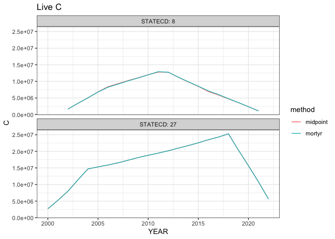
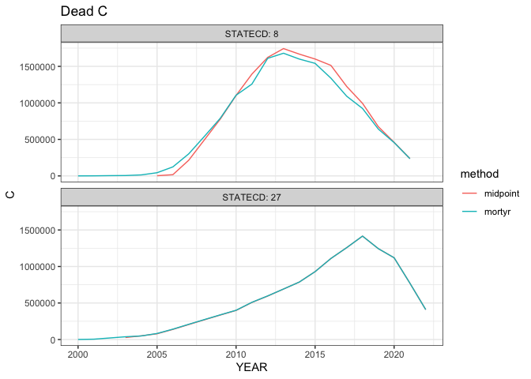

# Carbon - WIP
Renata Diaz

# Notes

Notes from the README.md associated with this carbon estimation code:

- This version implements two interpolation methods that are different
  from the one used in the `pre_carbon` branch. On the `pre_carbon`
  branch, trees that die are assumed to have died in the survey year in
  which they are first recorded as dead. This branch uses a “midpoint”
  and a “mortyr” method. In the “midpoint” method, dead trees are
  assumed to have died at the midpoint of the remeasurement year in
  which they died (e.g. a tree recorded as alive in 2010 and dead in
  2020 is assumed to have died in 2015). The “mortyr” method is the same
  as the midpoint, **except** that if a tree has a `MORTYR` recorded,
  the tree is assumed to have died in `MORTYR`.
- There have been additional interpolation methods discussed,
  e.g. taking into account disturbance years and types. This branch does
  not do any of that.
- Interpolation continues for as long as a tree remains in the database.
  It stops in the last survey year in which the tree is recorded. *TODO
  that has been discussed, but not implemented: Extend the interpolation
  period to the midpoint of the remeasurement period immediately after
  the last record of a tree.*
- Annualized measurements are generated only for trees that meet these
  criteria: Either alive in all survey periods, or alive in some surveys
  and dead in others; **and** have no NA measurements for HT or DIA.
  This excludes a lot (30-40%) of trees. Many trees can be re-added by
  adding trees that are always recorded as dead and/or have some NA
  measurements. NA measurements are likely to break the current code, so
  one solution is to filter the *measurements* to remove individual
  surveys with NA measurements but keep other records for that tree. I
  (Renata) began investigating this in the `allow_more` branch, but it
  may be equally efficient to start this work fresh.
- Some trees have NA measurements sandwiched between non-NA
  measurements. We could get additional information by interpolating the
  NA measurements from the adjoining non-NA measurements. This branch
  does not attempt any of this.
- This branch does not filter at all based on DIA. Trees with DIA \< 5
  are saplings measured on the subplot. Carbon estimated from these
  trees should be (somehow) scaled up to proportionally account for the
  area of the full plot. Or, these trees could be filtered out until
  they reach DIA \>= 5. This branch does neither of these things.
- This branch generates NSVB carbon variable estimates based on
  interpolated annual measurements of HT and DIA using the two
  interpolation methods. It does so using David Walker’s code copied
  essentially verbatim from the `nsvb_test.zip` file he sent the group
  in September 2024.
- The carbon estimation procedure runs locally. It runs for some states
  in GH actions but fails for others with a timeout. I (Renata) believe
  this is because it takes a lot of time/memory to run the carbon
  estimation on states with a lot of trees (e.g. Minnesota, Wisconsin).
  Currently, I just don’t run this on those states in GH actions. To get
  it running, you’d need to either speed up the carbon estimation code
  or break the states into smaller units (e.g. counties).
- Edge effects - the carbon estimates appear to decline after
  around 2010. This is not a real effect but reflects that fewer and
  fewer trees have been resampled since their last survey visit. It
  should be corrected for, either by scaling estimates to the number of
  plots resampled or by extrapolating measurements for upcoming surveys.

# Obtaining a database

## Download

You can download a copy of the *work in progress* database from this
[Google Drive
link](https://drive.google.com/file/d/1Ndn63S4ZWDvttZMcXUj8Wx8ziqCCClIf/view?usp=sharing).
The rest of this document will assume you downloaded it and put it in
`data/db`. This database has data for CO, MN, and NH.

## Generating it yourself

You can run `scripts/01-run_locally.R` to generate your own copy of the
database on your own computer. You can get data for different states by
changing lines 11-15 and 27 of that script.

# Connecting to the database

You can connect to the database like this:

``` r
library(dplyr)
```


    Attaching package: 'dplyr'

    The following objects are masked from 'package:stats':

        filter, lag

    The following objects are masked from 'package:base':

        intersect, setdiff, setequal, union

``` r
library(duckdb)
```

    Loading required package: DBI

``` r
library(DBI)
library(ggplot2)

con <- dbConnect(duckdb(
  dbdir = here::here("data/db/foresttime-from-state-parquet.duckdb")
))
```

Then you can pull data from tables in the database like this:

``` r
# List available tables
dbListTables(con)
```

     [1] "all_invyrs"                      "cond"                           
     [3] "nsvb_vars"                       "plot"                           
     [5] "qa_flags"                        "ref_species"                    
     [7] "ref_tree_carbon_ratio_dead"      "ref_tree_decay_prop"            
     [9] "sapling_transitions"             "tree"                           
    [11] "tree_annualized"                 "tree_carbon"                    
    [13] "tree_carbon_annualized_midpoint" "tree_carbon_annualized_mortyr"  
    [15] "tree_cns"                        "tree_info_composite_id"         

``` r
# Pull data from the tree table
some_trees <- tbl(con, "tree") |>
  # You can put dplyr-style filtering code here
  filter(STATECD == 8,
         INVYR > 2015) |>
  head() |>
  # And run collect() to pull data into R's memory
  collect()

knitr::kable(some_trees)
```

| TREE_CN | PLT_CN | PREV_TRE_CN | INVYR | STATECD | UNITCD | COUNTYCD | PLOT | SUBP | TREE | CONDID | PREVCOND | STATUSCD | SPCD | SPGRPCD | DIA | DIAHTCD | HT | HTCD | ACTUALHT | TREECLCD | CR | CCLCD | TREEGRCD | AGENTCD | CULL | DAMLOC1 | DAMTYP1 | DAMSEV1 | DAMLOC2 | DAMTYP2 | DAMSEV2 | DECAYCD | STOCKING | WDLDSTEM | VOLCFNET | VOLCFGRS | VOLCSNET | VOLCSGRS | VOLBFNET | VOLBFGRS | VOLCFSND | DIACHECK | MORTYR | SALVCD | UNCRCD | CPOSCD | CLIGHTCD | CVIGORCD | CDENCD | CDIEBKCD | TRANSCD | TREEHISTCD | BHAGE | TOTAGE | CULLDEAD | CULLFORM | CULLMSTOP | CULLBF | CULLCF | BFSND | CFSND | SAWHT | BOLEHT | FORMCL | HTCALC | HRDWD_CLUMP_CD | SITREE | CREATED_DATE | MODIFIED_DATE | MORTCD | HTDMP | ROUGHCULL | MIST_CL_CD | CULL_FLD | RECONCILECD | PREVDIA | P2A_GRM_FLG | TREECLCD_NERS | TREECLCD_SRS | TREECLCD_NCRS | TREECLCD_RMRS | STANDING_DEAD_CD | PREV_STATUS_CD | PREV_WDLDSTEM | TPA_UNADJ | DRYBIO_BOLE | DRYBIO_STUMP | DRYBIO_BG | CARBON_AG | CARBON_BG | SUBCYCLE | BORED_CD_PNWRS | DAMLOC1_PNWRS | DAMLOC2_PNWRS | DIACHECK_PNWRS | DMG_AGENT1_CD_PNWRS | DMG_AGENT2_CD_PNWRS | DMG_AGENT3_CD_PNWRS | MIST_CL_CD_PNWRS | SEVERITY1_CD_PNWRS | SEVERITY1A_CD_PNWRS | SEVERITY1B_CD_PNWRS | SEVERITY2_CD_PNWRS | SEVERITY2A_CD_PNWRS | SEVERITY2B_CD_PNWRS | SEVERITY3_CD_PNWRS | UNKNOWN_DAMTYP1_PNWRS | UNKNOWN_DAMTYP2_PNWRS | PREV_PNTN_SRS | DISEASE_SRS | DIEBACK_SEVERITY_SRS | DAMAGE_AGENT_CD1 | DAMAGE_AGENT_CD2 | DAMAGE_AGENT_CD3 | CENTROID_DIA | CENTROID_DIA_HT | CENTROID_DIA_HT_ACTUAL | UPPER_DIA | UPPER_DIA_HT | VOLCSSND | DRYBIO_SAWLOG | DAMAGE_AGENT_CD1_SRS | DAMAGE_AGENT_CD2_SRS | DAMAGE_AGENT_CD3_SRS | DRYBIO_AG | ACTUALHT_CALC | ACTUALHT_CALC_CD | CULL_BF_ROTTEN | CULL_BF_ROTTEN_CD | CULL_BF_ROUGH | CULL_BF_ROUGH_CD | PREVDIA_FLD | TREECLCD_31_NCRS | TREE_GRADE_NCRS | BOUGHS_AVAILABLE_NCRS | BOUGHS_HRVST_NCRS | TREECLCD_31_NERS | AGENTCD_NERS | BFSNDCD_NERS | AGECHKCD_RMRS | PREV_AGECHKCD_RMRS | PREV_BHAGE_RMRS | PREV_TOTAGE_RMRS | PREV_TREECLCD_RMRS | RADAGECD_RMRS | RADGRW_RMRS | VOLBSGRS | VOLBSNET | SAPLING_FUSIFORM_SRS | EPIPHYTE_PNWRS | ROOT_HT_PNWRS | CAVITY_USE_PNWRS | CORE_LENGTH_PNWRS | CULTURALLY_KILLED_PNWRS | DIA_EST_PNWRS | GST_PNWRS | INC10YR_PNWRS | INC5YRHT_PNWRS | INC5YR_PNWRS | RING_COUNT_INNER_2INCHES_PNWRS | RING_COUNT_PNWRS | SNAG_DIS_CD_PNWRS | CONEPRESCD1 | CONEPRESCD2 | CONEPRESCD3 | MASTCD | VOLTSGRS | VOLTSGRS_BARK | VOLTSSND | VOLTSSND_BARK | VOLCFGRS_STUMP | VOLCFGRS_STUMP_BARK | VOLCFSND_STUMP | VOLCFSND_STUMP_BARK | VOLCFGRS_BARK | VOLCFGRS_TOP | VOLCFGRS_TOP_BARK | VOLCFSND_BARK | VOLCFSND_TOP | VOLCFSND_TOP_BARK | VOLCFNET_BARK | VOLCSGRS_BARK | VOLCSSND_BARK | VOLCSNET_BARK | DRYBIO_STEM | DRYBIO_STEM_BARK | DRYBIO_STUMP_BARK | DRYBIO_BOLE_BARK | DRYBIO_BRANCH | DRYBIO_FOLIAGE | DRYBIO_SAWLOG_BARK | PREV_ACTUALHT_FLD | PREV_HT_FLD | UTILCLCD | PLOT_COMPOSITE_ID | TREE_COMPOSITE_ID | CYCLE |
|:---|:---|:---|---:|---:|---:|---:|---:|---:|---:|---:|---:|---:|---:|---:|---:|---:|---:|---:|---:|---:|---:|---:|---:|---:|---:|---:|---:|---:|---:|---:|---:|---:|---:|---:|---:|---:|---:|---:|---:|---:|---:|---:|---:|---:|---:|---:|---:|---:|---:|---:|---:|---:|---:|---:|---:|---:|---:|---:|---:|---:|---:|---:|---:|---:|---:|---:|---:|:---|:---|---:|---:|---:|---:|---:|---:|---:|:---|---:|---:|---:|---:|---:|---:|---:|---:|---:|---:|---:|---:|---:|---:|---:|---:|---:|---:|---:|---:|---:|---:|---:|---:|---:|---:|---:|---:|---:|---:|---:|---:|---:|---:|---:|---:|---:|---:|---:|---:|---:|---:|---:|---:|---:|---:|---:|---:|---:|---:|---:|---:|---:|---:|---:|---:|---:|---:|---:|---:|---:|---:|---:|---:|---:|---:|---:|---:|---:|---:|---:|---:|---:|---:|:---|---:|---:|---:|:---|---:|---:|---:|---:|---:|---:|---:|---:|---:|---:|---:|---:|---:|---:|---:|---:|---:|---:|---:|---:|---:|---:|---:|---:|---:|---:|---:|---:|---:|---:|---:|---:|---:|---:|---:|---:|---:|---:|:---|:---|---:|
| 756446453290487 | 431917409489998 | 39452935010690 | 2019 | 8 | 2 | 43 | 82555 | 1 | 5 | 1 | 1 | 2 | 106 | 23 | NA | 2 | NA | NA | NA | NA | NA | NA | NA | 10 | NA | NA | NA | NA | NA | NA | NA | NA | NA | NA | NA | NA | NA | NA | NA | NA | NA | NA | 2015 | NA | NA | NA | NA | NA | NA | NA | NA | NA | NA | NA | NA | NA | NA | NA | NA | NA | NA | NA | NA | NA | 16 | NA | NA | 2020-06-25 11:27:28 | 2024-08-29 11:48:28 | NA | NA | NA | NA | NA | NA | 5.5 | NA | NA | NA | NA | NA | 0 | 1 | 1 | NA | NA | NA | NA | NA | NA | 8 | NA | NA | NA | NA | NA | NA | NA | NA | NA | NA | NA | NA | NA | NA | NA | NA | NA | NA | NA | NA | NA | NA | NA | NA | NA | NA | NA | NA | NA | NA | NA | NA | NA | NA | NA | NA | NA | NA | NA | NA | 5.5 | NA | NA | NA | NA | NA | NA | NA | NA | NA | NA | NA | 2 | NA | NA | NA | NA | NA | NA | NA | NA | NA | NA | NA | NA | NA | NA | NA | NA | NA | NA | NA | NA | NA | NA | NA | NA | NA | NA | NA | NA | NA | NA | NA | NA | NA | NA | NA | NA | NA | NA | NA | NA | NA | NA | NA | NA | NA | NA | NA | 16 | 16 | NA | 8_2_43_82555 | 8_2_43_82555_1_5 | 3 |
| 756446455290487 | 431917409489998 | 39452937010690 | 2019 | 8 | 2 | 43 | 82555 | 1 | 7 | 1 | 1 | 1 | 106 | 23 | 5.6 | 2 | 17 | 1 | 17 | 3 | 60 | 3 | NA | NA | 0 | NA | NA | NA | NA | NA | NA | NA | 0.7991 | 1 | NA | NA | NA | NA | NA | NA | NA | 0 | NA | NA | 70 | NA | NA | NA | NA | NA | NA | NA | NA | NA | 0 | NA | 0 | NA | NA | NA | NA | NA | NA | NA | 17 | NA | NA | 2020-06-25 11:27:28 | 2024-08-29 11:48:28 | NA | NA | NA | 0 | 0 | NA | 5.6 | NA | NA | NA | NA | 2 | NA | 1 | 1 | 6.018046 | NA | NA | 10.32879 | 25.75875 | 4.916504 | 8 | NA | NA | NA | NA | NA | NA | NA | NA | NA | NA | NA | NA | NA | NA | NA | NA | NA | NA | NA | NA | 0 | NA | NA | NA | NA | NA | NA | NA | NA | NA | NA | NA | NA | 54.11501 | NA | NA | NA | NA | NA | NA | 5.6 | NA | NA | NA | NA | NA | NA | NA | NA | NA | NA | NA | 2 | 0 | NA | NA | NA | NA | NA | NA | NA | NA | NA | NA | NA | NA | NA | NA | NA | NA | NA | NA | NA | NA | NA | 1.438111 | NA | 1.438111 | NA | NA | NA | NA | NA | NA | NA | NA | NA | NA | NA | NA | NA | NA | NA | NA | NA | NA | NA | NA | 7.048037 | NA | 17 | 17 | NA | 8_2_43_82555 | 8_2_43_82555_1_7 | 3 |
| 756446456290487 | 431917409489998 | 39452938010690 | 2019 | 8 | 2 | 43 | 82555 | 1 | 8 | 1 | 1 | 1 | 69 | 23 | 16.4 | 2 | 11 | 1 | 11 | 3 | 20 | 5 | NA | NA | 0 | NA | NA | NA | NA | NA | NA | NA | 0.5896 | 6 | NA | NA | NA | NA | NA | NA | NA | 2 | NA | NA | 50 | NA | NA | NA | NA | NA | NA | NA | NA | NA | 95 | NA | 0 | NA | NA | NA | NA | NA | NA | NA | 12 | NA | NA | 2020-06-25 11:27:28 | 2024-08-29 11:48:28 | NA | NA | NA | 0 | 0 | NA | 16.5 | NA | NA | NA | NA | 2 | NA | 1 | 7 | 6.018046 | NA | NA | 45.11705 | 131.98838 | 21.520834 | 8 | NA | NA | NA | NA | NA | NA | NA | NA | NA | NA | NA | NA | NA | NA | NA | NA | NA | NA | NA | NA | 90011 | 0 | NA | NA | NA | NA | NA | NA | NA | NA | NA | NA | NA | 276.70521 | NA | NA | NA | NA | NA | NA | 16.5 | NA | NA | NA | NA | NA | NA | NA | NA | NA | NA | NA | 2 | 0 | NA | NA | NA | NA | NA | NA | NA | NA | NA | NA | NA | NA | NA | NA | NA | NA | NA | NA | NA | NA | NA | 7.200285 | NA | 7.200285 | NA | NA | NA | NA | NA | NA | NA | NA | NA | NA | NA | NA | NA | NA | NA | NA | NA | NA | NA | NA | 35.704781 | NA | 13 | 13 | NA | 8_2_43_82555 | 8_2_43_82555_1_8 | 3 |
| 756446457290487 | 431917409489998 | 39452939010690 | 2019 | 8 | 2 | 43 | 82555 | 1 | 9 | 1 | 1 | 2 | 106 | 23 | NA | 2 | NA | NA | NA | NA | NA | NA | NA | NA | NA | NA | NA | NA | NA | NA | NA | NA | NA | NA | NA | NA | NA | NA | NA | NA | NA | NA | NA | NA | NA | NA | NA | NA | NA | NA | NA | NA | NA | NA | NA | NA | NA | NA | NA | NA | NA | NA | NA | NA | NA | NA | NA | 2020-06-25 11:27:28 | 2024-08-29 11:48:28 | NA | NA | NA | NA | NA | NA | 5.2 | NA | NA | NA | NA | NA | 0 | 2 | 1 | NA | NA | NA | NA | NA | NA | 8 | NA | NA | NA | NA | NA | NA | NA | NA | NA | NA | NA | NA | NA | NA | NA | NA | NA | NA | NA | NA | NA | NA | NA | NA | NA | NA | NA | NA | NA | NA | NA | NA | NA | NA | NA | NA | NA | NA | NA | NA | 5.2 | NA | NA | NA | NA | NA | NA | NA | NA | NA | NA | NA | 5 | NA | NA | NA | NA | NA | NA | NA | NA | NA | NA | NA | NA | NA | NA | NA | NA | NA | NA | NA | NA | NA | NA | NA | NA | NA | NA | NA | NA | NA | NA | NA | NA | NA | NA | NA | NA | NA | NA | NA | NA | NA | NA | NA | NA | NA | NA | NA | 19 | 19 | NA | 8_2_43_82555 | 8_2_43_82555_1_9 | 3 |
| 756446458290487 | 431917409489998 | 39452940010690 | 2019 | 8 | 2 | 43 | 82555 | 1 | 10 | 1 | 1 | 1 | 69 | 23 | 12.3 | 2 | 18 | 1 | 18 | 3 | 85 | 3 | NA | NA | 0 | NA | NA | NA | NA | NA | NA | NA | 3.4529 | 4 | NA | NA | NA | NA | NA | NA | NA | 0 | NA | NA | 99 | NA | NA | NA | NA | NA | NA | NA | NA | NA | 35 | NA | 0 | NA | NA | NA | NA | NA | NA | NA | 18 | NA | NA | 2020-06-25 11:27:28 | 2024-08-29 11:48:28 | NA | NA | NA | 0 | 0 | NA | 12.2 | NA | NA | NA | NA | 2 | NA | 1 | 4 | 6.018046 | NA | NA | 41.60059 | 115.23128 | 19.843482 | 8 | NA | NA | NA | NA | NA | NA | NA | NA | NA | NA | NA | NA | NA | NA | NA | NA | NA | NA | NA | NA | 90011 | 41008 | 0 | NA | NA | NA | NA | NA | NA | NA | NA | NA | NA | 241.57500 | NA | NA | NA | NA | NA | NA | 12.2 | NA | NA | NA | NA | NA | NA | NA | NA | 1 | NA | 172 | 2 | 0 | NA | NA | NA | NA | NA | NA | NA | NA | NA | NA | NA | NA | NA | NA | NA | NA | NA | NA | NA | NA | NA | 6.589271 | NA | 6.589271 | NA | NA | NA | NA | NA | NA | NA | NA | NA | NA | NA | NA | NA | NA | NA | NA | NA | NA | NA | NA | 22.673861 | NA | 18 | 18 | NA | 8_2_43_82555 | 8_2_43_82555_1_10 | 3 |
| 756446459290487 | 431917409489998 | 39452941010690 | 2019 | 8 | 2 | 43 | 82555 | 1 | 11 | 1 | 1 | 1 | 106 | 23 | 7.4 | 2 | 22 | 1 | 22 | 3 | 40 | 3 | NA | NA | 0 | NA | NA | NA | NA | NA | NA | NA | 1.3419 | 1 | NA | NA | NA | NA | NA | NA | NA | 0 | NA | NA | 55 | NA | NA | NA | NA | NA | NA | NA | NA | NA | 0 | NA | 0 | NA | NA | NA | NA | NA | NA | NA | 22 | NA | NA | 2020-06-25 11:27:28 | 2024-08-29 11:48:28 | NA | NA | NA | 0 | 0 | NA | 7.2 | NA | NA | NA | NA | 2 | NA | 1 | 1 | 6.018046 | NA | NA | 25.33272 | 56.98143 | 12.058375 | 8 | NA | NA | NA | NA | NA | NA | NA | NA | NA | NA | NA | NA | NA | NA | NA | NA | NA | NA | NA | NA | 0 | NA | NA | NA | NA | NA | NA | NA | NA | NA | NA | NA | NA | 119.70888 | NA | NA | NA | NA | NA | NA | 7.2 | NA | NA | NA | NA | NA | NA | NA | NA | NA | NA | NA | 2 | 4 | NA | NA | NA | NA | NA | NA | NA | NA | NA | NA | NA | NA | NA | NA | NA | NA | NA | NA | NA | NA | NA | 3.587400 | NA | 3.587400 | NA | NA | NA | NA | NA | NA | NA | NA | NA | NA | NA | NA | NA | NA | NA | NA | NA | NA | NA | NA | 10.494132 | NA | 21 | 21 | NA | 8_2_43_82555 | 8_2_43_82555_1_11 | 3 |

``` r
# Pull some data from the carbon estimates table
mn_annual_carbon_midpoint <- 
  tbl(con, "tree_carbon_annualized_midpoint") |>
  filter(STATECD == 27) |>
  arrange(TREE_COMPOSITE_ID, YEAR) |>
  head() |>
  collect()

knitr::kable(mn_annual_carbon_midpoint)
```

| ID | PROVINCE | SFTWD_HRDWD | STATECD | TREE_COMPOSITE_ID | TRE_CN | YEAR | midpoint_dead_year | HT | DIA | ACTUALHT | PLT_CN | STATUSCD | SPCD | TREECLCD | CULL | VOLCFGRS | DRYBIO_AG | CARBON_AG | STANDING_DEAD_CD | DECAYCD | CR | ACTUAL_HT | ECOSUBCD | STDORGCD | JENKINS_SPGRPCD | WDSG | CULL_DECAY_RATIO | DECAY_WD | DECAY_BK | DECAY_BR | C_FRAC | DIVISION | CRmn | BROKEN_TOP | SPCD_DIVISION | SPCD_NUMERIC | k | saw | DBH | THT | VTOTIB_GROSS | VTOTBK_GROSS | VTOTOB_GROSS | HT4 | VMERIB_GROSS | VMEROB_GROSS | VMERBK_GROSS | VSTPIB_GROSS | VSTPOB_GROSS | VSTPBK_GROSS | VTOPIB_GROSS | VTOPOB_GROSS | VTOPBK_GROSS | HTSAW | VSAWIB_GROSS | VSAWOB_GROSS | VSAWBK_GROSS | HT_RAT_ADJ | VTOTIB_PRESENT | VTOTBK_PRESENT | VTOTOB_PRESENT | VMERIB_PRESENT | VMERBK_PRESENT | VMEROB_PRESENT | VSAWIB_PRESENT | VSAWBK_PRESENT | VSAWOB_PRESENT | VSTPIB_PRESENT | VSTPBK_PRESENT | VSTPOB_PRESENT | VTOPIB_PRESENT | VTOPBK_PRESENT | VTOPOB_PRESENT | SND_WOOD_DECAY | VTOTIB_SOUND | VMERIB_SOUND | VSTPIB_SOUND | VTOPIB_SOUND | VSAWIB_SOUND | VTOTBK_SOUND | VSTPBK_SOUND | VMERBK_SOUND | VTOPBK_SOUND | VSAWBK_SOUND | VTOTOB_SOUND | VMEROB_SOUND | VSTPOB_SOUND | VTOPOB_SOUND | VSAWOB_SOUND | Total | Bark | Branch | FOLIAGE | Wood | CULL_REDUCTION | WOOD_REDUCTION | BARK_REDUCTION | CRprop_HT | broken_crn_prop | BRANCH_REDUCTION | FOLIAGE_REDUCTION | Wood_Reduced | Bark_Reduced | Branch_Reduced | Foliage_Reduced | AGB_Reduction_Factor | Total_Reduced | TotalC | Diff | WoodR | BarkR | BranchR | WoodAdd | BarkAdd | BranchAdd | WoodF | BarkF | BranchF | WDSGAdj | BKSGAdj | WMERIB | WMERBK | WMEROB | WSTPIB | WSTPBK | WSTPOB | WTOPIB | WTOPBK | WTOPOB | WSAWIB | WSAWBK | WSAWOB | WTOTIB | WTOTBK | WTOTOB | WTOTBCH | WMERBCH | BIOMASS | CARBON | AGB |
|---:|:---|:---|---:|:---|:---|---:|---:|---:|---:|---:|:---|---:|---:|---:|---:|---:|---:|---:|---:|---:|---:|---:|:---|---:|---:|---:|---:|---:|---:|---:|---:|:---|---:|:---|:---|---:|---:|---:|---:|---:|---:|---:|---:|---:|---:|---:|---:|---:|---:|---:|---:|---:|---:|---:|---:|---:|---:|---:|---:|---:|---:|---:|---:|---:|---:|---:|---:|---:|---:|---:|---:|---:|---:|---:|---:|---:|---:|---:|---:|---:|---:|---:|---:|---:|---:|---:|---:|---:|---:|---:|---:|---:|---:|---:|---:|---:|---:|---:|---:|---:|---:|---:|---:|---:|---:|---:|---:|---:|---:|---:|---:|---:|---:|---:|---:|---:|---:|---:|---:|---:|---:|---:|---:|---:|---:|---:|---:|---:|---:|---:|---:|---:|---:|---:|---:|---:|---:|---:|---:|---:|
| 895455 | 212 | H | 27 | 27_1_137_10499_1_1 | 98958407010661 | 2005 | NA | 78 | 22.7 | 78 | 98958385010661 | 1 | 371 | 2 | 1 | 88.547403 | 4382.039700 | 2138.435374 | 0 | 0 | 60 | 78 | 212La | 0 | 7 | 0.55 | 0.54 | 1 | 1 | 1 | 48.8 | 210 | 38.6 | FALSE | 371 210 | 371 | 11 | 9 | 22.7 | 78 | 92.5906777 | 11.8226222 | 104.4132999 | 73.45555 | 88.547405 | 99.853754 | 11.3063490 | 3.8958927 | 4.3933474 | 0.4974547 | 0.1473801 | 0.1661986 | 0.0188185 | 60.396586 | 85.68999 | 96.63149 | 10.941495 | 1 | 92.5906777 | 11.8226222 | 104.4132999 | 88.547405 | 11.3063490 | 99.853754 | 85.68999 | 10.941495 | 96.63149 | 3.8958927 | 0.4974547 | 4.3933474 | 0.1473801 | 0.0188185 | 0.1661986 | 0.99 | 91.6647709 | 87.661931 | 3.8569338 | 0.1459063 | 84.83309 | 11.8226222 | 0.4974547 | 11.3063490 | 0.0188185 | 10.941495 | 103.4873931 | 98.968280 | 4.3543885 | 0.1647248 | 95.77459 | 4395.087431 | 379.666781 | 1366.4719663 | 28.7879020 | 3177.712057 | 0.9954 | 0.9954 | 1 | 0.60 | 1 | 1 | 1 | 3163.094582 | 379.666781 | 1366.4719663 | 28.7879020 | 0.9970313 | 4382.039700 | 4909.233329 | -527.193629 | 0.6443154 | 0.0773373 | 0.2783473 | -339.6789683 | -40.7717244 | -146.7429366 | 2823.415613 | 338.895057 | 1219.7290297 | 0.4886782 | 0.4593744 | 2700.12200 | 324.096103 | 3024.21810 | 118.799480 | 14.2595218 | 133.059002 | 4.494137 | 0.5394321 | 5.033569 | 2612.9894 | 313.6376 | 2926.627 | 2823.415613 | 338.895057 | 3162.310670 | 1219.7290297 | 1224.76260 | 4382.039700 | 2138.435374 | 4410.827602 |
| 718309 | 212 | H | 27 | 27_1_137_10499_1_2 | 98958409010661 | 2005 | NA | 58 | 9.1 | 58 | 98958385010661 | 1 | 316 | 2 | 1 | 9.800291 | 477.679682 | 232.152325 | 0 | 0 | 20 | 58 | 212La | 0 | 7 | 0.49 | 0.54 | 1 | 1 | 1 | 48.6 | 210 | 38.6 | FALSE | 316 210 | 316 | 11 | 9 | 9.1 | 58 | 10.9123883 | 1.5541758 | 12.4665641 | 40.41126 | 9.800290 | 11.196077 | 1.3957873 | 0.5776558 | 0.6599273 | 0.0822715 | 0.5344428 | 0.6105598 | 0.0761170 | 6.927049 | NA | NA | NA | 1 | 10.9123883 | 1.5541758 | 12.4665641 | 9.800290 | 1.3957873 | 11.196077 | NA | NA | NA | 0.5776558 | 0.0822715 | 0.6599273 | 0.5344428 | 0.0761170 | 0.6105598 | 0.99 | 10.8032644 | 9.702287 | 0.5718792 | 0.5290983 | NA | 1.5541758 | 0.0822715 | 1.3957873 | 0.0761170 | NA | 12.3574402 | 11.098074 | 0.6541507 | 0.6052153 | NA | 479.202668 | 43.798799 | 105.4712392 | 10.5603131 | 333.657184 | 0.9954 | 0.9954 | 1 | 0.20 | 1 | 1 | 1 | 332.122361 | 43.798799 | 105.4712392 | 10.5603131 | 0.9968218 | 477.679682 | 481.392399 | -3.712717 | 0.6899202 | 0.0909836 | 0.2190962 | -2.5614784 | -0.3377962 | -0.8134421 | 329.560882 | 43.461002 | 104.6577971 | 0.4839843 | 0.4481413 | 295.97482 | 39.031824 | 335.00664 | 17.445562 | 2.3006421 | 19.746204 | 16.140503 | 2.1285367 | 18.269039 | NA | NA | NA | 329.560882 | 43.461002 | 373.021885 | 104.6577971 | 122.92684 | 477.679682 | 232.152325 | 488.239995 |
| 1604043 | 212 | S | 27 | 27_1_137_10499_1_3 | 98958411010661 | 2005 | NA | 34 | 5.6 | 34 | 98958385010661 | 1 | 12 | 2 | 1 | 1.869570 | 96.386245 | 48.771440 | 0 | 0 | 70 | 34 | 212La | 0 | 3 | 0.33 | 0.92 | 1 | 1 | 1 | 50.6 | 210 | 48.0 | FALSE | 12 210 | 12 | 9 | 7 | 5.6 | 34 | 2.6731790 | 0.3680522 | 3.0412312 | 15.91669 | 1.869569 | 2.126977 | 0.2574084 | 0.2162790 | 0.2460570 | 0.0297780 | 0.5873314 | 0.6681971 | 0.0808657 | 5.000000 | NA | NA | NA | 1 | 2.6731790 | 0.3680522 | 3.0412312 | 1.869569 | 0.2574084 | 2.126977 | NA | NA | NA | 0.2162790 | 0.0297780 | 0.2460570 | 0.5873314 | 0.0808657 | 0.6681971 | 0.99 | 2.6464472 | 1.850873 | 0.2141162 | 0.5814580 | NA | 0.3680522 | 0.0297780 | 0.2574084 | 0.0808657 | NA | 3.0144994 | 2.108281 | 0.2438943 | 0.6623238 | NA | 96.430772 | 9.681823 | 30.6423370 | 17.5484838 | 55.046101 | 0.9992 | 0.9992 | 1 | 0.70 | 1 | 1 | 1 | 55.002065 | 9.681823 | 30.6423370 | 17.5484838 | 0.9995383 | 96.386245 | 95.326225 | 1.060021 | 0.5769878 | 0.1015652 | 0.3214471 | 0.6116189 | 0.1076612 | 0.3407405 | 55.613683 | 9.789485 | 30.9830775 | 0.3334026 | 0.4262514 | 38.89511 | 6.846572 | 45.74168 | 4.499539 | 0.7920383 | 5.291577 | 12.219032 | 2.1508740 | 14.369906 | NA | NA | NA | 55.613683 | 9.789485 | 65.403168 | 30.9830775 | 45.35298 | 96.386245 | 48.771440 | 113.934729 |
| 895458 | 212 | H | 27 | 27_1_137_10499_1_4 | 98958413010661 | 2005 | NA | 52 | 7.2 | 52 | 98958385010661 | 1 | 316 | 2 | 1 | 5.271121 | 274.916141 | 133.609244 | 0 | 0 | 65 | 52 | 212La | 0 | 7 | 0.49 | 0.54 | 1 | 1 | 1 | 48.6 | 210 | 38.6 | FALSE | 316 210 | 316 | 11 | 9 | 7.2 | 52 | 6.2857487 | 0.9034122 | 7.1891609 | 30.70862 | 5.271119 | 6.028704 | 0.7575856 | 0.3676814 | 0.4205260 | 0.0528446 | 0.6469488 | 0.7399308 | 0.0929820 | 5.000000 | NA | NA | NA | 1 | 6.2857487 | 0.9034122 | 7.1891609 | 5.271119 | 0.7575856 | 6.028704 | NA | NA | NA | 0.3676814 | 0.0528446 | 0.4205260 | 0.6469488 | 0.0929820 | 0.7399308 | 0.99 | 6.2228912 | 5.218407 | 0.3640046 | 0.6404793 | NA | 0.9034122 | 0.0528446 | 0.7575856 | 0.0929820 | NA | 7.1263034 | 5.975993 | 0.4168492 | 0.7334613 | NA | 275.810220 | 27.568973 | 52.9659466 | 7.1597148 | 192.193051 | 0.9954 | 0.9954 | 1 | 0.65 | 1 | 1 | 1 | 191.308963 | 27.568973 | 52.9659466 | 7.1597148 | 0.9967584 | 274.916141 | 271.843883 | 3.072258 | 0.7037457 | 0.1014147 | 0.1948396 | 2.1620882 | 0.3115722 | 0.5985974 | 193.471052 | 27.880545 | 53.5645440 | 0.4932583 | 0.4945734 | 162.24143 | 23.380136 | 185.62156 | 11.316983 | 1.6308571 | 12.947840 | 19.912643 | 2.8695525 | 22.782195 | NA | NA | NA | 193.471052 | 27.880545 | 221.351597 | 53.5645440 | 76.34674 | 274.916141 | 133.609244 | 282.075856 |
| 186878 | 212 | H | 27 | 27_1_137_10499_2_10 | 98958433010661 | 2005 | NA | 20 | 1.7 | 20 | 98958385010661 | 1 | 316 | 2 | 0 | NA | 8.175939 | 3.973506 | 0 | 0 | 50 | NA | 212La | 0 | 7 | 0.49 | 0.54 | 1 | 1 | 1 | 48.6 | 210 | 38.6 | FALSE | 316 210 | 316 | 11 | 9 | 1.7 | 20 | 0.1537082 | 0.0308045 | 0.1845128 | NA | NA | NA | NA | NA | NA | NA | NA | NA | NA | NA | NA | NA | NA | 1 | 0.1537082 | 0.0308045 | 0.1845128 | NA | NA | NA | NA | NA | NA | NA | NA | NA | NA | NA | NA | 1.00 | 0.1537082 | NA | NA | NA | NA | 0.0308045 | NA | NA | NA | NA | 0.1845128 | NA | NA | NA | NA | 8.175939 | 1.388624 | 0.6216662 | 0.8595601 | 4.699783 | 1.0000 | 1.0000 | 1 | 0.50 | 1 | 1 | 1 | 4.699783 | 1.388624 | 0.6216662 | 0.8595601 | 1.0000000 | 8.175939 | 6.710073 | 1.465866 | 0.7004071 | 0.2069462 | 0.0926467 | 1.0267029 | 0.3033553 | 0.1358077 | 5.726486 | 1.691979 | 0.7574739 | 0.5970442 | 0.8802291 | NA | NA | NA | NA | NA | NA | NA | NA | NA | NA | NA | NA | 5.726486 | 1.691979 | 7.418465 | 0.7574739 | NA | 8.175939 | 3.973507 | 9.035499 |
| 186871 | 212 | H | 27 | 27_1_137_10499_2_2 | 98958417010661 | 2005 | NA | 78 | 15.0 | 78 | 98958385010661 | 1 | 743 | 2 | 1 | 38.645440 | 1571.295326 | 754.221756 | 0 | 0 | 35 | 78 | 212La | 0 | 6 | 0.36 | 0.54 | 1 | 1 | 1 | 48.0 | 210 | 38.6 | FALSE | 743 210 | 743 | 11 | 9 | 15.0 | 78 | 40.3175350 | 4.9072768 | 45.2248118 | 68.08895 | 38.645438 | 43.349194 | 4.7037563 | 1.3394184 | 1.5024467 | 0.1630282 | 0.3326788 | 0.3731710 | 0.0404922 | 43.978007 | 33.23108 | 37.27582 | 4.044744 | 1 | 40.3175350 | 4.9072768 | 45.2248118 | 38.645438 | 4.7037563 | 43.349194 | 33.23108 | 4.044744 | 37.27582 | 1.3394184 | 0.1630282 | 1.5024467 | 0.3326788 | 0.0404922 | 0.3731710 | 0.99 | 39.9143596 | 38.258983 | 1.3260242 | 0.3293520 | 32.89877 | 4.9072768 | 0.1630282 | 4.7037563 | 0.0404922 | 4.044744 | 44.8216364 | 42.962740 | 1.4890525 | 0.3698443 | 36.94351 | 1575.794451 | 233.158011 | 320.3338694 | 17.1443426 | 905.693106 | 0.9954 | 0.9954 | 1 | 0.35 | 1 | 1 | 1 | 901.526918 | 233.158011 | 320.3338694 | 17.1443426 | 0.9971449 | 1571.295326 | 1455.018798 | 116.276528 | 0.6195981 | 0.1602440 | 0.2201579 | 72.0447186 | 18.6326142 | 25.5991951 | 973.571636 | 251.790625 | 345.9330645 | 0.3869807 | 0.8222699 | 933.19450 | 241.348062 | 1174.54257 | 32.343738 | 8.3649212 | 40.708659 | 8.033394 | 2.0776421 | 10.111036 | 802.4507 | 207.5344 | 1009.985 | 973.571636 | 251.790625 | 1225.362261 | 345.9330645 | 356.04410 | 1571.295326 | 754.221756 | 1588.439668 |

Plot carbon estimates for different interpolation methods:

``` r
mortyr_carbon <- tbl(con, "tree_carbon_annualized_mortyr") 
midpoint_carbon <- tbl(con, "tree_carbon_annualized_midpoint")

mortyr_carbon_total <- mortyr_carbon |> 
  filter(STATECD %in% c(8, 27)) |> 
  group_by(YEAR, STATECD, STATUSCD) |>
  summarize(C = sum(CARBON, na.rm = T)) |>
  ungroup()  |> 
  mutate(method = "mortyr")

midpoint_carbon_total <- midpoint_carbon |>
  filter(STATECD %in% c(8, 27)) |> 
  group_by(YEAR, STATECD, STATUSCD) |> 
  summarize(C = sum(CARBON, na.rm = T)) |>
  ungroup() |>
  mutate(method = "midpoint")

both_carbon_totals <- bind_rows(collect(mortyr_carbon_total),
                                collect(midpoint_carbon_total))
```

    `summarise()` has grouped output by "YEAR" and "STATECD". You can override
    using the `.groups` argument.
    `summarise()` has grouped output by "YEAR" and "STATECD". You can override
    using the `.groups` argument.

``` r
ggplot(both_carbon_totals |> filter(STATUSCD == 1), aes(YEAR, C, color = method)) +
  geom_line() +
  facet_wrap(vars(STATECD), ncol = 1, labeller = label_both) + 
  theme_bw() +
  ggtitle("Live C")
```



``` r
ggplot(both_carbon_totals |> filter(STATUSCD == 2), aes(YEAR, C, color = method)) +
  geom_line() + 
  facet_wrap(vars(STATECD), ncol = 1, labeller = label_both) + 
  theme_bw() + 
  ggtitle("Dead C")
```



When you’re done, disconnect from the database.

``` r
dbDisconnect(con, shutdown = TRUE)
```

# Description of database tables

Many of these tables are identical to their counterparts in the
`pre-carbon` branch. Detailed descriptions for these tables can be found
at <https://viz.datascience.arizona.edu/foresttime-tables/>.

- `all_invyrs`: See
  [here](https://viz.datascience.arizona.edu/foresttime-tables/table_descriptions.html#all_invyrs-table).
- `cond`: Nearly-completely raw from FIADB. See
  [here](https://viz.datascience.arizona.edu/foresttime-tables/table_descriptions.html#cond-table).
- `nsvb_vars`: The `tree` table with variables added to create a
  dataframe that mirrors the input data for David Walker’s NSVB
  estimation code.
- `plot`: Nearly-raw from FIADB. See
  [here](https://viz.datascience.arizona.edu/foresttime-tables/table_descriptions.html#plot-table).
- `qa_flags`: Derived as part of forestTIME. See
  [here](https://viz.datascience.arizona.edu/foresttime-tables/table_descriptions.html#qa_flags-table).
- `ref_species`: Nearly-raw from FIADB. Downloaded to support the
  creation of the `nsvb_vars` table.
- `ref_tree_carbon_ratio_dead`: Nearly-raw from FIADB. Downloaded to
  support the creation of the `nsvb_vars` table.
- `ref_tree_decay_prop`: Nearly-raw from FIADB. Downloaded to support
  the creation of the `nsvb_vars` table.
- `sapling_transitions`: Derived by `forestTIME`. See
  [here](https://viz.datascience.arizona.edu/foresttime-tables/table_descriptions.html#sapling_transitions-table).
- `tree`: Nearly-raw from FIADB. See
  [here](https://viz.datascience.arizona.edu/foresttime-tables/table_descriptions.html#tree-table).
- `tree_annualized`: Derived as part of `forestTIME`. Interpolations of
  annual measurements for `DIA`, `HT`, and `ACTUALHT` for tree surveys
  in FIADB. Currently restricted to trees that are either alive in all
  surveys or alive in some surveys and dead in others, and that have no
  NA measurements for `DIA`, `HT`, or `ACTUALHT`. Very similar to the
  table described
  [here](https://viz.datascience.arizona.edu/foresttime-tables/table_descriptions.html#tree_annualized-table),
  but with the following modifications:
  - `TREE_CN_midpoint` is the CN for the TREE_CN record for the most
    *recent* survey using the midpoint interpolation method. This is
    used to get the nsvb_vars for these interpolated years.
  - `midpoint_dead_year` is the year in which the tree is presumed to
    have died according to the midpoint interpolation method. (If a tree
    dies, it is assumed to have died in the middle year of the 5 or 10
    year remeasurement period).
  - `HT_est_midpoint`, `DIA_est_midpoint`, `AHEIGHT_est_midpoint`:
    Measurements interpolated for each year according to the midpoint
    method.
  - The corresponding columns ending in `_mortyr` are the same only for
    the mortyr interpolation method. (If a tree dies and has a `MORTYR`
    listed, it is assumed to have died in `MORTYR`; otherwise, it is
    assumed to have died in the midpoint year of the remeasurement
    period).
- `tree_carbon`: NSVB carbon estimates for the *tree surveys*
  (i.e. every 5-10 years). The direct output of David Walker’s code run
  on `nsvb_vars`.
- `tree_carbon_annualized_midpoint`: NSVB carbon estimates for
  *interpolated annual data* interpolated using the midpoint method.
- `tree_carbon_annualized_mortyr`: NSVB carbon estimates for
  interpolated annual data interpolated using the *mortyr* method.
- `tree_cns`: Derived in `forestTIME`. See
  [here](https://viz.datascience.arizona.edu/foresttime-tables/table_descriptions.html#tree_cns-table).
- `tree_info_composite_id`: Derived in `forestTIME`. See
  [here](https://viz.datascience.arizona.edu/foresttime-tables/table_descriptions.html#tree_info_composite_id-table).

# FIADB citation

Forest Inventory and Analysis Database, June 28, 2024. U.S. Department
of Agriculture, Forest Service, Northern Research Station. St. Paul, MN.
\[Available only on internet:
https://apps.fs.usda.gov/fia/datamart/datamart.html\]
